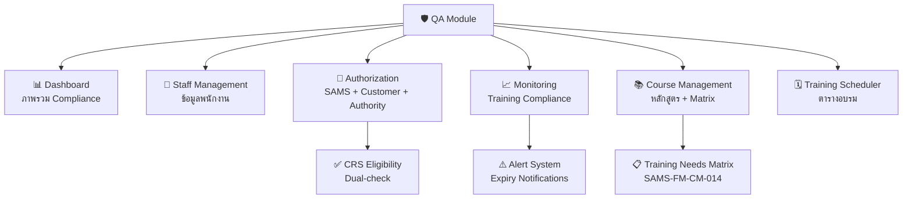
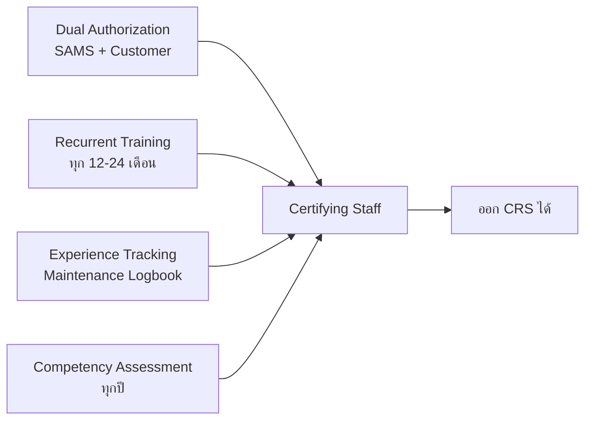
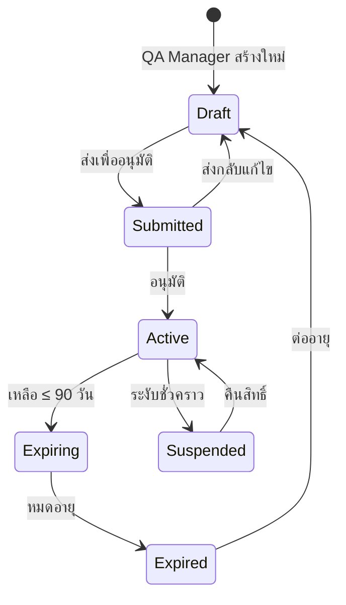
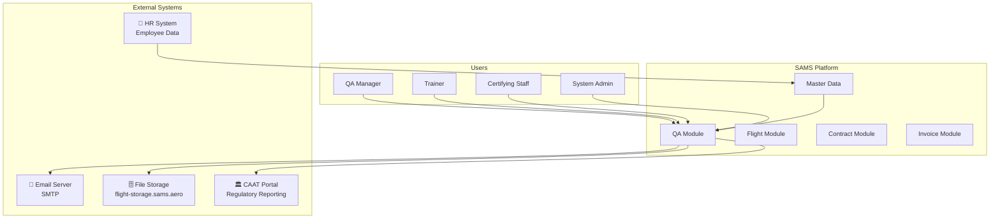
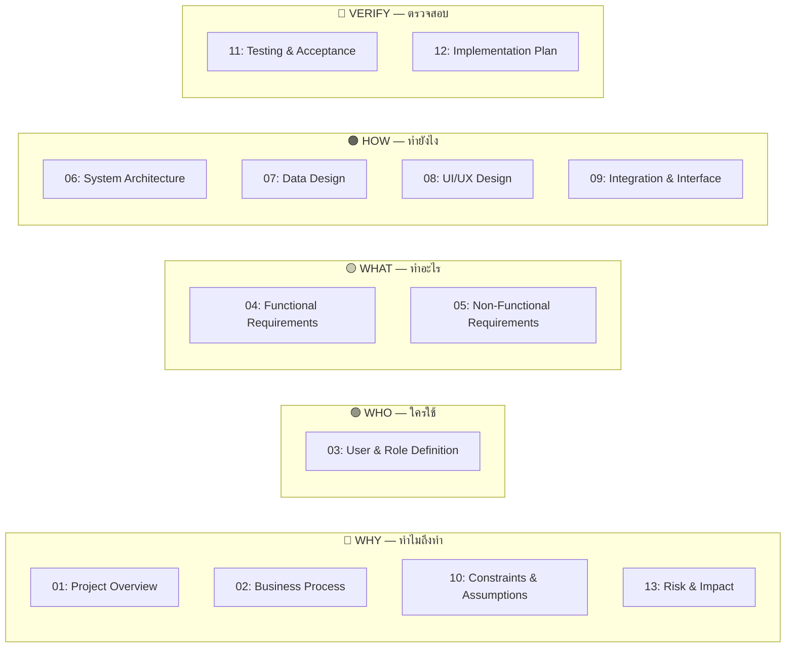

# SAMS-QA-SRS-01 — Project Overview
## ระบบ SAMS: โมดูล Quality Assurance (QA)

| รายการ | รายละเอียด |
|---|---|
| **Document No.** | SAMS-QA-SRS-01 |
| **Module** | Quality Assurance (QA) |
| **เวอร์ชัน** | 1.0 |
| **วันที่จัดทำ** | 2026-04-27 |
| **จัดทำโดย** | Triple-T Development Team |
| **อนุมัติโดย** | _(รอลงนาม)_ |
| **สถานะ** | Draft |

---

## Revision History

| เวอร์ชัน | วันที่ | ผู้จัดทำ | รายละเอียด |
|---|---|---|---|
| 1.0 | 2026-04-27 | Triple-T Dev | ร่างแรก — สร้างจาก codebase + เอกสารอ้างอิง SAMS |

---

## สารบัญ

1. [บทนำ](#1-บทนำ)
2. [วัตถุประสงค์ของระบบ](#2-วัตถุประสงค์ของระบบ)
3. [ขอบเขตของระบบ (Scope)](#3-ขอบเขตของระบบ-scope)
4. [ผู้มีส่วนได้เสีย (Stakeholders)](#4-ผู้มีส่วนได้เสีย-stakeholders)
5. [โมดูลหลักของ QA](#5-โมดูลหลักของ-qa)
6. [กรอบกฎหมายและมาตรฐาน](#6-กรอบกฎหมายและมาตรฐาน)
7. [Context ของระบบ](#7-context-ของระบบ)
8. [แผนผังเอกสาร SRS/BRD ทั้งชุด](#8-แผนผังเอกสาร-srsbrd-ทั้งชุด)

---

## 1. บทนำ

**SAMS (SAM Airline Maintenance System)** คือระบบเว็บแอปพลิเคชันสำหรับบริหารจัดการการซ่อมบำรุงอากาศยาน  
พัฒนาโดย **Triple-T** เพื่อใช้งานภายในองค์กรบำรุงรักษาอากาศยาน (Approved Maintenance Organization — AMO)

เอกสารชุดนี้เป็น **SRS/BRD (Software Requirements Specification / Business Requirements Document)**  
สำหรับ **QA Module** โดยเฉพาะ ซึ่งครอบคลุมการบริหารจัดการ:
- การฝึกอบรมและ Training Record ของบุคลากร
- การออก Authorization ให้ Certifying Staff (CS)
- การติดตาม Compliance ตามมาตรฐาน CAAT/EASA Part-145

---

## 2. วัตถุประสงค์ของระบบ

### 2.1 ปัญหาที่ต้องการแก้ไข

ปัจจุบันองค์กรบริหารจัดการข้อมูล Training และ Authorization ผ่าน **Excel spreadsheet** ซึ่งมีปัญหาดังนี้:

- ❌ ตรวจสอบวันหมดอายุ Authorization ได้ช้า ต้องเปิดทีละไฟล์
- ❌ ไม่มีระบบแจ้งเตือนอัตโนมัติเมื่อใกล้หมดอายุ
- ❌ ข้อมูล Training Record กระจัดกระจาย ไม่มี audit trail
- ❌ ไม่สามารถ track Customer Authorization ของ 18+ สายการบินพร้อมกันได้
- ❌ ไม่มีการตรวจสอบ CRS (Crew Resource Signing) eligibility แบบ real-time

### 2.2 เป้าหมายของระบบ

| เป้าหมาย | รายละเอียด |
|---|---|
| **Centralize** | รวมข้อมูล Staff, Training, Authorization ไว้ในที่เดียว |
| **Monitor** | Dashboard แสดง Compliance status แบบ real-time |
| **Alert** | แจ้งเตือนอัตโนมัติเมื่อ Authorization/Training ใกล้หมดอายุ |
| **Compliance** | รองรับมาตรฐาน CAAT/EASA Part-145 |
| **Audit** | มี Audit trail ทุกการเปลี่ยนแปลง |
| **Report** | Export รายงานเป็น XLSX/PDF ได้ทันที |

---

## 3. ขอบเขตของระบบ (Scope)

### 3.1 In Scope — สิ่งที่ระบบทำ

| หมวด | รายละเอียด |
|---|---|
| **Staff Management** | จัดการข้อมูลพนักงาน QA: ประวัติการศึกษา, ประสบการณ์ทำงาน, ประเภทพนักงาน |
| **Authorization Monitoring** | ติดตาม SAMS Authorization, Customer Authorization (18 airlines), Authority Authorization (13 regulators) |
| **CRS Eligibility** | คำนวณสิทธิ์การออก Certificate of Release to Service แบบ dual-check |
| **Training Compliance** | ติดตาม training expiry: 8 mandatory courses + 6 aircraft type courses |
| **Course Management** | จัดการ catalog หลักสูตร 33+ รายการ, Training Needs Matrix |
| **Training Scheduler** | จัดตารางอบรม, ลงทะเบียน, ติดตามสถานะ session |
| **QA Dashboard** | แสดงภาพรวม Compliance %, alert summary, upcoming events |
| **Export & Report** | Export XLSX (multi-sheet), PDF รายงาน Authorization/Training |

### 3.2 Out of Scope — สิ่งที่ระบบไม่ทำ

| หมวด | เหตุผล |
|---|---|
| **Payroll / HR Recruitment** | อยู่ในระบบ HR แยกต่างหาก |
| **Rostering / Shift Scheduling** | เป็น Module แยก (planned Phase 3) |
| **Aircraft Maintenance Logbook** | จัดการใน Line Maintenance Module |
| **Financial / Invoice** | จัดการใน Invoice Module |
| **Actual Flight Operations** | จัดการใน Flight Module |

---

## 4. ผู้มีส่วนได้เสีย (Stakeholders)

### 4.1 ผู้ใช้งานระบบโดยตรง

| Role | ตำแหน่ง | ประโยชน์ที่ได้รับ |
|---|---|---|
| **QA Manager** | ผู้จัดการ QA | ดูภาพรวม Compliance, อนุมัติ Authorization |
| **Compliance Monitoring Officer** | เจ้าหน้าที่ CM | Track expiry dates, สร้างรายงาน |
| **Trainer** | ผู้ฝึกอบรม | จัดตารางอบรม, บันทึกผลการอบรม |
| **QA Inspector** | ผู้ตรวจสอบ | ดูข้อมูล Staff, Training records |
| **Certifying Staff (CS)** | ช่างซ่อมบำรุง | ดูสถานะ Authorization ของตนเอง |
| **System Admin** | ผู้ดูแลระบบ | จัดการ users, roles, master data |

### 4.2 ผู้มีส่วนได้เสียทางธุรกิจ

| กลุ่ม | รายละเอียด |
|---|---|
| **ฝ่ายบริหาร** | รับรายงาน Compliance สำหรับการตัดสินใจ |
| **Customer Airlines (18 สายการบิน)** | รับประโยชน์จากการมี CS ที่ authorized ครบถ้วน |
| **CAAT (กรมการบินพลเรือน)** | ตรวจสอบ Compliance ผ่านรายงานที่ถูกต้อง |
| **EASA / FAA** | Authority oversight สำหรับ international airlines |

---

## 5. โมดูลหลักของ QA

### 5.1 สรุปโมดูล

| # | โมดูล | หน้าที่หลัก | สถานะ |
|---|---|---|---|
| 1 | **QA Dashboard** | ภาพรวม staff stats, alerts, upcoming events | ✅ พัฒนาแล้ว (mock data) |
| 2 | **Staff Management** | CRUD ข้อมูลพนักงาน, education, experience | ✅ API connected |
| 3 | **Authorization** | SAMS Auth, Customer Auth (18 airlines), Authority Auth (13), CRS | ✅ พัฒนาแล้ว (mock data) |
| 4 | **Monitoring** | Training expiry tracking, compliance %, alerts | ✅ พัฒนาแล้ว (mock data) |
| 5 | **Course Management** | Course catalog (33+), Training Needs Matrix | ✅ พัฒนาแล้ว (mock data) |
| 6 | **Training Scheduler** | Session management, enrollment, Calendar/List/Gantt view | ✅ พัฒนาแล้ว (mock data) |

> **หมายเหตุ**: โมดูลที่ระบุว่า "mock data" หมายถึงยังไม่ได้เชื่อมต่อ Backend API จริง — ดูรายละเอียดใน [NEW DESIGN] ของเอกสาร SRS-04

---

## 6. กรอบกฎหมายและมาตรฐาน

### 6.1 มาตรฐานที่ระบบรองรับ

| มาตรฐาน | หน่วยงาน | ข้อกำหนดที่เกี่ยวข้อง |
|---|---|---|
| **CAAT Part-145** | กรมการบินพลเรือน (ไทย) | Certifying Staff Authorization, Training Records |
| **EASA Part-145** | European Union Aviation Safety Agency | Dual Authorization, Recurrent Training |
| **FAA Part-145** | Federal Aviation Administration (USA) | สำหรับ airlines ที่ใช้มาตรฐาน FAA |
| **CAAM Part-145** | Civil Aviation Authority of Malaysia | สำหรับ MH (Malaysia Airlines) |
| **CAAP Part-145** | Civil Aviation Authority of Philippines | สำหรับ PAL, Cebu Pacific |

### 6.2 ข้อกำหนดหลักที่ระบบต้องรองรับ

| ข้อกำหนด | รายละเอียด |
|---|---|
| **Dual Authorization** | CS ต้องมีทั้ง SAMS Authorization และ Customer Authorization จากสายการบิน |
| **Recurrent Training** | Mandatory courses: ทุก 24 เดือน (บางรายการ 12 เดือน) |
| **Experience Threshold** | CS ต้องมีประสบการณ์ตามที่ Part-145 กำหนดก่อนออก Authorization |
| **CRS Eligibility** | CRS = SAMS auth active + อย่างน้อย 1 customer auth active |

### 6.3 วงจร Authorization (Part-145 Compliant)

---

## 7. Context ของระบบ

### 7.1 System Context Diagram

### 7.2 Technical Stack

| Layer | Technology |
|---|---|
| **Frontend** | Next.js 16, React 19, TypeScript 5, TailwindCSS 4 |
| **State Management** | Redux Toolkit + React Query (TanStack v5) |
| **UI Components** | Shadcn/UI + Radix UI |
| **Charts** | Recharts |
| **Backend API** | .NET (แยกต่างหาก) |
| **Authentication** | JWT Token + Redux (localStorage) |
| **File Generation** | jsPDF (PDF), xlsx (Excel) |
| **i18n** | next-intl (ไทย, อังกฤษ, อาหรับ) |

---

## 8. แผนผังเอกสาร SRS/BRD ทั้งชุด

เอกสารชุดนี้แบ่งออกเป็น 13 ส่วน จัดกลุ่มตาม 5 Cluster:

| # | ชื่อเอกสาร | Cluster | ไฟล์ |
|---|---|---|---|
| 01 | Project Overview | WHY | **เอกสารนี้** |
| 02 | Business Process | WHY | SAMS-QA-SRS-02 |
| 03 | User & Role Definition | WHO | SAMS-QA-SRS-03 |
| 04 | Functional Requirements | WHAT | SAMS-QA-SRS-04 |
| 05 | Non-Functional Requirements | WHAT | SAMS-QA-SRS-05 |
| 06 | System Architecture | HOW | SAMS-QA-SRS-06 |
| 07 | Data Design | HOW | SAMS-QA-SRS-07 |
| 08 | UI/UX Design | HOW | SAMS-QA-SRS-08 |
| 09 | Integration & Interface | HOW | SAMS-QA-SRS-09 |
| 10 | Constraints & Assumptions | WHY | SAMS-QA-SRS-10 |
| 11 | Testing & Acceptance Criteria | VERIFY | SAMS-QA-SRS-11 |
| 12 | Implementation Plan | VERIFY | SAMS-QA-SRS-12 |
| 13 | Risk & Impact | WHY | SAMS-QA-SRS-13 |

---

*— จบเอกสาร SAMS-QA-SRS-01 —*  
*สร้างโดย Triple-T Development Team | SAMS QA Module SRS/BRD v1.0*
