# SAMS-QA-SRS-02 — Business Process
## ระบบ SAMS: โมดูล Quality Assurance (QA)

| รายการ | รายละเอียด |
|---|---|
| **Document No.** | SAMS-QA-SRS-02 |
| **Module** | Quality Assurance (QA) |
| **เวอร์ชัน** | 1.0 |
| **วันที่จัดทำ** | 2026-04-27 |
| **จัดทำโดย** | Triple-T Development Team |

---

## Revision History

| เวอร์ชัน | วันที่ | ผู้จัดทำ | รายละเอียด |
|---|---|---|---|
| 1.0 | 2026-04-27 | Triple-T Dev | ร่างแรก |

---

## สารบัญ

1. [ภาพรวมกระบวนการธุรกิจ](#1-ภาพรวมกระบวนการธุรกิจ)
2. [As-Is Process: กระบวนการปัจจุบัน](#2-as-is-process-กระบวนการปัจจุบัน)
3. [Pain Points](#3-pain-points)
4. [To-Be Process: กระบวนการใหม่](#4-to-be-process-กระบวนการใหม่)
5. [Process Flow แต่ละ Sub-module](#5-process-flow-แต่ละ-sub-module)
6. [Cross-Process Dependencies](#6-cross-process-dependencies)

---

## 1. ภาพรวมกระบวนการธุรกิจ

QA Module ครอบคลุมกระบวนการธุรกิจหลัก **6 กระบวนการ** ที่เชื่อมโยงกัน:

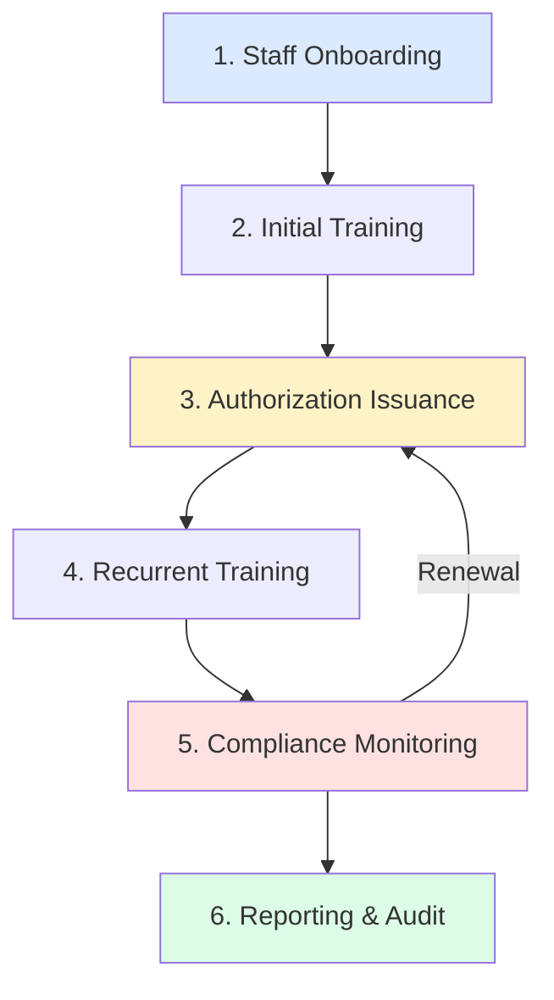

| # | กระบวนการ | ผู้รับผิดชอบ | วัตถุประสงค์ |
|---|---|---|---|
| 1 | Staff Onboarding | HR + QA Manager | บันทึกพนักงานใหม่เข้าระบบ |
| 2 | Initial Training | Trainer | ฝึกอบรมพื้นฐานก่อนออก Authorization |
| 3 | Authorization Issuance | QA Manager | ออก Authorization ให้ Certifying Staff |
| 4 | Recurrent Training | Trainer | Refresher training ตามรอบเวลา |
| 5 | Compliance Monitoring | CM Officer | ติดตามวันหมดอายุ + แจ้งเตือน |
| 6 | Reporting & Audit | QA Manager | สร้างรายงานสำหรับ Authority |

---

## 2. As-Is Process: กระบวนการปัจจุบัน

### 2.1 เครื่องมือที่ใช้อยู่

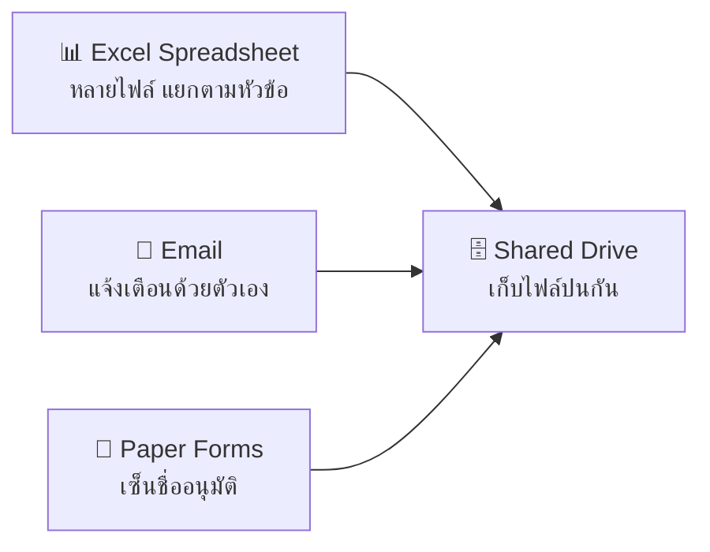

### 2.2 As-Is: Authorization Issuance

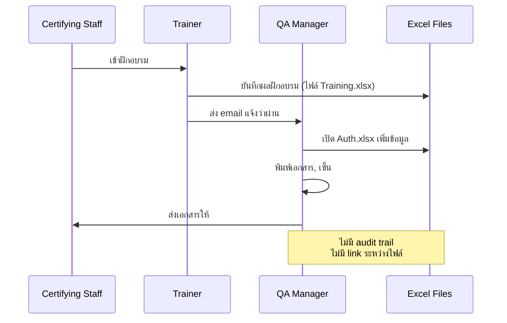

### 2.3 As-Is: Compliance Monitoring

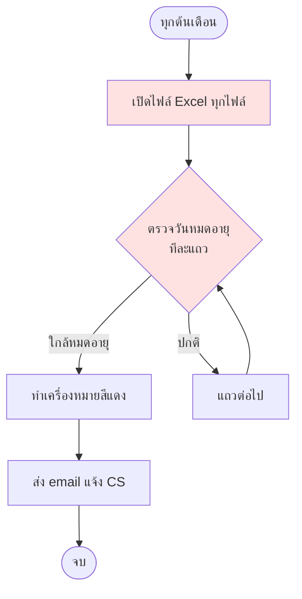

---

## 3. Pain Points

### 3.1 ปัญหาหลักที่พบ

| # | ปัญหา | ผลกระทบ | ความรุนแรง |
|---|---|---|---|
| P1 | ตรวจวันหมดอายุด้วยมือ ใช้เวลามาก | CM Officer ใช้เวลา 2-3 วัน/เดือน | 🔴 สูง |
| P2 | ไม่มี alert อัตโนมัติเมื่อใกล้หมดอายุ | พลาดวันหมดอายุ → CS ออก CRS ไม่ได้ | 🔴 สูง |
| P3 | ข้อมูลกระจายในหลายไฟล์ Excel | ข้อมูลขัดแย้งกัน, version control ยาก | 🟡 ปานกลาง |
| P4 | ไม่มี audit trail | ตรวจสอบย้อนหลังไม่ได้, audit ลำบาก | 🔴 สูง |
| P5 | ไม่รองรับ multi-customer concurrent | 18 สายการบินต้องเปิดทีละไฟล์ | 🟡 ปานกลาง |
| P6 | CRS eligibility ต้องคำนวณเอง | เกิด human error ได้สูง | 🔴 สูง |
| P7 | Report ต้องสร้างเอง ทุกครั้ง | ใช้เวลาในการเตรียม audit นาน | 🟡 ปานกลาง |
| P8 | ไม่มี role-based access | ทุกคนเห็นทุกอย่าง — risk ข้อมูลรั่ว | 🔴 สูง |

### 3.2 Root Cause Analysis

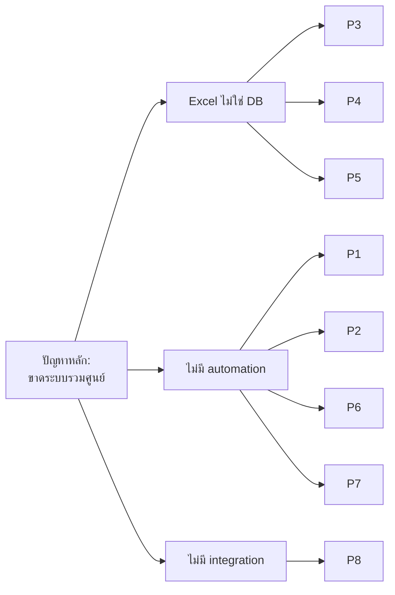

---

## 4. To-Be Process: กระบวนการใหม่

### 4.1 หลักการออกแบบ

| หลักการ | คำอธิบาย |
|---|---|
| **Single Source of Truth** | ข้อมูลทั้งหมดอยู่ใน DB เดียว, มี link ระหว่างกัน |
| **Automation First** | Automate alert, calculation, reporting |
| **Role-Based Access** | จำกัดสิทธิ์ตามตำแหน่ง |
| **Audit Trail** | บันทึกทุกการเปลี่ยนแปลง พร้อม timestamp + user |
| **Real-time Dashboard** | ผู้บริหารเห็นภาพรวมทันที |

### 4.2 To-Be: Authorization Issuance

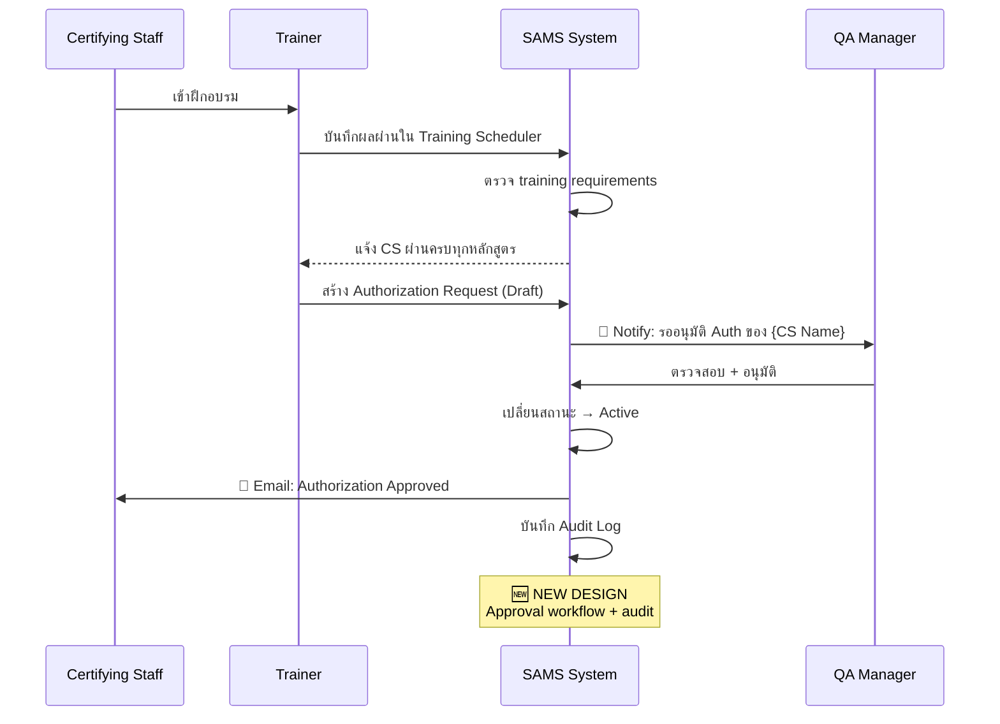

### 4.3 To-Be: Compliance Monitoring

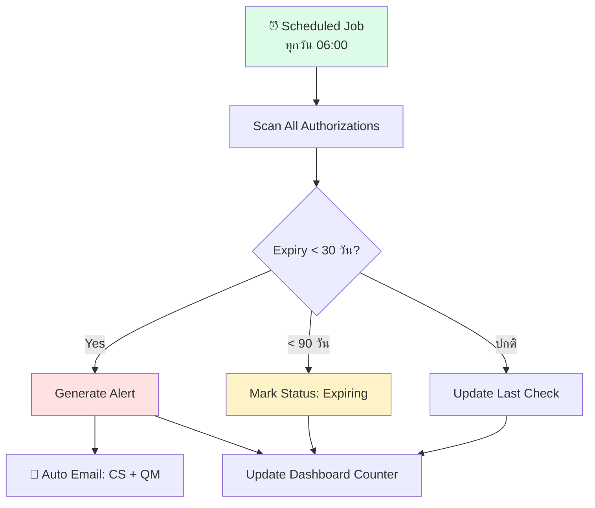

---

## 5. Process Flow แต่ละ Sub-module

### 5.1 Staff Management Flow

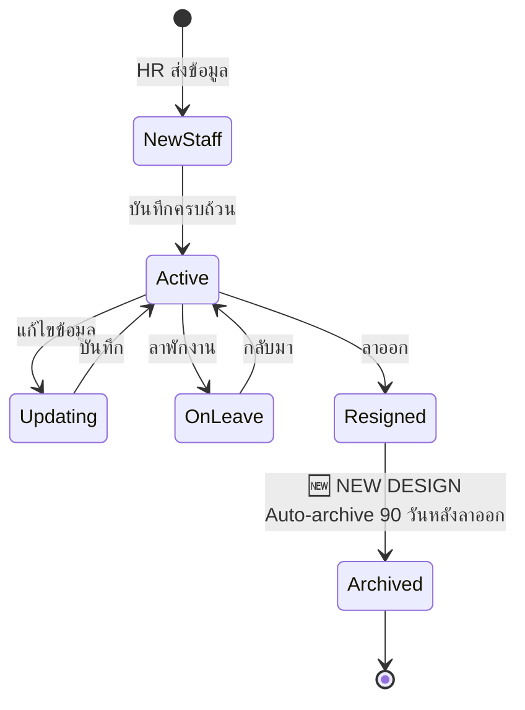

### 5.2 Authorization Lifecycle

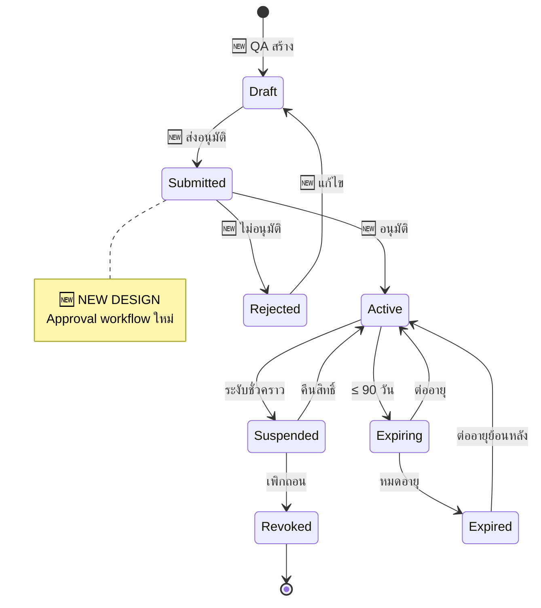

### 5.3 Training Compliance Flow

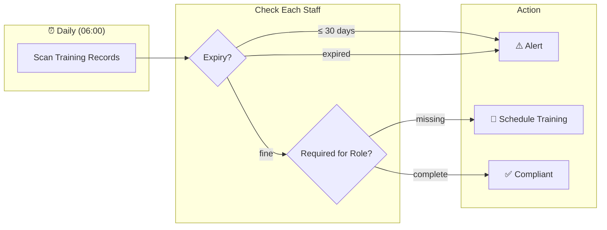

### 5.4 Course Management Flow

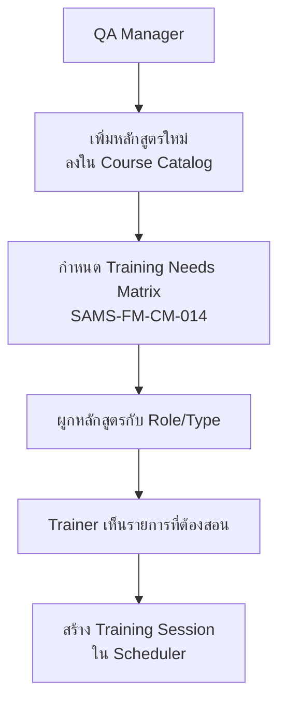

### 5.5 Training Scheduler Flow

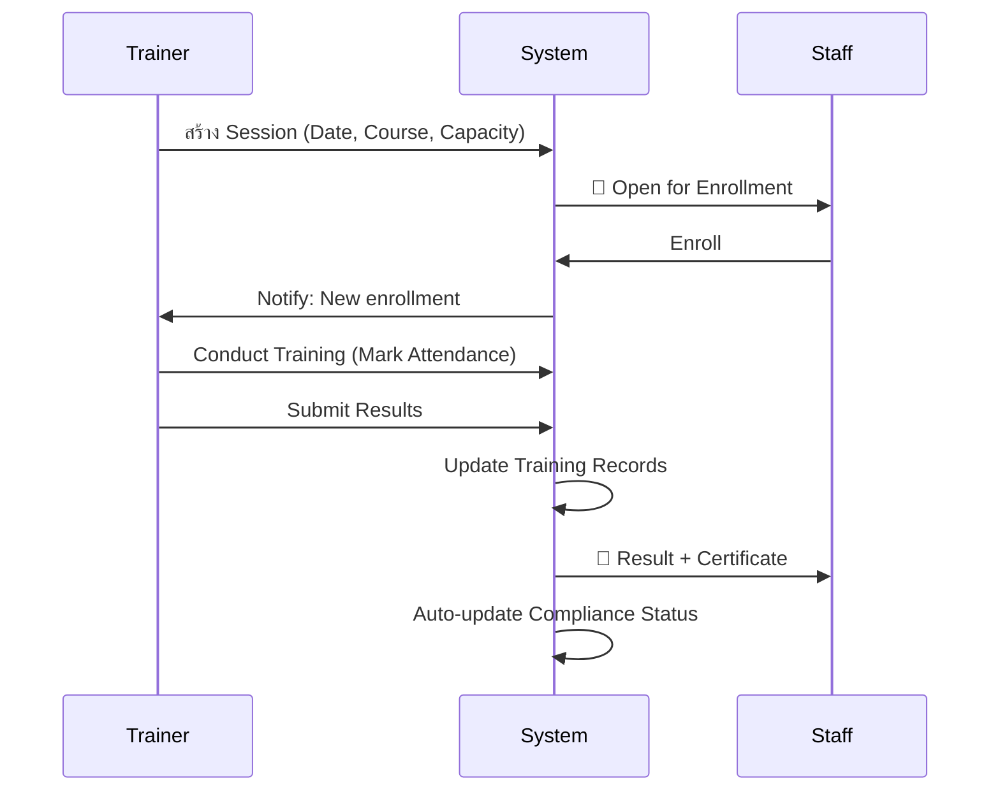

### 5.6 QA Dashboard (Read-only Aggregation)

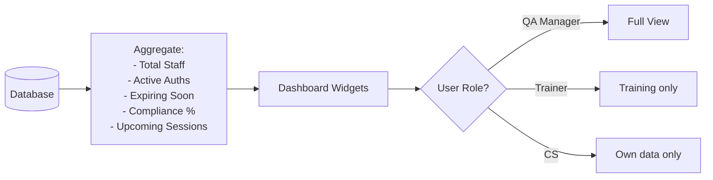

---

## 6. Cross-Process Dependencies

### 6.1 Data Flow ระหว่าง Sub-modules

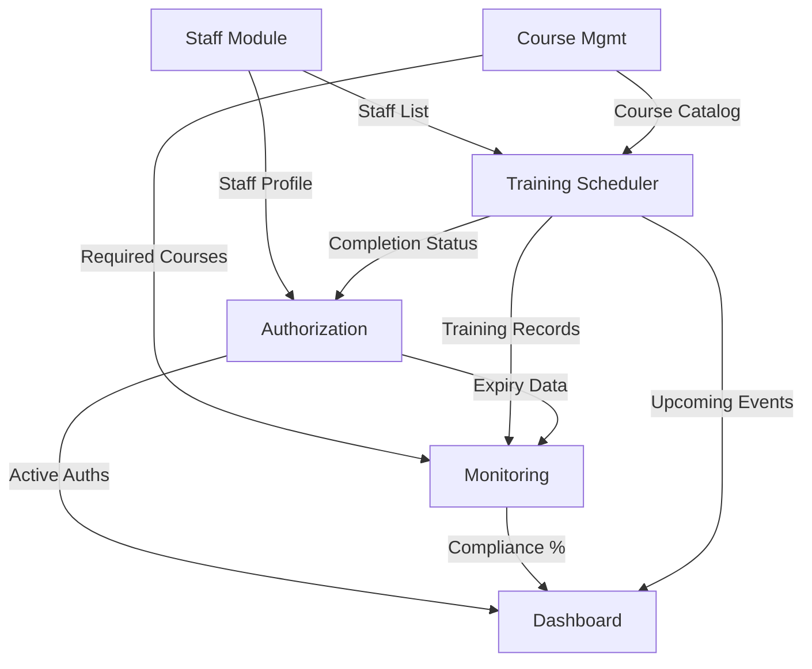

### 6.2 ตารางสรุป Trigger Events

| Trigger | ผลกระทบต่อ Module |
|---|---|
| Staff ลาออก | → Suspend ทุก Authorization → Cancel pending Training |
| Training ผ่าน | → Update Compliance % → Trigger Authorization eligibility check |
| Authorization Active | → Update Dashboard counter → Email confirmation |
| Authorization Expiring (30d) | → Alert → Suggest renewal training |
| Course เพิ่มใน Matrix | → Re-evaluate compliance ของ staff ที่เกี่ยวข้อง |
| Customer เพิ่มใหม่ | → Generate Customer Auth template |

### 6.3 Business Rules ที่ระบบต้อง Enforce

> 🆕 **[NEW DESIGN]** — กฎเหล่านี้ปัจจุบันใช้ความจำของ QA Manager ระบบใหม่จะ enforce อัตโนมัติ

| Rule ID | กฎ |
|---|---|
| BR-01 | CS ต้องมี SAMS Auth ที่ Active ก่อนจึงออก Customer Auth ได้ |
| BR-02 | Customer Auth ต้องไม่ extend เกิน SAMS Auth expiry |
| BR-03 | CRS Eligibility = SAMS Active + ≥1 Customer Active + Mandatory Training ครบ |
| BR-04 | Staff ที่ลาออกแล้ว → Auto-suspend ทุก Authorization |
| BR-05 | Training expiry ≤ 30 days → Auto-alert CS + Trainer + QA Manager |
| BR-06 | ห้ามแก้ไข Training Record ที่ approved แล้ว ต้องสร้าง Amendment record |

---

*— จบเอกสาร SAMS-QA-SRS-02 —*
