# SAMS-QA-SRS-02 — Business Process
## ระบบ SAMS: โมดูล Quality Assurance (QA)

| รายการ | รายละเอียด |
|---|---|
| **Document No.** | SAMS-QA-SRS-02 |
| **Module** | Quality Assurance (QA) |
| **เวอร์ชัน** | 1.0 |
| **วันที่จัดทำ** | 2026-04-27 |
| **จัดทำโดย** | Triple-T Development Team |

---

## Revision History

| เวอร์ชัน | วันที่ | ผู้จัดทำ | รายละเอียด |
|---|---|---|---|
| 1.0 | 2026-04-27 | Triple-T Dev | ร่างแรก |

---

## สารบัญ

1. [ภาพรวมกระบวนการธุรกิจ](#1-ภาพรวมกระบวนการธุรกิจ)
2. [As-Is Process: กระบวนการปัจจุบัน](#2-as-is-process-กระบวนการปัจจุบัน)
3. [Pain Points](#3-pain-points)
4. [To-Be Process: กระบวนการใหม่](#4-to-be-process-กระบวนการใหม่)
5. [Process Flow แต่ละ Sub-module](#5-process-flow-แต่ละ-sub-module)
6. [Cross-Process Dependencies](#6-cross-process-dependencies)
7. [Process Metrics & KPI](#7-process-metrics--kpi)
8. [Exception Flow](#8-exception-flow)

---

## 1. ภาพรวมกระบวนการธุรกิจ

QA Module ครอบคลุมกระบวนการธุรกิจหลัก **6 กระบวนการ** ที่เชื่อมโยงกัน:

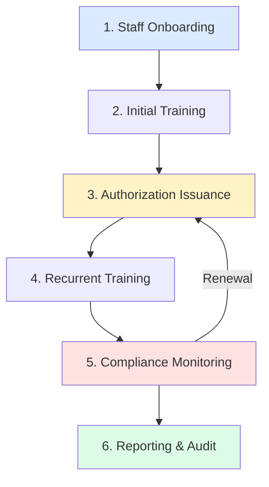
```mermaid
graph TB
    A[1. Staff Onboarding] --> B[2. Initial Training]
    B --> C[3. Authorization Issuance]
    C --> D[4. Recurrent Training]
    D --> E[5. Compliance Monitoring]
    E -->|Renewal| C
    E --> F[6. Reporting & Audit]
    
    style A fill:#dbeafe
    style C fill:#fef3c7
    style E fill:#fee2e2
    style F fill:#dcfce7
```

| # | กระบวนการ | ผู้รับผิดชอบ | วัตถุประสงค์ |
|---|---|---|---|
| 1 | Staff Onboarding | HR + QA Manager | บันทึกพนักงานใหม่เข้าระบบ |
| 2 | Initial Training | Trainer | ฝึกอบรมพื้นฐานก่อนออก Authorization |
| 3 | Authorization Issuance | QA Manager | ออก Authorization ให้ Certifying Staff |
| 4 | Recurrent Training | Trainer | Refresher training ตามรอบเวลา |
| 5 | Compliance Monitoring | CM Officer | ติดตามวันหมดอายุ + แจ้งเตือน |
| 6 | Reporting & Audit | QA Manager | สร้างรายงานสำหรับ Authority |

---

## 2. As-Is Process: กระบวนการปัจจุบัน

### 2.1 เครื่องมือที่ใช้อยู่

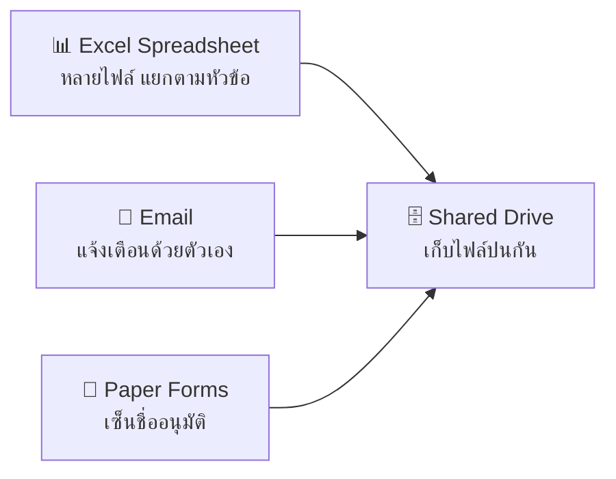
```mermaid
graph LR
    EXCEL[📊 Excel Spreadsheet<br/>หลายไฟล์ แยกตามหัวข้อ]
    EMAIL[📧 Email<br/>แจ้งเตือนด้วยตัวเอง]
    PAPER[📄 Paper Forms<br/>เซ็นชื่ออนุมัติ]
    SHARE[🗄️ Shared Drive<br/>เก็บไฟล์ปนกัน]
    
    EXCEL --> SHARE
    EMAIL --> SHARE
    PAPER --> SHARE
```

### 2.2 As-Is: Authorization Issuance

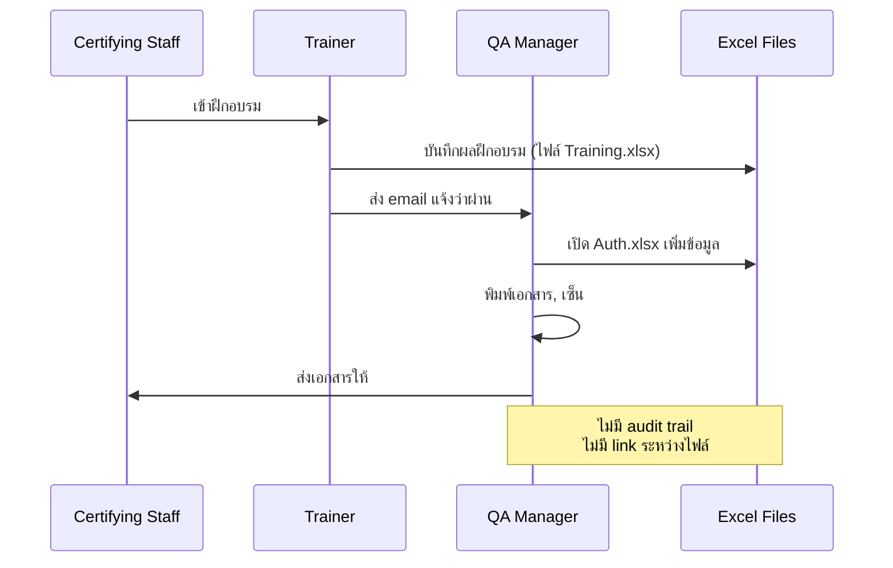
```mermaid
sequenceDiagram
    participant CS as Certifying Staff
    participant TR as Trainer
    participant QM as QA Manager
    participant XLS as Excel Files
    
    CS->>TR: เข้าฝึกอบรม
    TR->>XLS: บันทึกผลฝึกอบรม (ไฟล์ Training.xlsx)
    TR->>QM: ส่ง email แจ้งว่าผ่าน
    QM->>XLS: เปิด Auth.xlsx เพิ่มข้อมูล
    QM->>QM: พิมพ์เอกสาร, เซ็น
    QM->>CS: ส่งเอกสารให้
    Note over QM,XLS: ไม่มี audit trail<br/>ไม่มี link ระหว่างไฟล์
```

### 2.3 As-Is: Compliance Monitoring

```mermaid
flowchart TD
    START([ทุกต้นเดือน]) --> OPEN[เปิดไฟล์ Excel ทุกไฟล์]
    OPEN --> CHECK{ตรวจวันหมดอายุ<br/>ทีละแถว}
    CHECK -->|ใกล้หมดอายุ| MARK[ทำเครื่องหมายสีแดง]
    CHECK -->|ปกติ| NEXT[แถวต่อไป]
    MARK --> EMAIL[ส่ง email แจ้ง CS]
    NEXT --> CHECK
    EMAIL --> END([จบ])
    
    style OPEN fill:#fee2e2
    style CHECK fill:#fee2e2
```

---

## 3. Pain Points

### 3.1 ปัญหาหลักที่พบ

| # | ปัญหา | ผลกระทบ | ความรุนแรง |
|---|---|---|---|
| P1 | ตรวจวันหมดอายุด้วยมือ ใช้เวลามาก | CM Officer ใช้เวลา 2-3 วัน/เดือน | 🔴 สูง |
| P2 | ไม่มี alert อัตโนมัติเมื่อใกล้หมดอายุ | พลาดวันหมดอายุ → CS ออก CRS ไม่ได้ | 🔴 สูง |
| P3 | ข้อมูลกระจายในหลายไฟล์ Excel | ข้อมูลขัดแย้งกัน, version control ยาก | 🟡 ปานกลาง |
| P4 | ไม่มี audit trail | ตรวจสอบย้อนหลังไม่ได้, audit ลำบาก | 🔴 สูง |
| P5 | ไม่รองรับ multi-customer concurrent | 18 สายการบินต้องเปิดทีละไฟล์ | 🟡 ปานกลาง |
| P6 | CRS eligibility ต้องคำนวณเอง | เกิด human error ได้สูง | 🔴 สูง |
| P7 | Report ต้องสร้างเอง ทุกครั้ง | ใช้เวลาในการเตรียม audit นาน | 🟡 ปานกลาง |
| P8 | ไม่มี role-based access | ทุกคนเห็นทุกอย่าง — risk ข้อมูลรั่ว | 🔴 สูง |

### 3.2 Root Cause Analysis

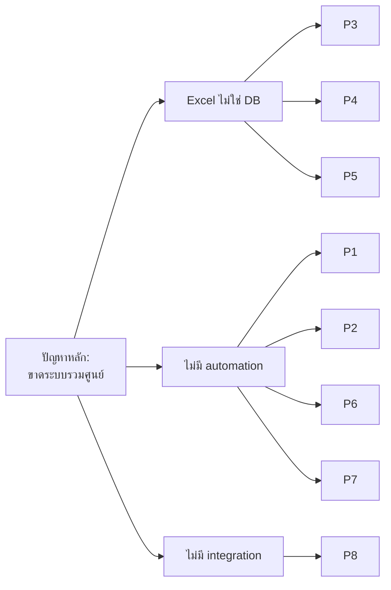
```mermaid
graph LR
    ROOT[ปัญหาหลัก:<br/>ขาดระบบรวมศูนย์]
    ROOT --> R1[Excel ไม่ใช่ DB]
    ROOT --> R2[ไม่มี automation]
    ROOT --> R3[ไม่มี integration]
    R1 --> P3 & P4 & P5
    R2 --> P1 & P2 & P6 & P7
    R3 --> P8
```

---

## 4. To-Be Process: กระบวนการใหม่

### 4.1 หลักการออกแบบ

| หลักการ | คำอธิบาย |
|---|---|
| **Single Source of Truth** | ข้อมูลทั้งหมดอยู่ใน DB เดียว, มี link ระหว่างกัน |
| **Automation First** | Automate alert, calculation, reporting |
| **Role-Based Access** | จำกัดสิทธิ์ตามตำแหน่ง |
| **Audit Trail** | บันทึกทุกการเปลี่ยนแปลง พร้อม timestamp + user |
| **Real-time Dashboard** | ผู้บริหารเห็นภาพรวมทันที |

### 4.2 To-Be: Authorization Issuance

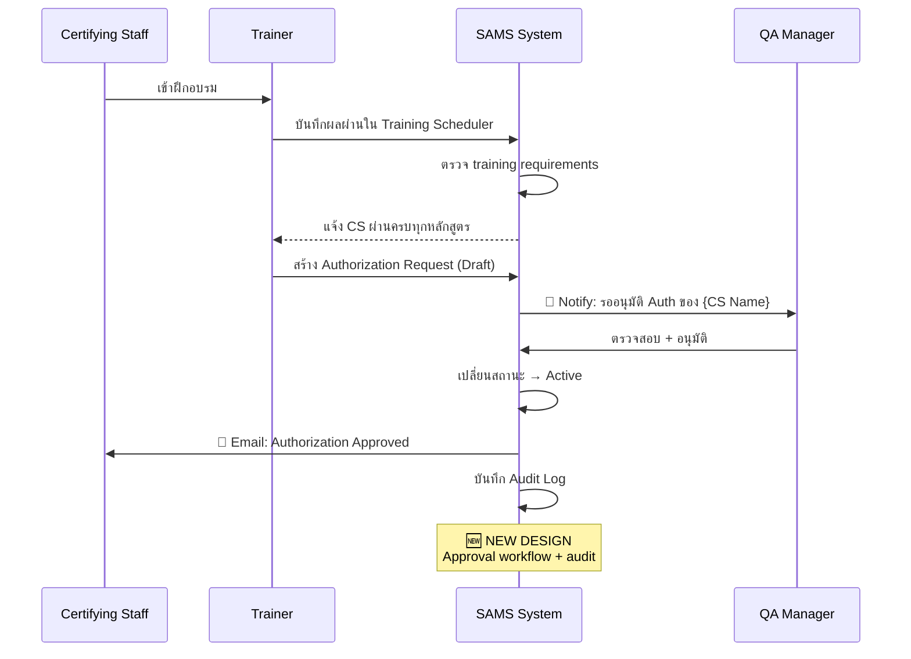
```mermaid
sequenceDiagram
    participant CS as Certifying Staff
    participant TR as Trainer
    participant SYS as SAMS System
    participant QM as QA Manager
    
    CS->>TR: เข้าฝึกอบรม
    TR->>SYS: บันทึกผลผ่านใน Training Scheduler
    SYS->>SYS: ตรวจ training requirements
    SYS-->>TR: แจ้ง CS ผ่านครบทุกหลักสูตร
    TR->>SYS: สร้าง Authorization Request (Draft)
    SYS->>QM: 🔔 Notify: รออนุมัติ Auth ของ {CS Name}
    QM->>SYS: ตรวจสอบ + อนุมัติ
    SYS->>SYS: เปลี่ยนสถานะ → Active
    SYS->>CS: 📧 Email: Authorization Approved
    SYS->>SYS: บันทึก Audit Log
    Note over SYS: 🆕 NEW DESIGN<br/>Approval workflow + audit
```

### 4.3 To-Be: Compliance Monitoring

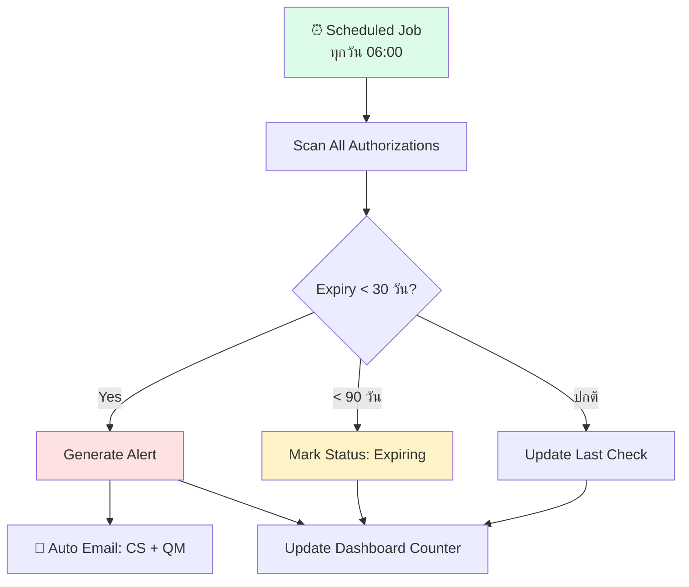
```mermaid
flowchart TD
    SCHED[⏰ Scheduled Job<br/>ทุกวัน 06:00] --> SCAN[Scan All Authorizations]
    SCAN --> CHECK{Expiry < 30 วัน?}
    CHECK -->|Yes| ALERT[Generate Alert]
    CHECK -->|< 90 วัน| WARN[Mark Status: Expiring]
    CHECK -->|ปกติ| LOG[Update Last Check]
    ALERT --> EMAIL[📧 Auto Email: CS + QM]
    ALERT --> DASH[Update Dashboard Counter]
    WARN --> DASH
    LOG --> DASH
    
    style SCHED fill:#dcfce7
    style ALERT fill:#fee2e2
    style WARN fill:#fef3c7
```

---

## 5. Process Flow แต่ละ Sub-module

### 5.1 Staff Management Flow

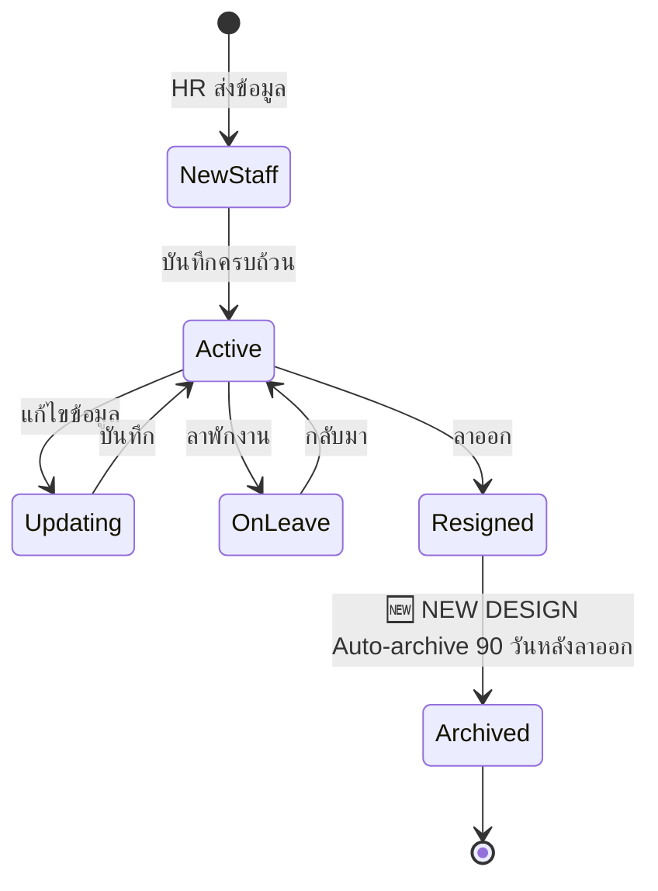
```mermaid
stateDiagram-v2
    [*] --> NewStaff: HR ส่งข้อมูล
    NewStaff --> Active: บันทึกครบถ้วน
    Active --> Updating: แก้ไขข้อมูล
    Updating --> Active: บันทึก
    Active --> OnLeave: ลาพักงาน
    OnLeave --> Active: กลับมา
    Active --> Resigned: ลาออก
    Resigned --> Archived: 🆕 NEW DESIGN<br/>Auto-archive 90 วันหลังลาออก
    Archived --> [*]
```

### 5.2 Authorization Lifecycle

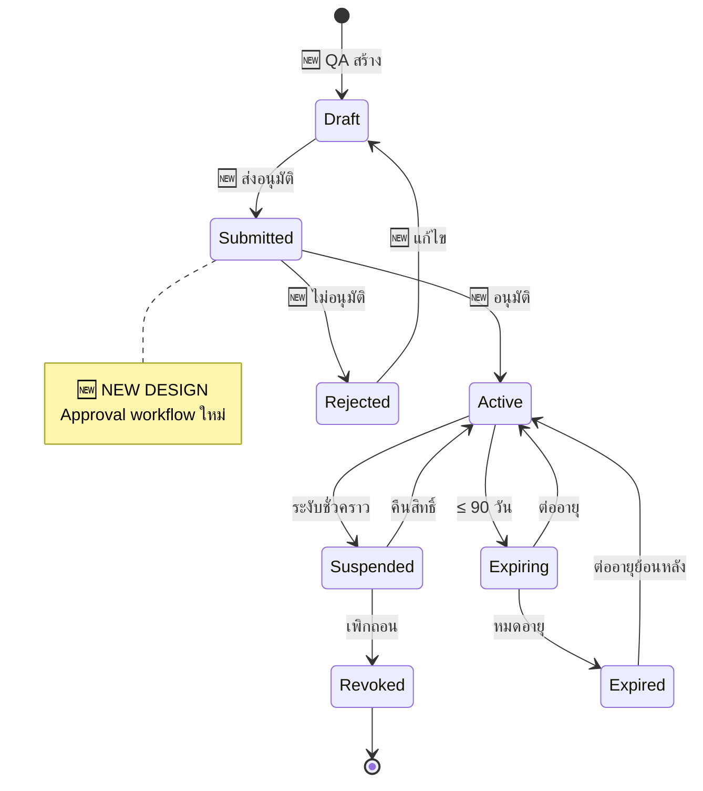
```mermaid
stateDiagram-v2
    [*] --> Draft: 🆕 QA สร้าง
    Draft --> Submitted: 🆕 ส่งอนุมัติ
    Submitted --> Active: 🆕 อนุมัติ
    Submitted --> Rejected: 🆕 ไม่อนุมัติ
    Rejected --> Draft: 🆕 แก้ไข
    Active --> Expiring: ≤ 90 วัน
    Active --> Suspended: ระงับชั่วคราว
    Suspended --> Active: คืนสิทธิ์
    Suspended --> Revoked: เพิกถอน
    Expiring --> Active: ต่ออายุ
    Expiring --> Expired: หมดอายุ
    Expired --> Active: ต่ออายุย้อนหลัง
    Revoked --> [*]
    
    note right of Submitted: 🆕 NEW DESIGN<br/>Approval workflow ใหม่
```

### 5.3 Training Compliance Flow

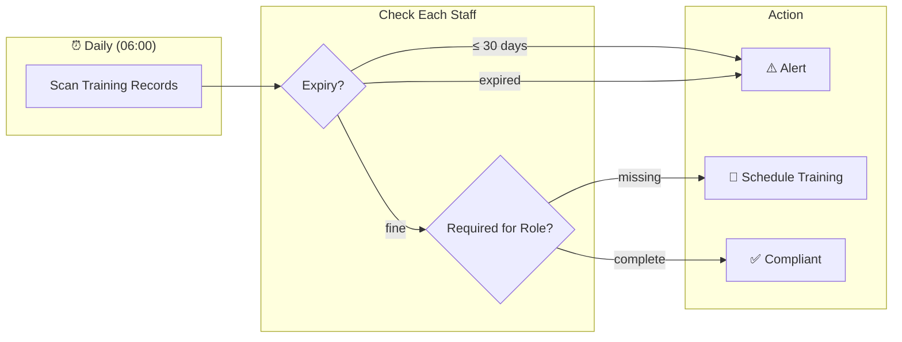
```mermaid
flowchart LR
    subgraph DAILY["⏰ Daily (06:00)"]
        SCAN[Scan Training Records]
    end
    
    subgraph CHECK["Check Each Staff"]
        EXP{Expiry?}
        REQ{Required for Role?}
    end
    
    subgraph ACTION["Action"]
        OK[✅ Compliant]
        ALERT[⚠️ Alert]
        SCHED_TRAIN[📅 Schedule Training]
    end
    
    SCAN --> EXP
    EXP -->|≤ 30 days| ALERT
    EXP -->|expired| ALERT
    EXP -->|fine| REQ
    REQ -->|missing| SCHED_TRAIN
    REQ -->|complete| OK
```

### 5.4 Course Management Flow

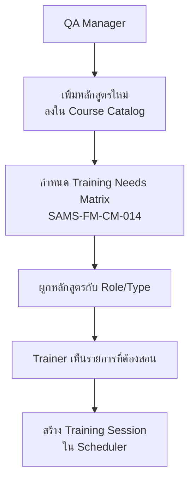
```mermaid
flowchart TD
    A[QA Manager] --> B[เพิ่มหลักสูตรใหม่<br/>ลงใน Course Catalog]
    B --> C[กำหนด Training Needs Matrix<br/>SAMS-FM-CM-014]
    C --> D[ผูกหลักสูตรกับ Role/Type]
    D --> E[Trainer เห็นรายการที่ต้องสอน]
    E --> F[สร้าง Training Session<br/>ใน Scheduler]
```

### 5.5 Training Scheduler Flow

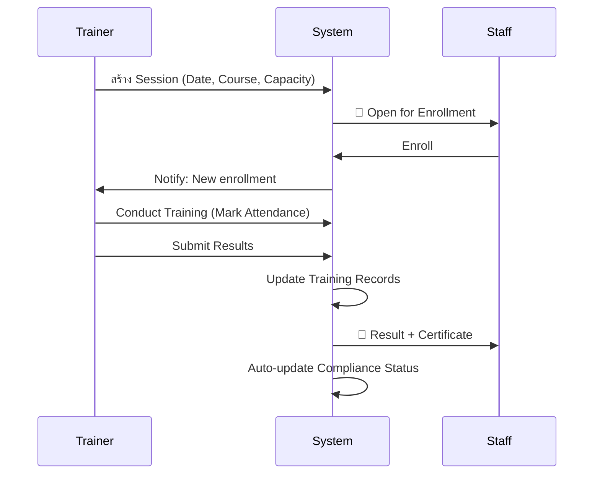
```mermaid
sequenceDiagram
    participant TR as Trainer
    participant SYS as System
    participant CS as Staff
    
    TR->>SYS: สร้าง Session (Date, Course, Capacity)
    SYS->>CS: 🔔 Open for Enrollment
    CS->>SYS: Enroll
    SYS->>TR: Notify: New enrollment
    TR->>SYS: Conduct Training (Mark Attendance)
    TR->>SYS: Submit Results
    SYS->>SYS: Update Training Records
    SYS->>CS: 📧 Result + Certificate
    SYS->>SYS: Auto-update Compliance Status
```

### 5.6 QA Dashboard (Read-only Aggregation)

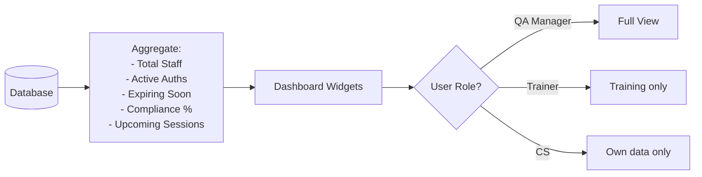
```mermaid
graph LR
    DB[(Database)] --> A[Aggregate:<br/>- Total Staff<br/>- Active Auths<br/>- Expiring Soon<br/>- Compliance %<br/>- Upcoming Sessions]
    A --> DASH[Dashboard Widgets]
    DASH --> ROLE{User Role?}
    ROLE -->|QA Manager| FULL[Full View]
    ROLE -->|Trainer| TRAINING[Training only]
    ROLE -->|CS| OWN[Own data only]
```

---

## 6. Cross-Process Dependencies

### 6.1 Data Flow ระหว่าง Sub-modules

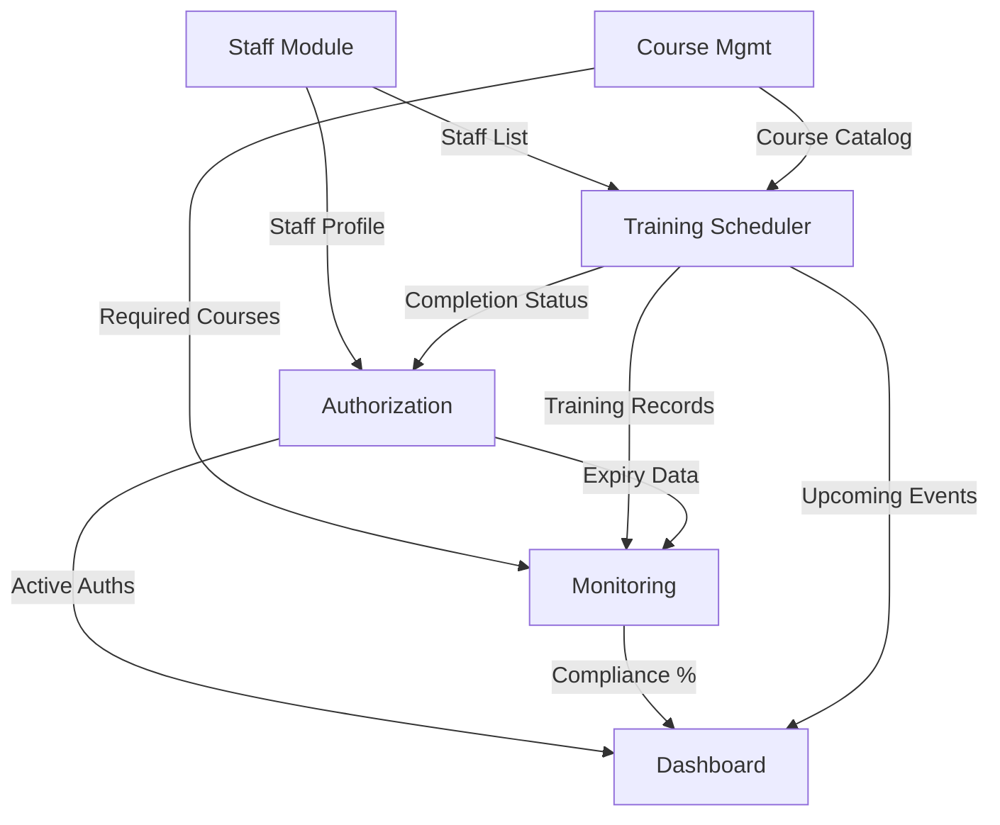
```mermaid
graph TB
    STAFF[Staff Module]
    COURSE[Course Mgmt]
    SCHED[Training Scheduler]
    AUTH[Authorization]
    MON[Monitoring]
    DASH[Dashboard]
    
    STAFF -->|Staff List| SCHED
    STAFF -->|Staff Profile| AUTH
    COURSE -->|Course Catalog| SCHED
    COURSE -->|Required Courses| MON
    SCHED -->|Training Records| MON
    SCHED -->|Completion Status| AUTH
    AUTH -->|Expiry Data| MON
    AUTH -->|Active Auths| DASH
    MON -->|Compliance %| DASH
    SCHED -->|Upcoming Events| DASH
```

### 6.2 ตารางสรุป Trigger Events

| Trigger | ผลกระทบต่อ Module |
|---|---|
| Staff ลาออก | → Suspend ทุก Authorization → Cancel pending Training |
| Training ผ่าน | → Update Compliance % → Trigger Authorization eligibility check |
| Authorization Active | → Update Dashboard counter → Email confirmation |
| Authorization Expiring (30d) | → Alert → Suggest renewal training |
| Course เพิ่มใน Matrix | → Re-evaluate compliance ของ staff ที่เกี่ยวข้อง |
| Customer เพิ่มใหม่ | → Generate Customer Auth template |

### 6.3 Business Rules ที่ระบบต้อง Enforce

> 🆕 **[NEW DESIGN]** — กฎเหล่านี้ปัจจุบันใช้ความจำของ QA Manager ระบบใหม่จะ enforce อัตโนมัติ

| Rule ID | กฎ |
|---|---|
| BR-01 | CS ต้องมี SAMS Auth ที่ Active ก่อนจึงออก Customer Auth ได้ |
| BR-02 | Customer Auth ต้องไม่ extend เกิน SAMS Auth expiry |
| BR-03 | CRS Eligibility = SAMS Active + ≥1 Customer Active + Mandatory Training ครบ |
| BR-04 | Staff ที่ลาออกแล้ว → Auto-suspend ทุก Authorization |
| BR-05 | Training expiry ≤ 30 days → Auto-alert CS + Trainer + QA Manager |
| BR-06 | ห้ามแก้ไข Training Record ที่ approved แล้ว ต้องสร้าง Amendment record |

---

## 7. Process Metrics & KPI

### 7.1 KPI หลักของแต่ละ Sub-module

#### Staff Management

| KPI | คำอธิบาย | Target | วิธีวัด |
|---|---|---|---|
| Staff Record Completeness | % พนักงานที่มีข้อมูลครบถ้วน (License, Medical, Training) | ≥ 95% | นับ record ที่ไม่มี null field สำคัญ / ทั้งหมด |
| Onboarding Lead Time | เวลาเฉลี่ยตั้งแต่รับเข้าถึงระบบ Active | ≤ 3 วันทำการ | วันที่ Active − วันที่ HR ส่งข้อมูล |
| Archive Compliance | % พนักงานลาออกที่ถูก Archive ตามกำหนด 90 วัน | 100% | Auto-check ทุกวัน |

#### Authorization Management

| KPI | คำอธิบาย | Target | วิธีวัด |
|---|---|---|---|
| Authorization Approval Time | เวลาเฉลี่ยจาก Submitted → Active | ≤ 3 วันทำการ | วันที่ Active − วันที่ Submitted |
| Authorization Expiry Rate | % Authorization ที่หมดอายุโดยไม่ได้ต่ออายุ | ≤ 2% | นับ Expired / ทั้งหมด ต่อเดือน |
| Active Authorization Coverage | % Certifying Staff ที่มี Authorization Active | ≥ 98% | นับ CS ที่ Active / CS ทั้งหมด |
| CRS Eligibility Rate | % CS ที่มีสิทธิ์ออก CRS | ≥ 90% | นับ isCrsEligible = true / CS ทั้งหมด |
| Customer Auth Coverage | จำนวน Customer ที่ CS แต่ละคนครอบคลุม | ตามแผน | Average customer auth per CS |

#### Compliance Monitoring

| KPI | คำอธิบาย | Target | วิธีวัด |
|---|---|---|---|
| Alert Response Time | เวลาเฉลี่ยที่ QA จัดการ Alert หลังได้รับ | ≤ 5 วันทำการ | วันที่แก้ไข − วันที่ Alert สร้าง |
| Expiring Authorization (30d) | จำนวน Authorization ที่จะหมดอายุใน 30 วัน | = 0 (ไม่มีรายการค้าง) | Dashboard counter |
| System Uptime (Monitoring Job) | % เวลาที่ Daily Job ทำงานสำเร็จ | ≥ 99.5% | Job log success / total runs |
| False Alert Rate | % Alert ที่เกิดจาก data ผิดพลาด | ≤ 1% | นับ Alert ที่ถูก dismiss ว่า invalid |

#### Course Management

| KPI | คำอธิบาย | Target | วิธีวัด |
|---|---|---|---|
| Training Matrix Coverage | % Role ที่มีหลักสูตรครบตาม CAAT requirement | 100% | นับ Role-Course mapping / requirement |
| Course Catalog Completeness | % หลักสูตรที่มีรายละเอียดครบ (วัตถุประสงค์, ระยะเวลา, Validity) | ≥ 95% | นับ course ที่ field ครบ |

#### Training Scheduler

| KPI | คำอธิบาย | Target | วิธีวัด |
|---|---|---|---|
| Training Pass Rate | % ผู้เข้าอบรมที่ผ่าน per session | ≥ 85% | นับ Passed / Total enrolled |
| Session Utilization Rate | % ที่นั่งที่ถูกใช้จริง / ที่นั่งทั้งหมด | ≥ 70% | นับ Attended / Capacity |
| Training Completion Rate | % Staff ที่ทำ Training ครบตาม Matrix รายปี | ≥ 95% | นับ Staff ที่ passed all required / ทั้งหมด |
| Result Entry Lead Time | เวลาเฉลี่ยที่ Trainer บันทึกผลหลัง Training เสร็จ | ≤ 1 วันทำการ | วันที่บันทึก − วันที่ training |

#### QA Dashboard

| KPI | คำอธิบาย | Target | วิธีวัด |
|---|---|---|---|
| Dashboard Load Time | เวลาโหลด Dashboard | ≤ 3 วินาที | Frontend performance log |
| Data Freshness | ความล่าช้าของข้อมูลบน Dashboard | ≤ 1 ชั่วโมง | Timestamp last updated |

---

### 7.2 KPI ระดับ Organization (Cross-module)

| KPI | คำอธิบาย | Target | ความถี่รายงาน |
|---|---|---|---|
| Overall Compliance Rate | % Staff ที่ compliant ทั้ง Training + Authorization | ≥ 95% | รายเดือน |
| Audit Readiness Score | % เอกสารที่พร้อม audit (ครบ, ถูกต้อง, ทันสมัย) | ≥ 98% | รายไตรมาส |
| Time Saved vs As-Is | ชั่วโมง/เดือนที่ประหยัดได้เทียบกับ Excel | ≥ 40 ชม./เดือน | รายไตรมาส |
| System Adoption Rate | % User ที่ใช้ระบบจริง (login ≥ 1 ครั้ง/สัปดาห์) | ≥ 90% | รายเดือน |
| Data Accuracy Rate | % record ที่ถูกต้องเทียบกับเอกสารต้นฉบับ | ≥ 99% | รายไตรมาส (sample audit) |

---

### 7.3 Measurement Dashboard (ตำแหน่งแสดงผล)

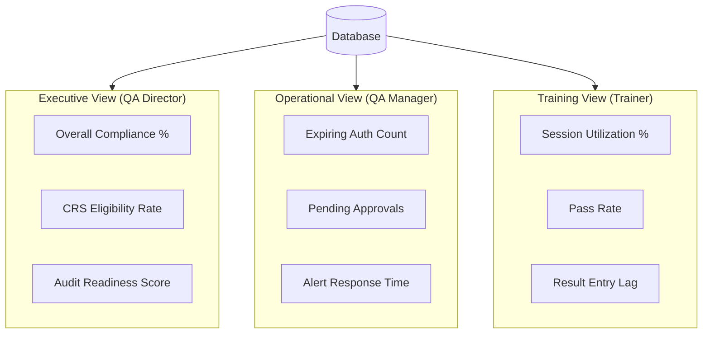
```mermaid
graph TB
    subgraph EXEC["Executive View (QA Director)"]
        K1[Overall Compliance %]
        K2[CRS Eligibility Rate]
        K3[Audit Readiness Score]
    end

    subgraph OPS["Operational View (QA Manager)"]
        K4[Expiring Auth Count]
        K5[Pending Approvals]
        K6[Alert Response Time]
    end

    subgraph TRAIN["Training View (Trainer)"]
        K7[Session Utilization %]
        K8[Pass Rate]
        K9[Result Entry Lag]
    end

    DB[(Database)] --> EXEC & OPS & TRAIN
```

---

### 7.4 Baseline & Target (เปรียบ As-Is vs To-Be)

| KPI | As-Is (ปัจจุบัน) | To-Be (Target) | ปรับปรุง |
|---|---|---|---|
| เวลาตรวจ Compliance รายเดือน | 2–3 วัน/เดือน (manual) | อัตโนมัติ ทุกวัน | ลด 100% manual effort |
| เวลาออก Authorization | 5–7 วันทำการ | ≤ 3 วันทำการ | ลด 50% |
| Authorization หมดอายุโดยไม่รู้ตัว | เกิดขึ้นบ่อย | ≤ 2% | ลด > 90% |
| เวลาเตรียมรายงาน Audit | 3–5 วัน/ครั้ง | ≤ 1 วัน (auto-generate) | ลด 70–80% |
| Data entry errors | ~5% (manual Excel) | ≤ 1% | ลด 80% |

---

## 8. Exception Flow

Exception Flow คือกระบวนการที่เกิดขึ้นเมื่อ **กระบวนการหลัก (Happy Path) ไม่สามารถดำเนินต่อได้** ระบบต้องรองรับทุก exception และมีแนวทางแก้ไขที่ชัดเจน

---

### 8.1 Staff Management — Exception Flow

#### EX-S01: ข้อมูลพนักงานไม่ครบถ้วน

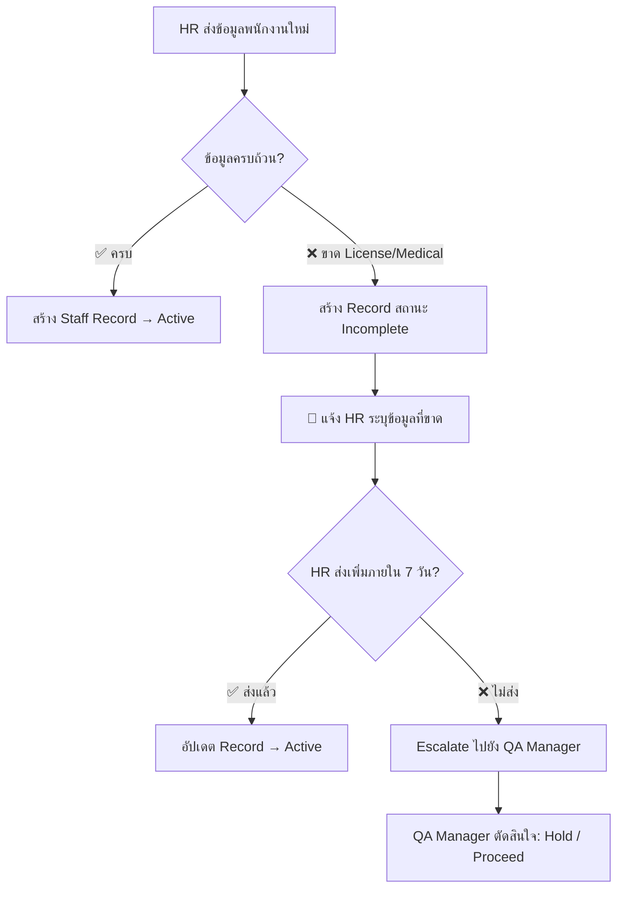
```mermaid
flowchart TD
    A[HR ส่งข้อมูลพนักงานใหม่] --> B{ข้อมูลครบถ้วน?}
    B -->|✅ ครบ| C[สร้าง Staff Record → Active]
    B -->|❌ ขาด License/Medical| D[สร้าง Record สถานะ Incomplete]
    D --> E[🔔 แจ้ง HR ระบุข้อมูลที่ขาด]
    E --> F{HR ส่งเพิ่มภายใน 7 วัน?}
    F -->|✅ ส่งแล้ว| G[อัปเดต Record → Active]
    F -->|❌ ไม่ส่ง| H[Escalate ไปยัง QA Manager]
    H --> I[QA Manager ตัดสินใจ: Hold / Proceed]
```

| Exception | การจัดการ | ผู้รับผิดชอบ |
|---|---|---|
| License หมดอายุตั้งแต่วันแรก | บันทึกได้ แต่ Mark: Invalid License | QA Manager |
| Duplicate Employee ID | Block การบันทึก + แจ้ง HR | System |
| Medical Certificate หมดอายุ | Warning + แจ้ง Staff ต่ออายุ | CM Officer |

---

#### EX-S02: Staff ลาออกระหว่างมี Active Authorization

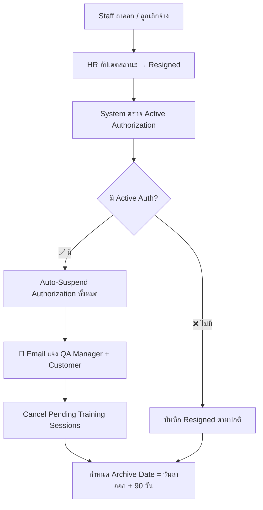
```mermaid
flowchart TD
    A[Staff ลาออก / ถูกเลิกจ้าง] --> B[HR อัปเดตสถานะ → Resigned]
    B --> C[System ตรวจ Active Authorization]
    C --> D{มี Active Auth?}
    D -->|✅ มี| E[Auto-Suspend Authorization ทั้งหมด]
    D -->|❌ ไม่มี| F[บันทึก Resigned ตามปกติ]
    E --> G[📧 Email แจ้ง QA Manager + Customer]
    G --> H[Cancel Pending Training Sessions]
    H --> I[กำหนด Archive Date = วันลาออก + 90 วัน]
    F --> I
```

---

### 8.2 Authorization Management — Exception Flow

#### EX-A01: Authorization ถูก Reject

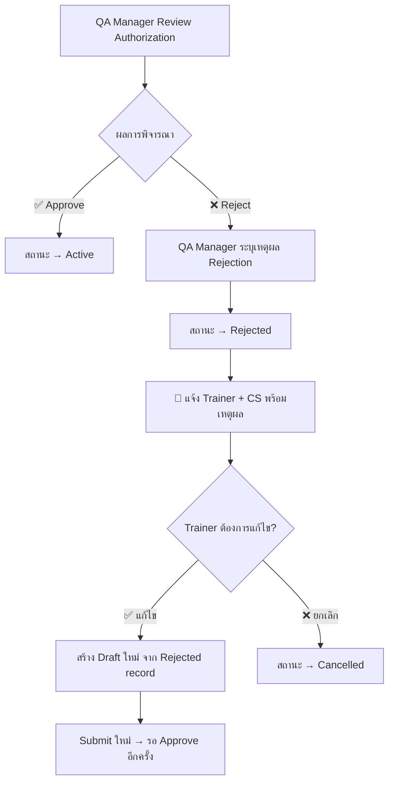
```mermaid
flowchart TD
    A[QA Manager Review Authorization] --> B{ผลการพิจารณา}
    B -->|✅ Approve| C[สถานะ → Active]
    B -->|❌ Reject| D[QA Manager ระบุเหตุผล Rejection]
    D --> E[สถานะ → Rejected]
    E --> F[🔔 แจ้ง Trainer + CS พร้อมเหตุผล]
    F --> G{Trainer ต้องการแก้ไข?}
    G -->|✅ แก้ไข| H[สร้าง Draft ใหม่ จาก Rejected record]
    G -->|❌ ยกเลิก| I[สถานะ → Cancelled]
    H --> J[Submit ใหม่ → รอ Approve อีกครั้ง]
```

#### EX-A02: Authorization หมดอายุโดยไม่ได้ต่ออายุ

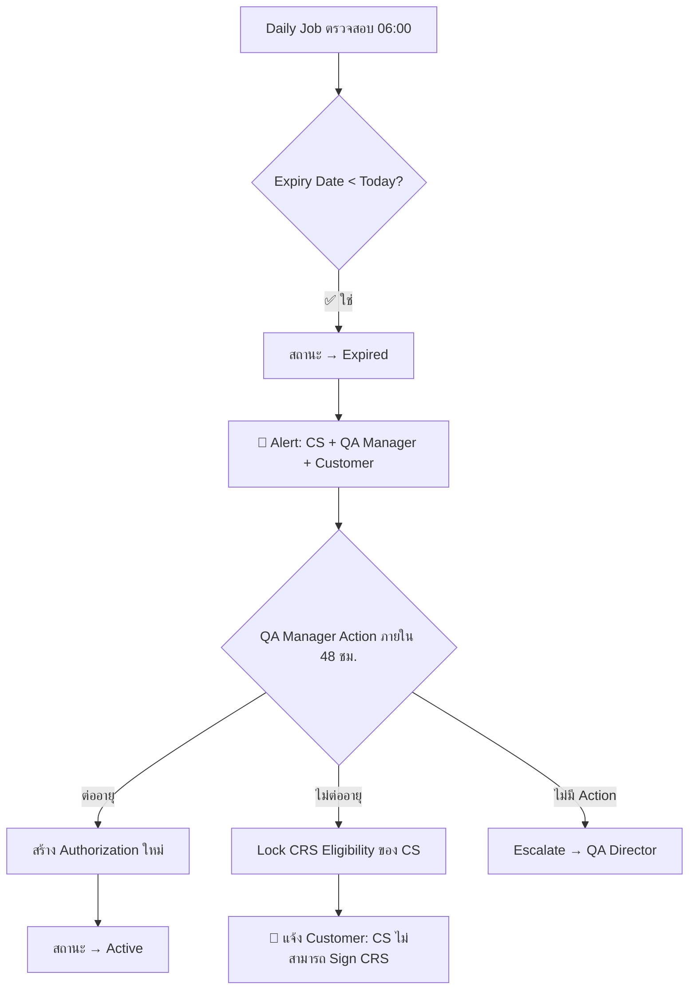
```mermaid
flowchart TD
    A[Daily Job ตรวจสอบ 06:00] --> B{Expiry Date < Today?}
    B -->|✅ ใช่| C[สถานะ → Expired]
    C --> D[📧 Alert: CS + QA Manager + Customer]
    D --> E{QA Manager Action ภายใน 48 ชม.}
    E -->|ต่ออายุ| F[สร้าง Authorization ใหม่]
    E -->|ไม่ต่ออายุ| G[Lock CRS Eligibility ของ CS]
    E -->|ไม่มี Action| H[Escalate → QA Director]
    F --> I[สถานะ → Active]
    G --> J[📧 แจ้ง Customer: CS ไม่สามารถ Sign CRS]
```

#### EX-A03: Customer Authorization เกิน SAMS Auth Expiry

```mermaid
flowchart TD
    A[Trainer สร้าง Customer Auth] --> B[System ตรวจ SAMS Auth Expiry ของ CS]
    B --> C{Customer Auth Expiry > SAMS Auth Expiry?}
    C -->|✅ ไม่เกิน| D[บันทึกได้ตามปกติ]
    C -->|❌ เกิน| E[Block การบันทึก]
    E --> F[แสดง Error: 'Customer Auth ต้องไม่เกินวันหมดอายุ SAMS Auth ({date})']
    F --> G[Trainer แก้ไข Expiry Date]
    G --> B
```

---

### 8.3 Training Scheduler — Exception Flow

#### EX-T01: Staff ไม่ผ่าน Training

```mermaid
flowchart TD
    A[Trainer บันทึกผล Training] --> B{ผลการอบรม}
    B -->|✅ ผ่าน| C[Update Training Record → Passed]
    B -->|❌ ไม่ผ่าน| D[บันทึก Failed + เหตุผล]
    D --> E[🔔 แจ้ง QA Manager + CS]
    E --> F{QA Manager กำหนด Action}
    F -->|Re-training| G[จัด Session ซ้ำ ภายใน 30 วัน]
    F -->|Waiver| H[🆕 QA Director อนุมัติ Waiver พร้อมเหตุผล]
    F -->|ไม่ผ่านซ้ำ| I[Review Authorization Eligibility]
    G --> A
    H --> J[บันทึก Waiver + เงื่อนไข]
    I --> K{มี Auth ที่ต้อง Suspend?}
    K -->|✅ มี| L[Auto-Suspend Auth ที่เกี่ยวข้อง]
    K -->|❌ ไม่มี| M[บันทึก Non-compliance note]
```

#### EX-T02: Trainer ยกเลิก Session กะทันหัน

```mermaid
flowchart TD
    A[Trainer ยกเลิก Session] --> B[System ตรวจ Enrolled Staff]
    B --> C{มี Enrolled Staff?}
    C -->|❌ ไม่มี| D[ยกเลิก Session ได้ทันที]
    C -->|✅ มี| E[📧 แจ้ง Staff ที่ Enrolled ทั้งหมด]
    E --> F[Trainer ต้องระบุเหตุผล]
    F --> G{กำหนด Reschedule ภายใน 7 วัน?}
    G -->|✅ กำหนดแล้ว| H[ย้าย Enrolled Staff → Session ใหม่ อัตโนมัติ]
    G -->|❌ ไม่กำหนด| I[Escalate → QA Manager จัด Trainer สำรอง]
```

#### EX-T03: Training Record ต้องการแก้ไขหลัง Approve

```mermaid
flowchart TD
    A[Trainer ต้องการแก้ไข Training Record ที่ Approved แล้ว] --> B[System Block การแก้ไขตรง]
    B --> C[Trainer สร้าง Amendment Request พร้อมเหตุผล]
    C --> D[QA Manager Review Amendment]
    D --> E{อนุมัติ?}
    E -->|✅ อนุมัติ| F[สร้าง Amendment Record ใหม่]
    F --> G[บันทึก Audit Log: แก้ไขโดย / วันที่ / เหตุผล]
    E -->|❌ ปฏิเสธ| H[Lock Record ตามเดิม + บันทึกเหตุผล]
    
    note1[🆕 NEW DESIGN: ห้ามแก้ไขตรง<br/>ต้องสร้าง Amendment เสมอ]
    C -.-> note1
```

---

### 8.4 Compliance Monitoring — Exception Flow

#### EX-M01: Daily Job ล้มเหลว

```mermaid
flowchart TD
    A[Daily Monitoring Job 06:00] --> B{Job สำเร็จ?}
    B -->|✅ สำเร็จ| C[Log: Success + Timestamp]
    B -->|❌ ล้มเหลว| D[Retry อัตโนมัติ ทุก 30 นาที x 3 ครั้ง]
    D --> E{Retry สำเร็จ?}
    E -->|✅ สำเร็จ| F[Log: Retry Success + จำนวนครั้ง]
    E -->|❌ ยังล้มเหลว| G[📧 Alert: System Admin + QA Manager]
    G --> H[Manual Trigger โดย Admin]
    H --> I{Manual สำเร็จ?}
    I -->|✅ สำเร็จ| C
    I -->|❌ ไม่สำเร็จ| J[Incident Report + Escalate to Dev Team]
```

#### EX-M02: Alert ส่ง Email ไม่ได้ (SMTP Error)

| สถานการณ์ | การจัดการ | Fallback |
|---|---|---|
| SMTP timeout | Retry 3 ครั้ง ห่าง 5 นาที | บันทึก Failed Email Queue |
| Email address ไม่ถูกต้อง | Mark Email Invalid + แจ้ง Admin | แสดง In-app notification แทน |
| Email rejected by server | Log + Alert Admin | In-app notification + Dashboard warning |
| ส่งสำเร็จแต่ไม่มีคนเปิด | — | In-app alert ยังคงอยู่จนกว่าจะ Acknowledge |

---

### 8.5 สรุปตาราง Exception ทั้งหมด

| Exception ID | Sub-module | สถานการณ์ | ผลกระทบ | วิธีรับมือ |
|---|---|---|---|---|
| EX-S01 | Staff | ข้อมูลไม่ครบ | Record ค้างสถานะ Incomplete | แจ้ง HR + Escalate 7 วัน |
| EX-S02 | Staff | Staff ลาออกระหว่างมี Auth | Auth ยังใช้งานได้ (risk) | Auto-suspend + แจ้ง Customer |
| EX-A01 | Authorization | Reject Auth | CS ไม่มี Authorization | แจ้งเหตุผล + เปิด Draft ใหม่ |
| EX-A02 | Authorization | Auth หมดอายุ ไม่ต่อ | CS ออก CRS ไม่ได้ | Lock CRS + Escalate 48 ชม. |
| EX-A03 | Authorization | Customer Auth เกิน SAMS | ผิด BR-02 | Block บันทึก + แจ้ง Error |
| EX-T01 | Training | Staff ไม่ผ่านการอบรม | Compliance ลด | Re-training / Waiver / Suspend Auth |
| EX-T02 | Training | Trainer ยกเลิก Session | Staff ขาด Training | Auto-reschedule + Escalate |
| EX-T03 | Training | แก้ไข Record ที่ Approved | Audit trail ขาด | Amendment workflow + บันทึก Audit |
| EX-M01 | Monitoring | Daily Job ล้มเหลว | Alert ไม่ส่ง | Retry x3 → Manual → Incident |
| EX-M02 | Monitoring | Email ส่งไม่ได้ | ไม่ได้รับการแจ้งเตือน | Queue + In-app fallback |

---

*— จบเอกสาร SAMS-QA-SRS-02 —*
