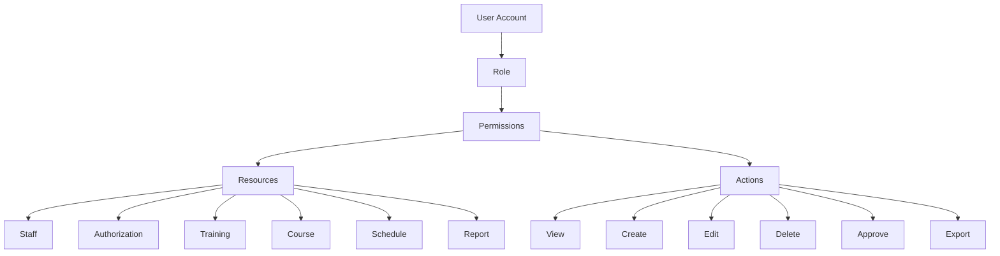
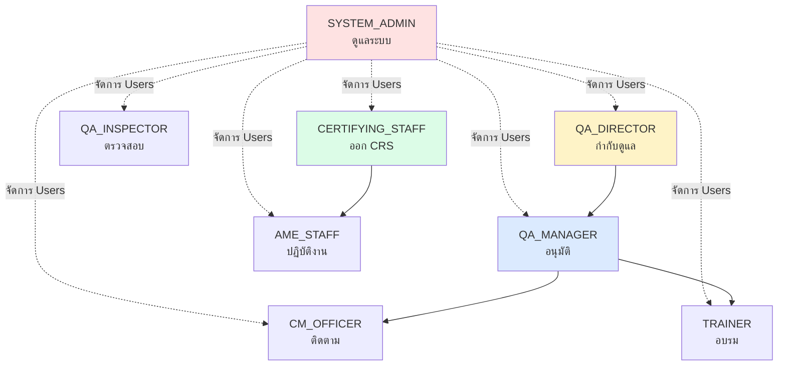
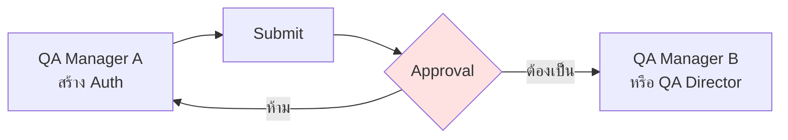
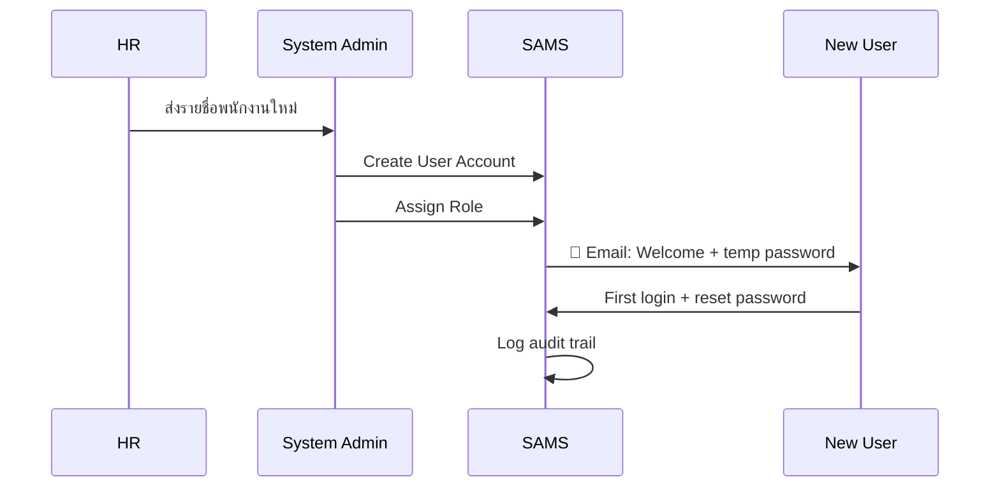
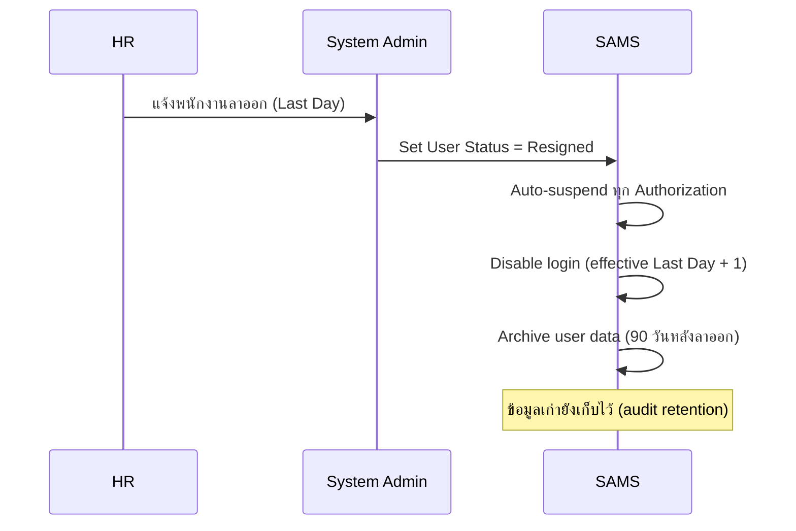
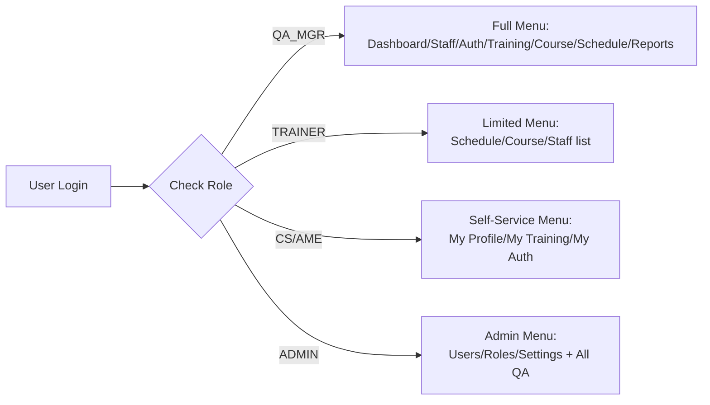
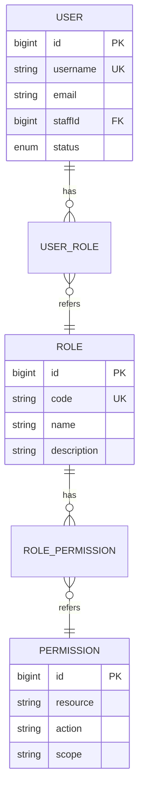

# SAMS-QA-SRS-03 — User & Role Definition
## ระบบ SAMS: โมดูล Quality Assurance (QA)

| รายการ | รายละเอียด |
|---|---|
| **Document No.** | SAMS-QA-SRS-03 |
| **Module** | Quality Assurance (QA) |
| **เวอร์ชัน** | 1.0 |
| **วันที่จัดทำ** | 2026-04-27 |
| **จัดทำโดย** | Triple-T Development Team |

---

## Revision History

| เวอร์ชัน | วันที่ | ผู้จัดทำ | รายละเอียด |
|---|---|---|---|
| 1.0 | 2026-04-27 | Triple-T Dev | ร่างแรก |

---

> 🆕 **[NEW DESIGN]**  
> Role-Based Access Control (RBAC) สำหรับ QA Module เป็นการออกแบบใหม่ทั้งหมด  
> Codebase ปัจจุบันยังไม่มี role enforcement — จะ implement ในส่วนนี้

---

## 1. ภาพรวมระบบ Role

### 1.1 หลักการออกแบบ



### 1.2 หลักการ

| หลักการ | คำอธิบาย |
|---|---|
| **Least Privilege** | ผู้ใช้มีสิทธิ์เฉพาะที่จำเป็นต่อการทำงาน |
| **Separation of Duties** | ผู้สร้างไม่ใช่ผู้อนุมัติ |
| **Role-Based** | กำหนดสิทธิ์ที่ Role ไม่ใช่รายบุคคล |
| **Auditable** | ทุก action บันทึก userId + timestamp |
| **Scoped Access** | บาง role ดูเฉพาะข้อมูลของตนเอง (CS) |

---

## 2. Role Definitions

### 2.1 รายการ Role (8 Roles)

| Role Code | Role Name | คำอธิบาย | จำนวนคนคาดการณ์ |
|---|---|---|---|
| **QA_DIRECTOR** | QA Director | ผู้อำนวยการ QA | 1-2 |
| **QA_MANAGER** | QA Manager | ผู้จัดการ QA | 2-5 |
| **CM_OFFICER** | Compliance Monitoring Officer | เจ้าหน้าที่ติดตาม compliance | 3-8 |
| **TRAINER** | Trainer / Instructor | ผู้ฝึกอบรม | 5-15 |
| **QA_INSPECTOR** | QA Inspector | ผู้ตรวจสอบ | 5-10 |
| **CERTIFYING_STAFF** | Certifying Staff (CS) | ช่างซ่อมบำรุงที่ออก CRS ได้ | 200-500 |
| **AME_STAFF** | AME Staff | ช่างซ่อมบำรุงทั่วไป | 500-1500 |
| **SYSTEM_ADMIN** | System Administrator | ผู้ดูแลระบบ | 1-3 |

### 2.2 Role Hierarchy



### 2.3 รายละเอียดแต่ละ Role

#### 2.3.1 QA_DIRECTOR (ผู้อำนวยการ QA)

| รายการ | รายละเอียด |
|---|---|
| **หน้าที่หลัก** | กำกับดูแลภาพรวม, อนุมัติ Authorization ระดับสูง, ตรวจรายงาน |
| **ใช้งานส่วนใด** | Dashboard (full), Authorization (read), Reports (full), Audit logs |
| **Critical Actions** | Approve high-tier authorizations, View audit logs |
| **เวลาที่ใช้งาน** | 1-2 ชม./วัน |

#### 2.3.2 QA_MANAGER (ผู้จัดการ QA)

| รายการ | รายละเอียด |
|---|---|
| **หน้าที่หลัก** | อนุมัติ Authorization, จัดการ Course Catalog, อนุมัติ Training Records |
| **ใช้งานส่วนใด** | ทุก sub-module ของ QA |
| **Critical Actions** | Approve Authorization, Approve Training Result, Manage Master Data |
| **เวลาที่ใช้งาน** | 4-6 ชม./วัน |

#### 2.3.3 CM_OFFICER (Compliance Monitoring Officer)

| รายการ | รายละเอียด |
|---|---|
| **หน้าที่หลัก** | ติดตามวันหมดอายุ, สร้างรายงาน, ส่ง alert |
| **ใช้งานส่วนใด** | Monitoring (full), Authorization (read+update expiry), Reports |
| **Critical Actions** | Trigger alerts, Generate compliance reports |
| **เวลาที่ใช้งาน** | 6-8 ชม./วัน |

#### 2.3.4 TRAINER (ผู้ฝึกอบรม)

| รายการ | รายละเอียด |
|---|---|
| **หน้าที่หลัก** | สร้าง Training Session, บันทึกผลอบรม, Submit เพื่ออนุมัติ |
| **ใช้งานส่วนใด** | Training Scheduler (full), Course Mgmt (read), Staff (read) |
| **Critical Actions** | Submit training results (ต้อง QA Manager approve) |
| **เวลาที่ใช้งาน** | 3-5 ชม./วัน |

#### 2.3.5 QA_INSPECTOR (ผู้ตรวจสอบ)

| รายการ | รายละเอียด |
|---|---|
| **หน้าที่หลัก** | ตรวจสอบความถูกต้องของ records, ตรวจสอบ compliance |
| **ใช้งานส่วนใด** | Read-only ทุก sub-module |
| **Critical Actions** | Flag inconsistencies, Comment on records |

#### 2.3.6 CERTIFYING_STAFF (CS)

| รายการ | รายละเอียด |
|---|---|
| **หน้าที่หลัก** | ใช้ระบบดูสถานะ Authorization ของตนเอง, ดูตารางอบรม |
| **ใช้งานส่วนใด** | Self-Service Portal (own data only) |
| **Critical Actions** | Enroll in training, Acknowledge alerts |
| **Scope** | Own data only |

#### 2.3.7 AME_STAFF

| รายการ | รายละเอียด |
|---|---|
| **หน้าที่หลัก** | ดูข้อมูลของตนเอง, ลงทะเบียนอบรม |
| **ใช้งานส่วนใด** | Self-Service Portal (own data only) |
| **Scope** | Own data only |

#### 2.3.8 SYSTEM_ADMIN

| รายการ | รายละเอียด |
|---|---|
| **หน้าที่หลัก** | จัดการ users, roles, permissions, master data |
| **ใช้งานส่วนใด** | User Management, Role Management, Master Data, System Settings |
| **Critical Actions** | Create/disable users, Reset passwords, Modify roles |

---

## 3. Permission Matrix

### 3.1 Permission Codes

| Action Code | คำอธิบาย |
|---|---|
| `VIEW_OWN` | ดูข้อมูลของตนเอง |
| `VIEW_TEAM` | ดูข้อมูลของทีม/แผนก |
| `VIEW_ALL` | ดูข้อมูลทั้งหมด |
| `CREATE` | สร้างใหม่ |
| `EDIT` | แก้ไข (ก่อน approve) |
| `EDIT_APPROVED` | แก้ไขหลัง approve (สร้าง amendment) |
| `DELETE` | ลบ (soft delete) |
| `SUBMIT` | ส่งเพื่ออนุมัติ |
| `APPROVE` | อนุมัติ |
| `REJECT` | ปฏิเสธ |
| `EXPORT` | Export PDF/XLSX |
| `IMPORT` | Bulk import |
| `AUDIT_VIEW` | ดู Audit log |

### 3.2 Permission Matrix — Staff Module

| Action | DIR | MGR | CM | TR | INSP | CS | AME | ADMIN |
|---|---|---|---|---|---|---|---|---|
| View Own | ✅ | ✅ | ✅ | ✅ | ✅ | ✅ | ✅ | ✅ |
| View All | ✅ | ✅ | ✅ | ✅ | ✅ | ❌ | ❌ | ✅ |
| Create | ❌ | ✅ | ❌ | ❌ | ❌ | ❌ | ❌ | ✅ |
| Edit | ❌ | ✅ | ❌ | ❌ | ❌ | Own (limited) | Own (limited) | ✅ |
| Delete | ❌ | ❌ | ❌ | ❌ | ❌ | ❌ | ❌ | ✅ |
| Export | ✅ | ✅ | ✅ | ❌ | ✅ | ❌ | ❌ | ✅ |
| Import | ❌ | ✅ | ❌ | ❌ | ❌ | ❌ | ❌ | ✅ |

### 3.3 Permission Matrix — Authorization Module

| Action | DIR | MGR | CM | TR | INSP | CS | AME | ADMIN |
|---|---|---|---|---|---|---|---|---|
| View Own | ✅ | ✅ | ✅ | ✅ | ✅ | ✅ | ❌ | ✅ |
| View All | ✅ | ✅ | ✅ | ❌ | ✅ | ❌ | ❌ | ✅ |
| Create (Draft) | ❌ | ✅ | ❌ | ❌ | ❌ | ❌ | ❌ | ❌ |
| Submit for Approval | ❌ | ✅ | ❌ | ❌ | ❌ | ❌ | ❌ | ❌ |
| Approve | ✅ | ✅* | ❌ | ❌ | ❌ | ❌ | ❌ | ❌ |
| Reject | ✅ | ✅ | ❌ | ❌ | ❌ | ❌ | ❌ | ❌ |
| Suspend | ✅ | ✅ | ❌ | ❌ | ❌ | ❌ | ❌ | ❌ |
| Revoke | ✅ | ❌ | ❌ | ❌ | ❌ | ❌ | ❌ | ❌ |
| Renew | ❌ | ✅ | ✅ | ❌ | ❌ | ❌ | ❌ | ❌ |
| Export | ✅ | ✅ | ✅ | ❌ | ✅ | Own | ❌ | ✅ |

> * = QA_MANAGER อนุมัติได้สำหรับ Authorization ที่ตนเองไม่ได้สร้าง (Separation of Duties)

### 3.4 Permission Matrix — Training Module

| Action | DIR | MGR | CM | TR | INSP | CS | AME | ADMIN |
|---|---|---|---|---|---|---|---|---|
| View Own | ✅ | ✅ | ✅ | ✅ | ✅ | ✅ | ✅ | ✅ |
| View All | ✅ | ✅ | ✅ | ✅ | ✅ | ❌ | ❌ | ✅ |
| Create Session | ❌ | ✅ | ❌ | ✅ | ❌ | ❌ | ❌ | ❌ |
| Edit Session | ❌ | ✅ | ❌ | ✅ (own) | ❌ | ❌ | ❌ | ❌ |
| Cancel Session | ❌ | ✅ | ❌ | ✅ (own) | ❌ | ❌ | ❌ | ❌ |
| Enroll Self | ❌ | ❌ | ❌ | ❌ | ❌ | ✅ | ✅ | ❌ |
| Enroll Others | ❌ | ✅ | ❌ | ✅ | ❌ | ❌ | ❌ | ❌ |
| Mark Attendance | ❌ | ❌ | ❌ | ✅ (own) | ❌ | ❌ | ❌ | ❌ |
| Submit Result | ❌ | ❌ | ❌ | ✅ (own) | ❌ | ❌ | ❌ | ❌ |
| Approve Result | ✅ | ✅ | ❌ | ❌ | ❌ | ❌ | ❌ | ❌ |
| Edit Approved | ❌ | ❌ | ❌ | ❌ | ❌ | ❌ | ❌ | ❌ |

### 3.5 Permission Matrix — Course Management

| Action | DIR | MGR | CM | TR | INSP | CS | AME | ADMIN |
|---|---|---|---|---|---|---|---|---|
| View Catalog | ✅ | ✅ | ✅ | ✅ | ✅ | ✅ | ✅ | ✅ |
| Create Course | ❌ | ✅ | ❌ | ❌ | ❌ | ❌ | ❌ | ✅ |
| Edit Course | ❌ | ✅ | ❌ | ❌ | ❌ | ❌ | ❌ | ✅ |
| Manage Matrix | ❌ | ✅ | ❌ | ❌ | ❌ | ❌ | ❌ | ✅ |

### 3.6 Permission Matrix — Monitoring & Dashboard

| Action | DIR | MGR | CM | TR | INSP | CS | AME | ADMIN |
|---|---|---|---|---|---|---|---|---|
| View QA Dashboard | ✅ | ✅ | ✅ | Limited | ✅ | ❌ | ❌ | ✅ |
| View Self Dashboard | ❌ | ❌ | ❌ | ❌ | ❌ | ✅ | ✅ | ❌ |
| Generate Reports | ✅ | ✅ | ✅ | ❌ | ✅ | ❌ | ❌ | ✅ |
| Schedule Reports | ❌ | ✅ | ✅ | ❌ | ❌ | ❌ | ❌ | ✅ |
| View Audit Log | ✅ | Limited | ❌ | ❌ | ❌ | ❌ | ❌ | ✅ |

### 3.7 Permission Matrix — System Admin

| Action | DIR | MGR | CM | TR | INSP | CS | AME | ADMIN |
|---|---|---|---|---|---|---|---|---|
| Manage Users | ❌ | ❌ | ❌ | ❌ | ❌ | ❌ | ❌ | ✅ |
| Reset Password | ❌ | ❌ | ❌ | ❌ | ❌ | ❌ | ❌ | ✅ |
| Manage Roles | ❌ | ❌ | ❌ | ❌ | ❌ | ❌ | ❌ | ✅ |
| System Settings | ❌ | ❌ | ❌ | ❌ | ❌ | ❌ | ❌ | ✅ |
| Backup/Restore | ❌ | ❌ | ❌ | ❌ | ❌ | ❌ | ❌ | ✅ |

---

## 4. Special Rules

### 4.1 Self-Service Scope (CS, AME)

CS และ AME staff ดูได้เฉพาะข้อมูลของตนเอง:
- Profile, Training Records, Authorization Status, Upcoming Sessions
- ไม่เห็นข้อมูลของพนักงานคนอื่น
- ไม่เห็น Dashboard รวม

### 4.2 Separation of Duties



> ผู้สร้าง Authorization ไม่สามารถ approve Authorization ของตนเองได้

### 4.3 Time-Sensitive Permissions

| สถานการณ์ | กฎ |
|---|---|
| Staff resigned | Auto-suspend ทุก permission ภายใน 24 ชม. |
| Account inactive 90 วัน | Auto-disable account |
| Failed login 5 ครั้ง | Lock account 30 นาที |
| QA Manager on leave | สามารถ delegate approval ให้ QA Director ชั่วคราว |

### 4.4 Audit Required Actions

Action ที่ต้องบันทึก audit log อย่างละเอียด:
- ✅ Authorization: Create, Submit, Approve, Reject, Suspend, Revoke, Renew
- ✅ Training Result: Submit, Approve, Reject, Edit Approved
- ✅ Staff: Create, Resign, Reactivate
- ✅ User Account: Create, Modify role, Disable
- ✅ Master Data: Add/Edit Course, Modify Training Matrix

---

## 5. Onboarding & Offboarding Process

### 5.1 User Onboarding



### 5.2 User Offboarding



---

## 6. UI/UX Implications

### 6.1 Role-Based Menu Visibility



### 6.2 Action Buttons Conditional Rendering

| Component | ตัวอย่าง |
|---|---|
| `<RoleGate role="QA_MANAGER">` | Wrap component, render เฉพาะ role ที่กำหนด |
| `usePermission('AUTH_APPROVE')` | Hook ตรวจ permission |
| `<PermissionAlert>` | แสดงข้อความเมื่อไม่มีสิทธิ์ |

### 6.3 Empty State for Restricted Pages

หาก user ไม่มีสิทธิ์เข้าหน้านั้น → แสดง:
```
🔒 Access Denied
คุณไม่มีสิทธิ์เข้าถึงหน้านี้
ติดต่อ System Admin หากเชื่อว่าควรมีสิทธิ์
[← Back to Dashboard]
```

---

## 7. Implementation Notes

### 7.1 Database Schema (Preview)

> **รายละเอียดเต็มอยู่ใน SRS-07 (Data Design)**



### 7.2 Implementation Stack

| Layer | เทคโนโลยี |
|---|---|
| Auth Provider | JWT (existing) |
| Role Storage | RBAC Database tables (NEW) |
| Permission Check (Frontend) | Custom hook `usePermission()` |
| Permission Check (Backend) | Middleware ที่ตรวจ JWT claims |
| Audit Log | Append-only table (NEW — ดู SRS-07) |

---

*— จบเอกสาร SAMS-QA-SRS-03 —*
