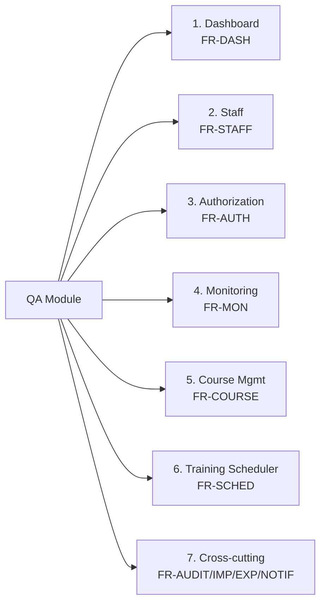
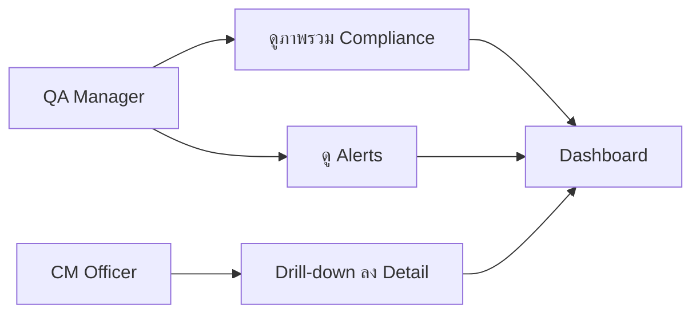
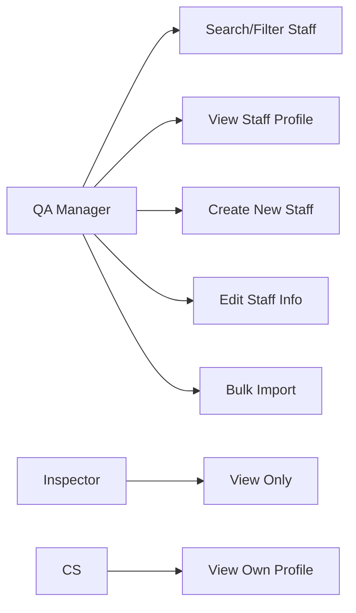
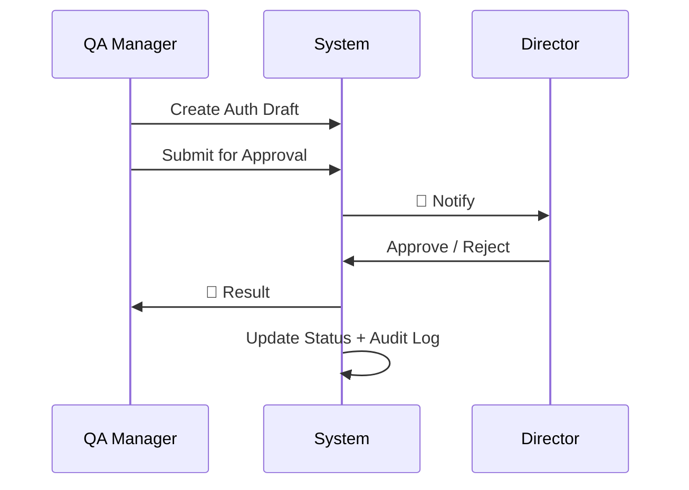
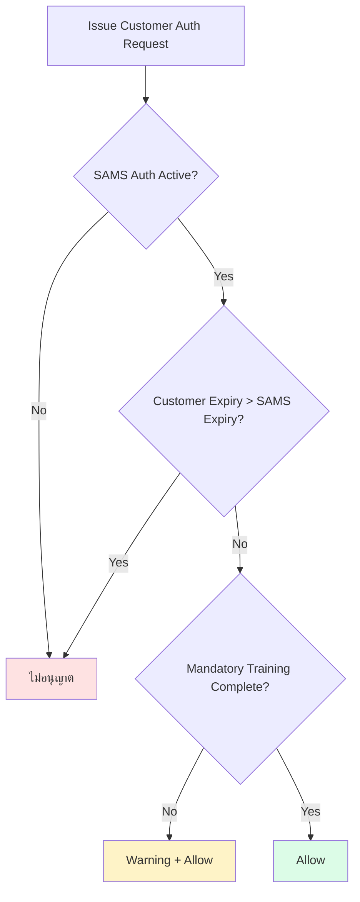
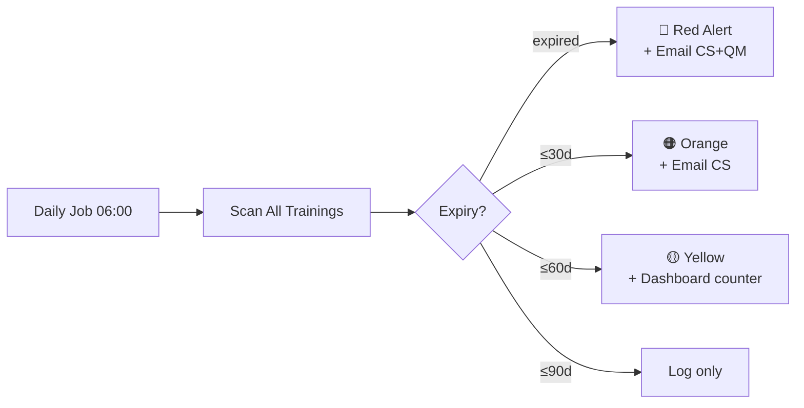
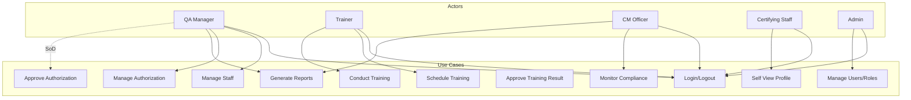

# SAMS-QA-SRS-04 — Functional Requirements
## ระบบ SAMS: โมดูล Quality Assurance (QA)

| รายการ | รายละเอียด |
|---|---|
| **Document No.** | SAMS-QA-SRS-04 |
| **Module** | Quality Assurance (QA) |
| **เวอร์ชัน** | 1.0 |
| **วันที่จัดทำ** | 2026-04-27 |
| **จัดทำโดย** | Triple-T Development Team |

---

## Revision History

| เวอร์ชัน | วันที่ | ผู้จัดทำ | รายละเอียด |
|---|---|---|---|
| 1.0 | 2026-04-27 | Triple-T Dev | ร่างแรก |

---

## 1. ภาพรวม Functional Requirements

### 1.1 หลักการอ้างอิง FR ID

```
FR-<MODULE>-<NUM>
ตัวอย่าง: FR-AUTH-001 = Functional Requirement #1 ของ Authorization module
```

### 1.2 ระดับความสำคัญ (Priority)

| ระดับ | คำอธิบาย |
|---|---|
| **MUST** | ต้องมีก่อน Go-Live (Phase 1) |
| **SHOULD** | ควรมี (Phase 1-2) |
| **COULD** | มีก็ดี (Phase 2-3) |
| **WONT** | ไม่อยู่ในแผน (Out of scope) |

### 1.3 รายการ Sub-modules



---

## 2. FR-DASH: QA Dashboard

### 2.1 Use Cases



### 2.2 Functional Requirements

| ID | Description | Priority |
|---|---|---|
| FR-DASH-001 | แสดง Total Staff count + Active/Inactive breakdown | MUST |
| FR-DASH-002 | แสดง Active Authorization count + รายละเอียดต่อสายการบิน | MUST |
| FR-DASH-003 | แสดง Expiring Soon counter (≤30 days, ≤60 days, ≤90 days) | MUST |
| FR-DASH-004 | แสดง Compliance % แยกตาม department/role | MUST |
| FR-DASH-005 | แสดง Upcoming Training Sessions (7 วันข้างหน้า) | MUST |
| FR-DASH-006 | แสดง Recent Activity (10 รายการล่าสุด) | SHOULD |
| FR-DASH-007 | แสดง Compliance trend chart (12 เดือนย้อนหลัง) | SHOULD |
| FR-DASH-008 | คลิก widget เพื่อ drill-down ไปหน้า detail | MUST |
| FR-DASH-009 | Auto-refresh ทุก 5 นาที | SHOULD |
| FR-DASH-010 | Filter dashboard ตาม customer airline | COULD |

### 2.3 Acceptance Criteria

- ✅ Dashboard load สำเร็จภายใน 3 วินาที
- ✅ แสดงข้อมูลตาม role (CS เห็นเฉพาะข้อมูลตนเอง)
- ✅ ตัวเลข match กับ Detail page เมื่อ drill-down

---

## 3. FR-STAFF: Staff Management

### 3.1 Use Cases



### 3.2 Functional Requirements

| ID | Description | Priority |
|---|---|---|
| FR-STAFF-001 | List staff พร้อม search (name, employeeCode, position) | MUST |
| FR-STAFF-002 | Filter staff ตาม department, employeeType, status | MUST |
| FR-STAFF-003 | View staff profile (Personal, Education, Experience, Training, Authorization) | MUST |
| FR-STAFF-004 | Create new staff (form ตามมาตรฐาน SAMS-FM-CM-036) | MUST |
| FR-STAFF-005 | Edit staff personal info (name, contact) | MUST |
| FR-STAFF-006 | Edit education records (Add/Edit/Delete) | MUST |
| FR-STAFF-007 | Edit work experience (Add/Edit/Delete) | MUST |
| FR-STAFF-008 | Edit license info (B1, B2, etc.) | MUST |
| FR-STAFF-009 | Upload profile photo (max 2MB, jpg/png) | SHOULD |
| FR-STAFF-010 | Mark staff as Resigned (with effective date) | MUST |
| FR-STAFF-011 | 🆕 Bulk import staff from XLSX template | SHOULD |
| FR-STAFF-012 | 🆕 Auto-archive resigned staff หลัง 90 วัน | SHOULD |
| FR-STAFF-013 | Print/Export staff profile as PDF (form SAMS-FM-CM-036) | MUST |
| FR-STAFF-014 | Logbook tab: Add/Edit logbook records (SAMS-FM-CM-041) | MUST |
| FR-STAFF-015 | Print Logbook PDF | MUST |
| FR-STAFF-016 | CS Experience Summary tab (SAMS-FM-CM-062) | SHOULD |

### 3.3 Data Validation Rules

| Field | Rule |
|---|---|
| Employee Code | Unique, format: alphanumeric + dash, 3-20 chars |
| Name | Required, 2-100 chars, ไม่อนุญาต special chars |
| Email | Valid email format, unique |
| Phone | Format ตาม country code |
| Hire Date | ≤ today |
| License Expiry | ต้องมากกว่า License Issue Date |

> 🆕 **[NEW DESIGN]** FR-STAFF-011, 012 = ฟีเจอร์ใหม่ที่ยังไม่มีในโค้ด

---

## 4. FR-AUTH: Authorization Management

### 4.1 Use Cases



### 4.2 Functional Requirements

#### 4.2.1 Authorization List & View

| ID | Description | Priority |
|---|---|---|
| FR-AUTH-001 | List staff with authorization summary (CS only) | MUST |
| FR-AUTH-002 | Filter ตาม customer airline (18 airlines) | MUST |
| FR-AUTH-003 | Search by staff name, authNumber | MUST |
| FR-AUTH-004 | Show CRS eligibility badge (Eligible / Not Eligible / Fully Authorized) | MUST |
| FR-AUTH-005 | Color-coded status: active/expiring/expired/suspended | MUST |
| FR-AUTH-006 | Drawer: ดู authorization detail per customer | MUST |

#### 4.2.2 Authorization Lifecycle

| ID | Description | Priority |
|---|---|---|
| FR-AUTH-010 | 🆕 Create authorization in Draft status | MUST |
| FR-AUTH-011 | 🆕 Submit authorization for approval (workflow) | MUST |
| FR-AUTH-012 | 🆕 Approve/Reject authorization (with reason) | MUST |
| FR-AUTH-013 | Manually mark authorization as Active | MUST |
| FR-AUTH-014 | Suspend authorization (with reason) | MUST |
| FR-AUTH-015 | Revoke authorization (with reason) | MUST |
| FR-AUTH-016 | Renew authorization (extend expiry) | MUST |
| FR-AUTH-017 | History timeline: ดูการเปลี่ยนแปลง | MUST |
| FR-AUTH-018 | Validation: Customer auth ห้ามเกิน SAMS auth expiry | MUST |
| FR-AUTH-019 | Validation: ไม่อนุญาต issue Customer auth ถ้า SAMS auth ไม่ active | MUST |

#### 4.2.3 Authority Authorization (13 regulators)

| ID | Description | Priority |
|---|---|---|
| FR-AUTH-020 | Track authority authorization (CAAT, EASA, FAA, CAAM, CAAP, etc.) | MUST |
| FR-AUTH-021 | Link authority auth กับ customer auth (เช่น CAAM → MH) | SHOULD |

#### 4.2.4 CRS Eligibility

| ID | Description | Priority |
|---|---|---|
| FR-AUTH-030 | คำนวณ CRS eligibility อัตโนมัติ (real-time) | MUST |
| FR-AUTH-031 | แสดง CRS reason: "Eligible เพราะ..." / "Not Eligible เพราะ..." | MUST |
| FR-AUTH-032 | List CS ที่ eligible สำหรับ customer X | MUST |

#### 4.2.5 Export

| ID | Description | Priority |
|---|---|---|
| FR-AUTH-040 | Export Excel: List of Customer Authorization (multi-sheet, 1 sheet/airline) | MUST |
| FR-AUTH-041 | Export PDF: Single staff authorization summary | MUST |
| FR-AUTH-042 | 🆕 Schedule auto-export รายเดือน (email PDF/XLSX) | COULD |

### 4.3 Business Rules



---

## 5. FR-MON: Compliance Monitoring

### 5.1 Functional Requirements

| ID | Description | Priority |
|---|---|---|
| FR-MON-001 | List ทุก staff พร้อม training compliance status | MUST |
| FR-MON-002 | Filter expiring training (≤30/60/90 days) | MUST |
| FR-MON-003 | Show training matrix per staff (8 mandatory + 6 type courses) | MUST |
| FR-MON-004 | Highlight missing/expired training | MUST |
| FR-MON-005 | Calendar view: training events (FullCalendar) | MUST |
| FR-MON-006 | Send manual alert ให้ CS + Trainer | SHOULD |
| FR-MON-007 | 🆕 Daily scheduled job: scan expiry + auto-email | MUST |
| FR-MON-008 | 🆕 Configurable alert thresholds (default 30/60/90) | SHOULD |
| FR-MON-009 | Export compliance report XLSX | MUST |
| FR-MON-010 | Export compliance certificate PDF | SHOULD |

### 5.2 Alert Logic



---

## 6. FR-COURSE: Course Management

### 6.1 Functional Requirements

| ID | Description | Priority |
|---|---|---|
| FR-COURSE-001 | List courses (33+ items) with search/filter | MUST |
| FR-COURSE-002 | Categorize: Mandatory / Aircraft Type / Specialized | MUST |
| FR-COURSE-003 | Course detail: code, name, validity period, prerequisites | MUST |
| FR-COURSE-004 | Add new course | MUST |
| FR-COURSE-005 | Edit course (with effective date) | MUST |
| FR-COURSE-006 | Deactivate course (soft delete) | MUST |
| FR-COURSE-007 | Training Needs Matrix (SAMS-FM-CM-014): map course → role/dept | MUST |
| FR-COURSE-008 | Bulk-update matrix (CSV import) | SHOULD |
| FR-COURSE-009 | Print Matrix PDF | MUST |
| FR-COURSE-010 | Track course version history | SHOULD |

---

## 7. FR-SCHED: Training Scheduler

### 7.1 Functional Requirements

| ID | Description | Priority |
|---|---|---|
| FR-SCHED-001 | Calendar view: monthly/weekly | MUST |
| FR-SCHED-002 | List view: filter by status, course, trainer | MUST |
| FR-SCHED-003 | Gantt view: long courses spanning days | SHOULD |
| FR-SCHED-004 | Create training session (date, course, trainer, location, capacity) | MUST |
| FR-SCHED-005 | Enroll staff (single / bulk) | MUST |
| FR-SCHED-006 | Mark attendance (per session) | MUST |
| FR-SCHED-007 | Submit results (Pass / Fail / Score) | MUST |
| FR-SCHED-008 | 🆕 QA Manager approve results before saving to record | MUST |
| FR-SCHED-009 | Auto-update training record after approve | MUST |
| FR-SCHED-010 | Print Attendance Sheet PDF | MUST |
| FR-SCHED-011 | Cancel session (with reason + notify enrolled) | MUST |
| FR-SCHED-012 | Reschedule session | MUST |
| FR-SCHED-013 | Trainer dashboard: my upcoming sessions | SHOULD |
| FR-SCHED-014 | Self-enrollment portal สำหรับ CS/AME | COULD |

---

## 8. Cross-cutting Functional Requirements

### 8.1 🆕 FR-AUDIT: Audit Log [NEW DESIGN]

| ID | Description | Priority |
|---|---|---|
| FR-AUDIT-001 | บันทึกทุก critical action (Create/Update/Delete/Approve/Reject) | MUST |
| FR-AUDIT-002 | บันทึก: timestamp, userId, action, resource, before/after JSON | MUST |
| FR-AUDIT-003 | Audit log immutable (append-only, ไม่อนุญาตให้ edit/delete) | MUST |
| FR-AUDIT-004 | Search/filter audit log by user, date, resource | MUST |
| FR-AUDIT-005 | Export audit log (XLSX) สำหรับ Authority audit | MUST |
| FR-AUDIT-006 | Retain audit log อย่างน้อย 5 ปี | MUST |

### 8.2 🆕 FR-NOTIF: Notification System [NEW DESIGN]

| ID | Description | Priority |
|---|---|---|
| FR-NOTIF-001 | In-app notification (bell icon + dropdown) | MUST |
| FR-NOTIF-002 | Email notification (SMTP) | MUST |
| FR-NOTIF-003 | Notification preferences per user | SHOULD |
| FR-NOTIF-004 | Email templates: Authorization Approved/Rejected/Expiring/Expired | MUST |
| FR-NOTIF-005 | Email templates: Training Enrolled/Cancelled/Result | MUST |
| FR-NOTIF-006 | Email retry queue (3 retries, 5/15/60 min) | MUST |
| FR-NOTIF-007 | Notification log (ส่งสำเร็จ/ไม่สำเร็จ) | SHOULD |

### 8.3 🆕 FR-IMP: Bulk Import [NEW DESIGN]

| ID | Description | Priority |
|---|---|---|
| FR-IMP-001 | Import Staff (XLSX template) | MUST |
| FR-IMP-002 | Import Authorization (XLSX template) | MUST |
| FR-IMP-003 | Import Training Records (XLSX template) | MUST |
| FR-IMP-004 | Validation report ก่อน commit | MUST |
| FR-IMP-005 | Dry-run mode | MUST |
| FR-IMP-006 | Rollback on error | MUST |
| FR-IMP-007 | Download XLSX template | MUST |

### 8.4 FR-EXP: Export & Report

| ID | Description | Priority |
|---|---|---|
| FR-EXP-001 | Export XLSX (multi-sheet สำหรับ list of customer auth) | MUST |
| FR-EXP-002 | Export PDF (form templates) | MUST |
| FR-EXP-003 | Export filtered/searched data only | MUST |
| FR-EXP-004 | 🆕 Schedule auto-export (รายเดือน, email ผลลัพธ์) | COULD |

### 8.5 FR-AUTH-COMMON: Authentication & Session

| ID | Description | Priority |
|---|---|---|
| FR-LOGIN-001 | Login with username + password | MUST |
| FR-LOGIN-002 | JWT token (30 min expiry) + refresh token | MUST |
| FR-LOGIN-003 | "Remember me" (refresh token 7 วัน) | SHOULD |
| FR-LOGIN-004 | Forgot password (email reset link) | MUST |
| FR-LOGIN-005 | Lock account after 5 failed attempts | MUST |
| FR-LOGIN-006 | Auto-logout after 30 min idle | MUST |
| FR-LOGIN-007 | Multi-device login (allowed) | SHOULD |

---

## 9. Use Case Diagram (Top Level)



---

## 10. Traceability Matrix

| FR ID | Source Document | Section |
|---|---|---|
| FR-DASH-001 to 010 | Codebase + Stakeholder workshop | qa/dashboard/* |
| FR-STAFF-001 to 016 | SAMS-FM-CM-036, -041, -062 + Codebase | qa/staff/* |
| FR-AUTH-001 to 042 | List of Customer Authorization + Codebase | qa/authorization/* |
| FR-MON-001 to 010 | Flowchart: Compliance Monitoring | qa/monitoring/* |
| FR-COURSE-001 to 010 | SAMS-FM-CM-014 (Training Matrix) | qa/course-management/* |
| FR-SCHED-001 to 014 | Codebase + Workshop | qa/training-scheduler/* |
| FR-AUDIT-* | 🆕 NEW DESIGN | — |
| FR-NOTIF-* | 🆕 NEW DESIGN | — |
| FR-IMP-* | 🆕 NEW DESIGN | — |

---

*— จบเอกสาร SAMS-QA-SRS-04 —*
