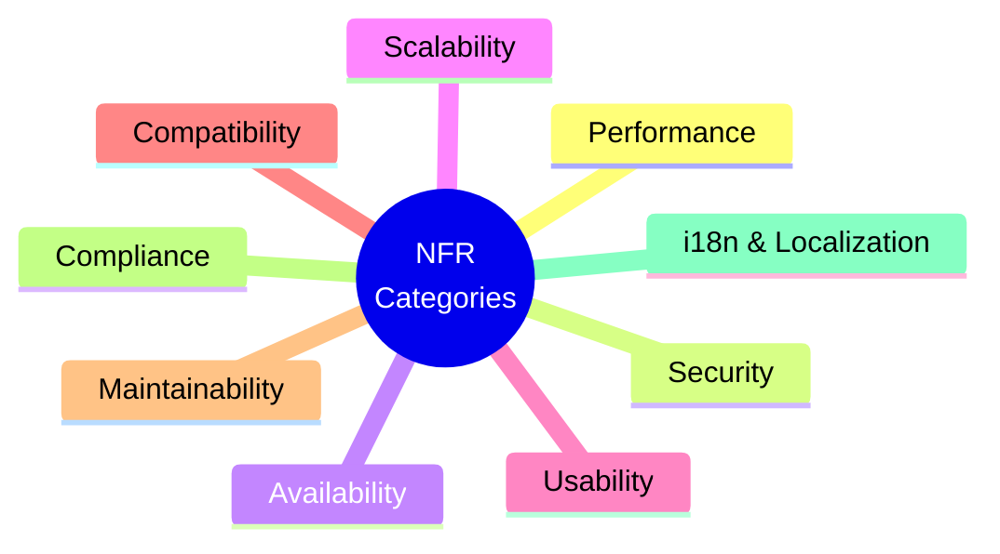
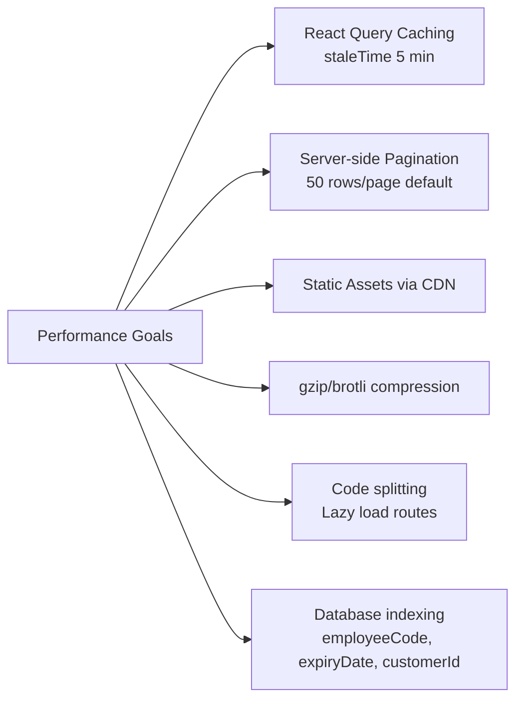
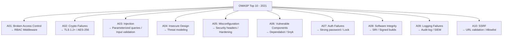
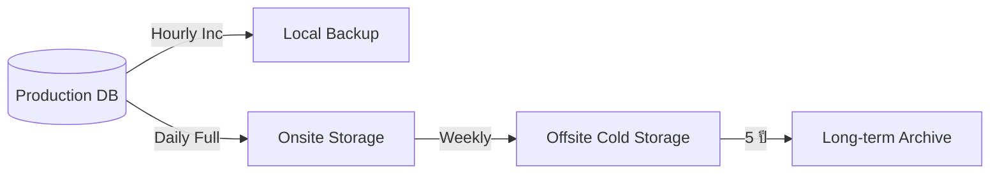
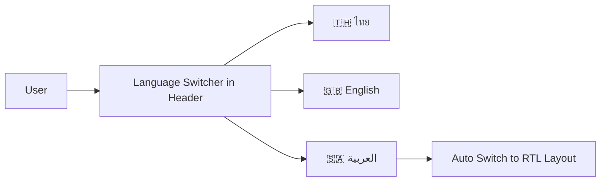

# SAMS-QA-SRS-05 — Non-Functional Requirements
## ระบบ SAMS: โมดูล Quality Assurance (QA)

| รายการ | รายละเอียด |
|---|---|
| **Document No.** | SAMS-QA-SRS-05 |
| **Module** | Quality Assurance (QA) |
| **เวอร์ชัน** | 1.0 |
| **วันที่จัดทำ** | 2026-04-27 |
| **จัดทำโดย** | Triple-T Development Team |

---

## Revision History

| เวอร์ชัน | วันที่ | ผู้จัดทำ | รายละเอียด |
|---|---|---|---|
| 1.0 | 2026-04-27 | Triple-T Dev | ร่างแรก |

---

## 1. หมวดหมู่ NFR

---

## 2. NFR-PERF: Performance

| ID | ข้อกำหนด | เป้าหมาย | วิธีวัด |
|---|---|---|---|
| NFR-PERF-001 | Page initial load (P95) | ≤ 3 วินาที | Lighthouse / RUM |
| NFR-PERF-002 | API response time (P95) | ≤ 1 วินาที | APM tool |
| NFR-PERF-003 | API response time (P99) | ≤ 3 วินาที | APM tool |
| NFR-PERF-004 | Dashboard load with full widgets | ≤ 5 วินาที | Manual + RUM |
| NFR-PERF-005 | Search with 5,000 staff | ≤ 2 วินาที | Manual + APM |
| NFR-PERF-006 | Export XLSX (10,000 records) | ≤ 30 วินาที | Manual |
| NFR-PERF-007 | Print PDF (single record) | ≤ 5 วินาที | Manual |
| NFR-PERF-008 | Concurrent users supported | 200 users | Load test |
| NFR-PERF-009 | First Contentful Paint (FCP) | ≤ 1.8 วินาที | Lighthouse |
| NFR-PERF-010 | Largest Contentful Paint (LCP) | ≤ 2.5 วินาที | Lighthouse |
| NFR-PERF-011 | Cumulative Layout Shift (CLS) | ≤ 0.1 | Lighthouse |
| NFR-PERF-012 | Time to Interactive (TTI) | ≤ 3.8 วินาที | Lighthouse |

### 2.1 Performance Strategy

---

## 3. NFR-SEC: Security

### 3.1 Authentication & Authorization

| ID | ข้อกำหนด |
|---|---|
| NFR-SEC-001 | JWT token expiry ≤ 30 นาที |
| NFR-SEC-002 | Refresh token expiry ≤ 7 วัน |
| NFR-SEC-003 | Password: ≥ 8 ตัว, ตัวพิมพ์ใหญ่+เล็ก+ตัวเลข+พิเศษ |
| NFR-SEC-004 | Password hashing ด้วย bcrypt (cost ≥ 12) |
| NFR-SEC-005 | Lock account หลัง failed login 5 ครั้ง (30 นาที) |
| NFR-SEC-006 | Force change password ทุก 90 วัน |
| NFR-SEC-007 | ห้าม reuse password 5 รหัสล่าสุด |
| NFR-SEC-008 | All API endpoints ต้อง authenticate ยกเว้น login/forgot |

### 3.2 Data Security

| ID | ข้อกำหนด |
|---|---|
| NFR-SEC-010 | HTTPS only (HSTS enforced) |
| NFR-SEC-011 | TLS ≥ 1.2 |
| NFR-SEC-012 | Encrypt PII at rest (AES-256) |
| NFR-SEC-013 | Sensitive fields masked ใน UI (เช่น national ID, phone) |
| NFR-SEC-014 | Secure cookie flags (HttpOnly, Secure, SameSite) |
| NFR-SEC-015 | CSP headers configured |

### 3.3 OWASP Top 10 Coverage

| ID | OWASP | Mitigation |
|---|---|---|
| NFR-SEC-020 | A01 Broken Access Control | RBAC middleware, JWT claims, scope check |
| NFR-SEC-021 | A02 Crypto Failures | TLS 1.2+, bcrypt, AES-256 at rest |
| NFR-SEC-022 | A03 Injection | Parameterized queries, input validation, output escaping |
| NFR-SEC-023 | A04 Insecure Design | Threat modeling ก่อน dev |
| NFR-SEC-024 | A05 Misconfiguration | Security headers, hardening checklist |
| NFR-SEC-025 | A06 Vulnerable Components | Dependabot + Snyk weekly |
| NFR-SEC-026 | A07 Auth Failures | Strong password + lockout + MFA (Phase 2) |
| NFR-SEC-027 | A08 Software Integrity | Signed releases, SRI for CDN |
| NFR-SEC-028 | A09 Logging Failures | Audit log + log retention |
| NFR-SEC-029 | A10 SSRF | URL validation, allowlist external endpoints |

### 3.4 Audit & Compliance

| ID | ข้อกำหนด |
|---|---|
| NFR-SEC-030 | บันทึกทุก login attempt (success/fail) |
| NFR-SEC-031 | บันทึกทุก critical action (Create/Update/Delete/Approve) |
| NFR-SEC-032 | Audit log retention ≥ 5 ปี |
| NFR-SEC-033 | Audit log immutable (append-only) |
| NFR-SEC-034 | Pen-test ก่อน Go-Live |

---

## 4. NFR-AVAIL: Availability & Reliability

| ID | ข้อกำหนด | เป้าหมาย |
|---|---|---|
| NFR-AVAIL-001 | System uptime | ≥ 99.5% (~3.5 ชม. downtime/เดือน) |
| NFR-AVAIL-002 | Recovery Time Objective (RTO) | ≤ 4 ชั่วโมง |
| NFR-AVAIL-003 | Recovery Point Objective (RPO) | ≤ 1 ชั่วโมง |
| NFR-AVAIL-004 | Database backup frequency | Daily (full) + Hourly (incremental) |
| NFR-AVAIL-005 | Backup retention | 30 วัน online, 5 ปี offline/cold storage |
| NFR-AVAIL-006 | DR site (Phase 2) | Read-replica ใน region อื่น |
| NFR-AVAIL-007 | Planned maintenance window | เสาร์-อาทิตย์ 22:00-04:00 |

### 4.1 Backup Strategy

---

## 5. NFR-SCALE: Scalability

| ID | ข้อกำหนด | เป้าหมาย |
|---|---|---|
| NFR-SCALE-001 | จำนวน Staff รองรับ | 5,000 records ใน 5 ปี |
| NFR-SCALE-002 | จำนวน Authorization records | 50,000 records ใน 5 ปี |
| NFR-SCALE-003 | จำนวน Training records | 1,250,000 records ใน 5 ปี |
| NFR-SCALE-004 | Concurrent users | 200 (peak) |
| NFR-SCALE-005 | API requests/sec | 500 RPS |
| NFR-SCALE-006 | Horizontal scaling | Frontend stateless (เพิ่ม instance ได้) |
| NFR-SCALE-007 | Database scaling | Read replica สำหรับ reporting (Phase 2) |
| NFR-SCALE-008 | File storage growth | 100 GB / ปี (estimated) |

---

## 6. NFR-USAB: Usability

| ID | ข้อกำหนด |
|---|---|
| NFR-USAB-001 | UI ต้องเรียนรู้ได้ภายใน 2 ชั่วโมง training |
| NFR-USAB-002 | Common task ต้องทำสำเร็จใน ≤ 3 clicks |
| NFR-USAB-003 | Error message ภาษาไทยที่เข้าใจได้ |
| NFR-USAB-004 | Loading indicator สำหรับ action > 1 วินาที |
| NFR-USAB-005 | Confirmation dialog สำหรับ destructive action |
| NFR-USAB-006 | Undo/Edit ในกรณี approval (กลับ Draft) |
| NFR-USAB-007 | Keyboard shortcut สำหรับ power user (Phase 2) |
| NFR-USAB-008 | Accessibility: WCAG 2.1 Level AA |
| NFR-USAB-009 | Color contrast ratio ≥ 4.5:1 |
| NFR-USAB-010 | Screen reader compatible (ARIA labels) |
| NFR-USAB-011 | Tooltip บน button/icon ที่ไม่ชัดเจน |

### 6.1 Responsive Design

| Device | Min Width | Layout |
|---|---|---|
| Desktop | 1280px+ | Full sidebar + content |
| Laptop | 1024-1279px | Compact sidebar + content |
| Tablet | 768-1023px | Collapsible sidebar |
| Mobile | < 768px | Bottom nav (limited features) |

> **หมายเหตุ**: Phase 1 prioritize Desktop/Laptop. Mobile = best-effort (อ่านได้, แต่อาจ edit ไม่สะดวก)

---

## 7. NFR-COMPAT: Compatibility

### 7.1 Browser Support

| Browser | Min Version | Support Level |
|---|---|---|
| Chrome | 110+ | ✅ Full |
| Edge | 110+ | ✅ Full |
| Firefox | 110+ | ✅ Full |
| Safari | 16+ | ✅ Full |
| IE 11 | — | ❌ Not supported |
| Mobile Chrome | Latest | ⚠️ Best-effort |
| Mobile Safari | Latest | ⚠️ Best-effort |

### 7.2 OS Support

| OS | Status |
|---|---|
| Windows 10/11 | ✅ Tested |
| macOS 12+ | ✅ Tested |
| Linux (Chrome) | ✅ Tested |
| iOS 15+ | ⚠️ Best-effort |
| Android 10+ | ⚠️ Best-effort |

---

## 8. NFR-MAINT: Maintainability

| ID | ข้อกำหนด |
|---|---|
| NFR-MAINT-001 | Code coverage ≥ 70% (unit test) |
| NFR-MAINT-002 | E2E test cover critical user journeys |
| NFR-MAINT-003 | TypeScript strict mode |
| NFR-MAINT-004 | ESLint + Prettier enforced ใน CI |
| NFR-MAINT-005 | Conventional commit messages |
| NFR-MAINT-006 | Semantic versioning |
| NFR-MAINT-007 | API versioning (URL prefix /api/v1, /api/v2) |
| NFR-MAINT-008 | Documentation (README, API docs, architecture) |
| NFR-MAINT-009 | Logging (structured JSON logs) |
| NFR-MAINT-010 | Monitoring (APM + error tracking) |

---

## 9. NFR-COMP: Compliance

### 9.1 Aviation Regulation

| ID | ข้อกำหนด |
|---|---|
| NFR-COMP-001 | CAAT Part-145 compliant (Authorization tracking) |
| NFR-COMP-002 | EASA Part-145 compliant (Training records) |
| NFR-COMP-003 | Audit trail immutable + retention ≥ 5 ปี |
| NFR-COMP-004 | Form templates ตรงตาม Authority requirement |

### 9.2 Data Protection (PDPA)

| ID | ข้อกำหนด |
|---|---|
| NFR-COMP-010 | ขอ consent สำหรับ personal data |
| NFR-COMP-011 | Right to access — User สามารถ download ข้อมูลตนเอง |
| NFR-COMP-012 | Right to be forgotten — Process การลบข้อมูล |
| NFR-COMP-013 | Data Processing Record |
| NFR-COMP-014 | Breach notification ภายใน 72 ชม. |

---

## 10. NFR-I18N: Internationalization & Localization

| ID | ข้อกำหนด |
|---|---|
| NFR-I18N-001 | รองรับภาษาไทย (เริ่มต้น) |
| NFR-I18N-002 | รองรับภาษาอังกฤษ |
| NFR-I18N-003 | รองรับภาษาอาหรับ (RTL) — สำหรับ MEA airlines |
| NFR-I18N-004 | Date format: ตามภาษาที่เลือก (พ.ศ./ค.ศ.) |
| NFR-I18N-005 | Number format: ตาม locale (1,000.50 vs 1.000,50) |
| NFR-I18N-006 | Time zone: Asia/Bangkok (default) + UTC offset toggle |
| NFR-I18N-007 | Currency display (Phase 2) |

### 10.1 Language Switch UI

---

## 11. NFR Verification Methods

| NFR Category | Verification Method |
|---|---|
| Performance | Load test (k6/JMeter) + Lighthouse + APM |
| Security | Pen-test + SAST + DAST + Code review |
| Availability | Synthetic monitoring + Uptime tracker |
| Scalability | Load test scenarios |
| Usability | User testing + UAT feedback + Heatmap |
| Compatibility | Browser matrix testing + Cross-browser test |
| Maintainability | Code metrics (Sonar) + Coverage reports |
| Compliance | Audit checklist + Authority sign-off |
| i18n | Manual test + Pseudo-localization |

---

## 12. Service Level Agreement (SLA) Summary

| Metric | Target | Penalty |
|---|---|---|
| Uptime | 99.5%/month | Credit ตามสัญญา |
| API P95 latency | < 1 sec | Investigate ถ้า > 1.5s |
| Critical bug fix time | ≤ 4 ชม. | — |
| Major bug fix time | ≤ 1 day | — |
| Minor bug fix time | ≤ 1 week | — |
| Support response | < 30 min (business hours) | — |

---

*— จบเอกสาร SAMS-QA-SRS-05 —*
