# SAMS-QA-SRS-06 — System Architecture
## ระบบ SAMS: โมดูล Quality Assurance (QA)

| รายการ | รายละเอียด |
|---|---|
| **Document No.** | SAMS-QA-SRS-06 |
| **Module** | Quality Assurance (QA) |
| **เวอร์ชัน** | 1.0 |
| **วันที่จัดทำ** | 2026-04-27 |
| **จัดทำโดย** | Triple-T Development Team |

---

## Revision History

| เวอร์ชัน | วันที่ | ผู้จัดทำ | รายละเอียด |
|---|---|---|---|
| 1.0 | 2026-04-27 | Triple-T Dev | ร่างแรก |

---

## 1. Architecture Overview

### 1.1 High-Level Architecture (3-Tier)

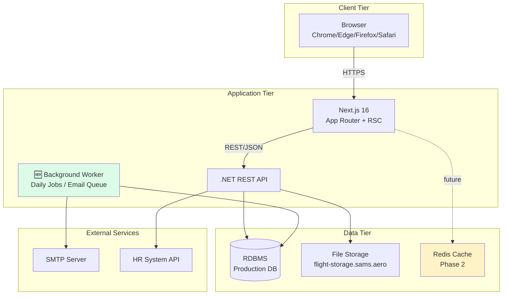

### 1.2 Architecture Principles

| หลักการ | คำอธิบาย |
|---|---|
| **Separation of Concerns** | UI / Business / Data ชัดเจน |
| **Stateless Frontend** | ไม่เก็บ session ที่ Frontend (ยกเว้น JWT ใน localStorage) |
| **API-First** | ทุก feature เริ่มจาก API contract |
| **Defense in Depth** | Auth ที่ Frontend + Backend + DB |
| **Single Responsibility** | แต่ละ component ทำหน้าที่เดียว |
| **Progressive Enhancement** | RSC + Client Component แบ่งบทบาทชัดเจน |

---

## 2. Frontend Architecture

### 2.1 Frontend Stack

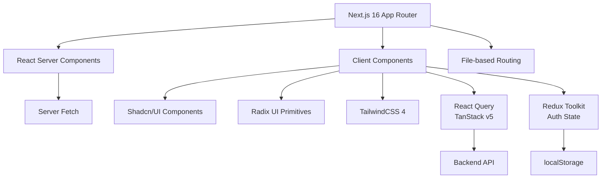

### 2.2 Folder Structure

```
/home/user/sams/
├── app/[locale]/
│   ├── (protected)/
│   │   ├── qa/
│   │   │   ├── dashboard/
│   │   │   ├── staff/
│   │   │   │   ├── [id]/
│   │   │   │   ├── new/
│   │   │   │   └── page.tsx
│   │   │   ├── authorization/
│   │   │   ├── monitoring/
│   │   │   ├── course-management/
│   │   │   └── training-scheduler/
│   ├── (auth)/
│   └── layout.tsx
├── components/
│   ├── ui/              # Shadcn primitives
│   ├── partials/        # Sidebar, Header
│   └── auth/            # withAuth, RoleGate
├── lib/
│   ├── api/
│   │   ├── client.ts    # Axios instance
│   │   ├── hooks/       # React Query hooks
│   │   └── services/    # API services
│   └── store/           # Redux store
└── messages/            # i18n: th.json, en.json, ar.json
```

### 2.3 Component Hierarchy (QA Module)

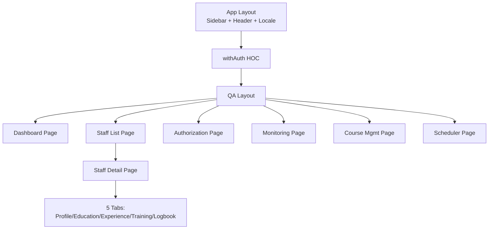

### 2.4 State Management Strategy

| State Type | Tool | ตัวอย่าง |
|---|---|---|
| **Server State** | React Query (TanStack v5) | Staff list, Auth records, Training data |
| **Auth State** | Redux Toolkit + persist | User info, JWT token |
| **UI State** | useState / useReducer | Modal open/close, form draft |
| **URL State** | Next.js searchParams | Filters, pagination, tab selection |
| **Form State** | React Hook Form + Zod | Form validation, submission |
| **Theme** | next-themes | Light/Dark mode |
| **Locale** | next-intl | th/en/ar switching |

---

## 3. Backend Architecture

### 3.1 Backend Stack (.NET API)

> **หมายเหตุ**: Backend จัดการโดยทีมแยก — ส่วนนี้สรุปจาก Frontend perspective

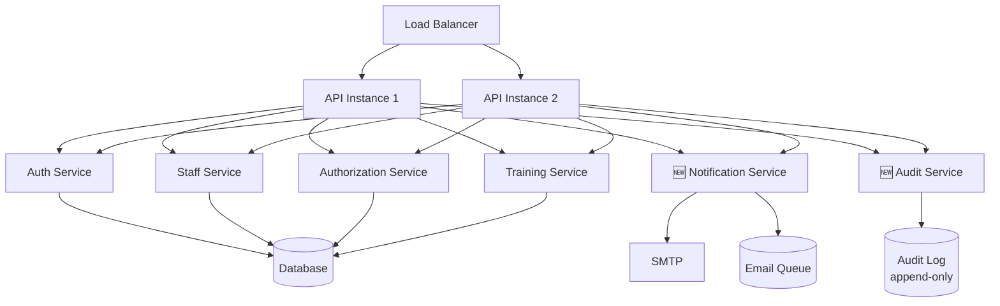

### 3.2 API Layers

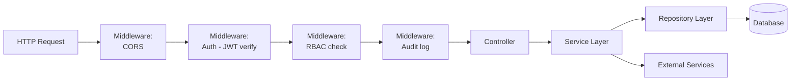

### 3.3 API Design Principles

| หลักการ | รายละเอียด |
|---|---|
| **REST** | URL = resource, HTTP method = action |
| **JSON** | Request/Response body |
| **Versioning** | `/api/v1/...` |
| **Pagination** | `?page=1&size=50` |
| **Filtering** | `?status=active&customer=TG` |
| **Sorting** | `?sort=expiryDate&order=asc` |
| **Error Format** | `{ "code": "...", "message": "...", "details": [...] }` |

---

## 4. Data Architecture

### 4.1 Data Layer Components

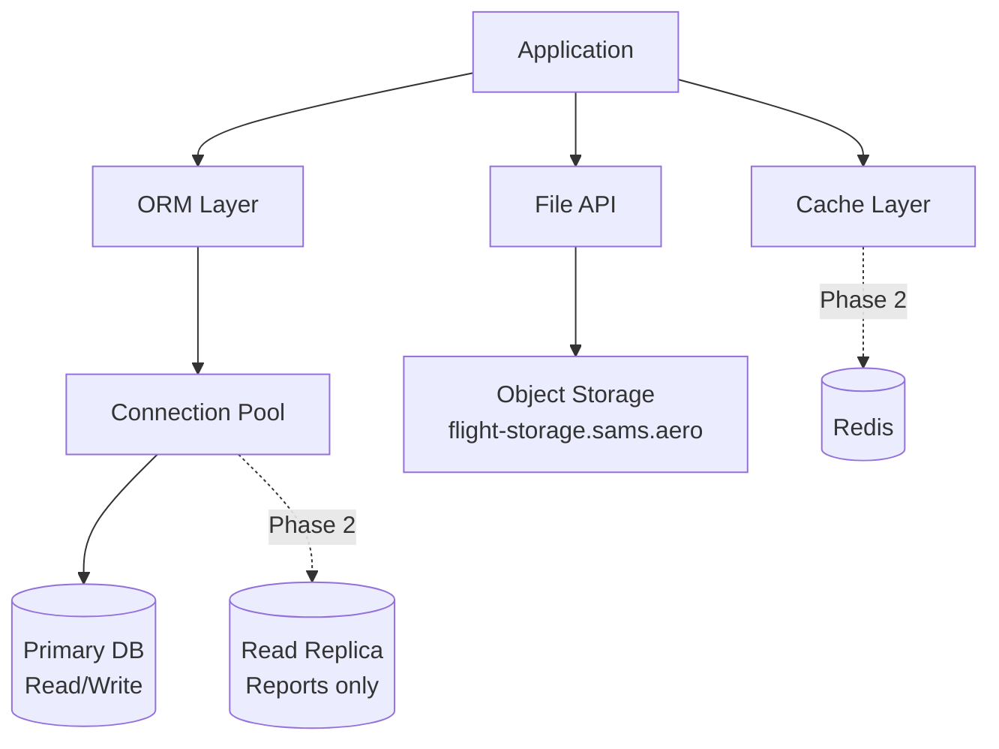

### 4.2 Data Storage Strategy

| Data Type | Storage | Reason |
|---|---|---|
| Transactional (Staff, Auth, Training) | RDBMS | ACID, relations |
| Audit Logs | RDBMS (append-only table) | Immutable, queryable |
| Files (Avatar, Certificate, License) | Object Storage | Large blobs |
| Generated Reports (PDF/XLSX) | Object Storage (temp 7d) | Async generation |
| Session / Cache (Phase 2) | Redis | Fast access |
| Email Queue (NEW) | DB queue table | Reliable retry |

### 4.3 Database Type Selection

| Module | Primary Storage | Schema Style |
|---|---|---|
| Staff | RDBMS | Normalized (3NF) |
| Authorization | RDBMS | Normalized + JSON for flexible scope |
| Training Records | RDBMS | Normalized + JSON for course-specific data |
| Audit Log | RDBMS | Append-only flat table |
| File Metadata | RDBMS | URL reference only |
| File Content | Object Storage | Direct upload via signed URL |

> **รายละเอียด schema เต็มอยู่ใน SRS-07 (Data Design)**

---

## 5. Integration Architecture

### 5.1 Internal Integration

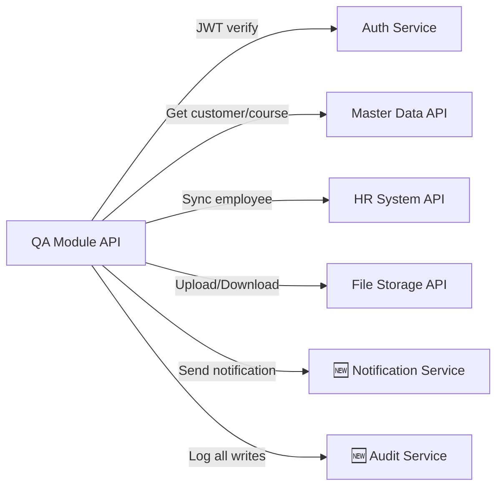

### 5.2 External Integration

```mermaid
graph LR
    QA[QA Module]
    QA -->|SMTP| EMAIL[Email Server]
    QA -.Phase 2.->|REST| CAAT[CAAT Portal]
    QA -.Phase 3.->|Webhook| CUSTOMERS[Customer Airline Systems]
```

> **รายละเอียดเต็มอยู่ใน SRS-09 (Integration & Interface)**

---

## 6. Deployment Architecture

### 6.1 Environment Topology

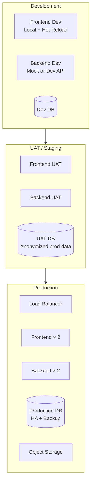

### 6.2 Deployment Pipeline

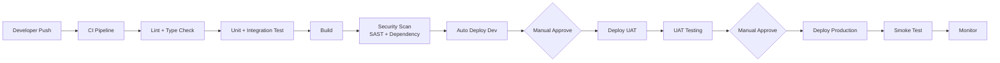

### 6.3 Infrastructure Requirements

| Environment | Frontend | Backend | DB |
|---|---|---|---|
| **Dev** | 1 instance, 2 vCPU, 4 GB RAM | 1 instance | Shared dev DB |
| **UAT** | 1 instance, 2 vCPU, 4 GB RAM | 1 instance | Dedicated UAT DB |
| **Prod** | 2 instances, 4 vCPU, 8 GB RAM each | 2 instances | HA Primary + Replica |

---

## 7. Security Architecture

### 7.1 Defense in Depth

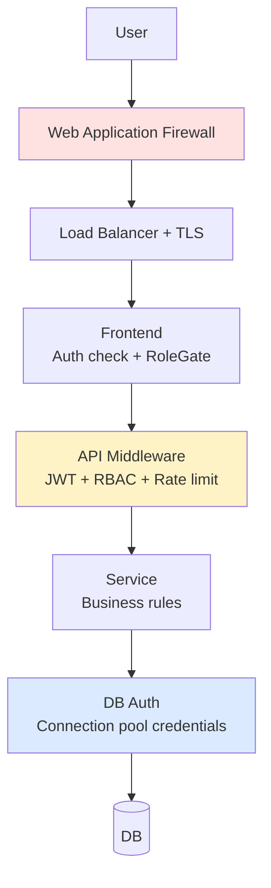

### 7.2 Auth Flow

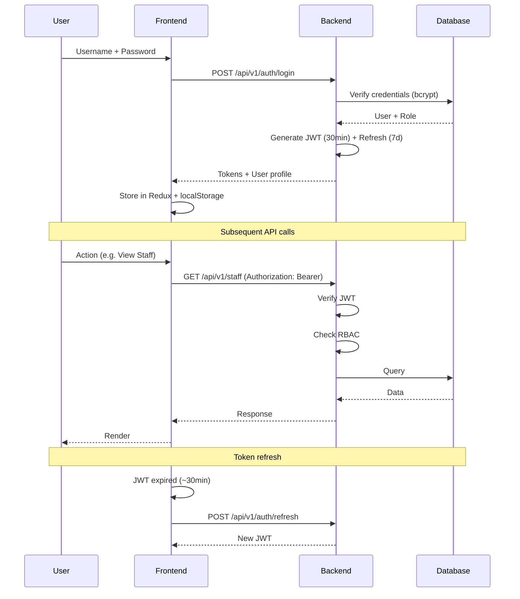

---

## 8. Background Jobs Architecture

> 🆕 **[NEW DESIGN]** ส่วนนี้เป็นการออกแบบใหม่ทั้งหมด

### 8.1 Scheduled Jobs

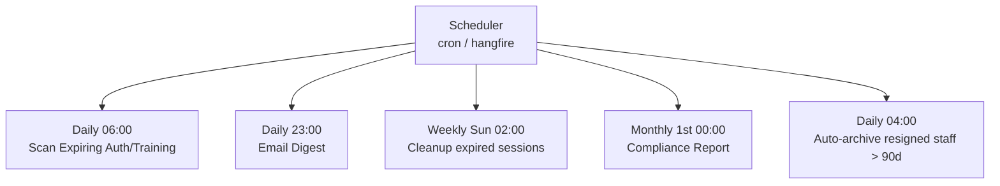

| Job | ความถี่ | หน้าที่ |
|---|---|---|
| Scan Expiry | Daily 06:00 | Find expired/expiring → trigger alerts |
| Email Digest | Daily 23:00 | Roll-up alerts to Manager email |
| Session Cleanup | Weekly Sun 02:00 | Delete expired sessions |
| Compliance Report | Monthly 1st | Auto-generate + email |
| Staff Archive | Daily 04:00 | Archive resigned staff > 90 days |

### 8.2 Email Queue Architecture

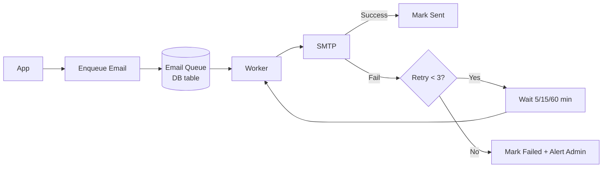

---

## 9. Monitoring & Observability

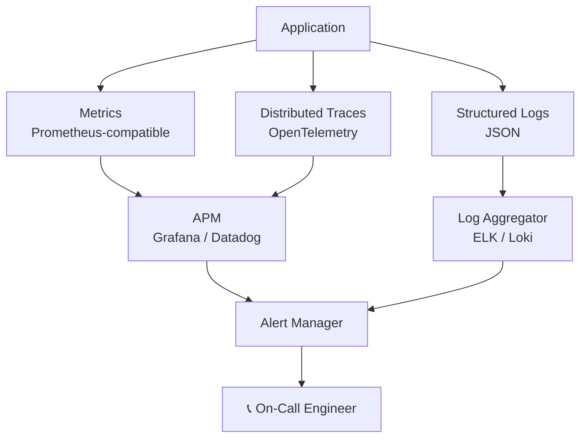

### 9.1 Observability Stack

| Layer | Tool (Recommended) | Purpose |
|---|---|---|
| Log Aggregation | ELK / Grafana Loki | Centralized log search |
| Metrics | Prometheus + Grafana | Performance monitoring |
| Distributed Tracing | OpenTelemetry | Request flow across services |
| Error Tracking | Sentry | Frontend/Backend errors |
| Synthetic Monitoring | UptimeRobot / Datadog Synthetics | Up/Down detection |
| RUM | Datadog RUM / New Relic Browser | Real user metrics |

---

## 10. Decision Records

| Decision | เลือก | เหตุผล |
|---|---|---|
| Frontend Framework | Next.js 16 (App Router) | RSC + SSR + ecosystem |
| State Management | React Query + Redux | Server vs auth state แยก |
| UI Components | Shadcn + Radix | Customizable + accessible |
| Styling | TailwindCSS 4 | Utility-first + design system |
| Authentication | JWT (existing) | สอดคล้องกับ Backend |
| Database | RDBMS | ACID + relations + reporting |
| File Storage | Object Storage | Scalable + cost-effective |
| Background Jobs (NEW) | Hangfire (.NET) / cron | Reliable scheduling |

---

*— จบเอกสาร SAMS-QA-SRS-06 —*
