# SAMS-QA-SRS-07 — Data Design
## ระบบ SAMS: โมดูล Quality Assurance (QA)

| รายการ | รายละเอียด |
|---|---|
| **Document No.** | SAMS-QA-SRS-07 |
| **Module** | Quality Assurance (QA) |
| **เวอร์ชัน** | 1.0 |
| **วันที่จัดทำ** | 2026-04-27 |

---

## Revision History

| เวอร์ชัน | วันที่ | ผู้จัดทำ | รายละเอียด |
|---|---|---|---|
| 1.0 | 2026-04-27 | Triple-T Dev | ร่างแรก |

---

## 1. Conceptual Data Model

### 1.1 Entity Overview

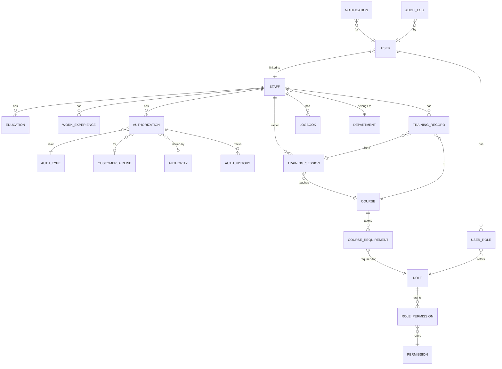

### 1.2 หลัก Entity (15 Entities)

| Entity | คำอธิบาย | NEW? |
|---|---|---|
| USER | บัญชีผู้ใช้ระบบ | 🆕 NEW |
| ROLE | บทบาท | 🆕 NEW |
| PERMISSION | สิทธิ์ | 🆕 NEW |
| USER_ROLE | mapping table | 🆕 NEW |
| ROLE_PERMISSION | mapping table | 🆕 NEW |
| STAFF | พนักงาน | Existing |
| EDUCATION | ประวัติการศึกษา | Existing |
| WORK_EXPERIENCE | ประวัติทำงาน | Existing |
| AUTHORIZATION | การอนุญาต | Existing |
| AUTH_HISTORY | ประวัติ Authorization | 🆕 NEW |
| TRAINING_RECORD | ผลการอบรม | Existing |
| TRAINING_SESSION | ตารางอบรม | Existing |
| COURSE | หลักสูตร | Existing |
| COURSE_REQUIREMENT | Training Matrix | Existing |
| LOGBOOK | บันทึกการทำงาน | Existing |
| CUSTOMER_AIRLINE | สายการบินลูกค้า | Existing |
| AUTHORITY | หน่วยงานกำกับ | Existing |
| DEPARTMENT | แผนก | Existing |
| AUDIT_LOG | บันทึกการเปลี่ยนแปลง | 🆕 NEW |
| NOTIFICATION | การแจ้งเตือน | 🆕 NEW |
| EMAIL_QUEUE | คิวส่ง email | 🆕 NEW |

---

## 2. Logical Data Model — Core Tables

### 2.1 STAFF Table

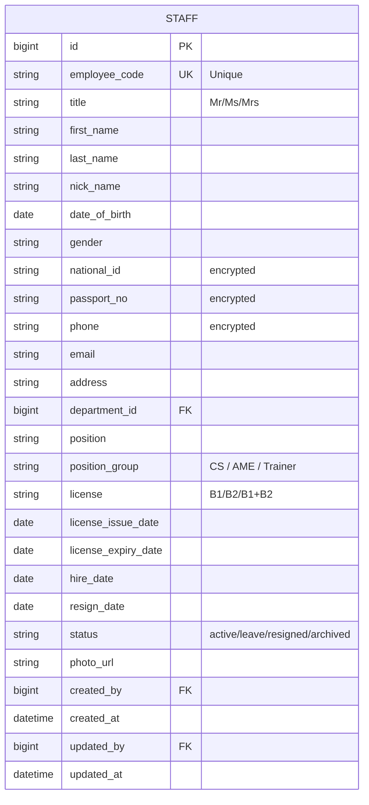

### 2.2 AUTHORIZATION Table

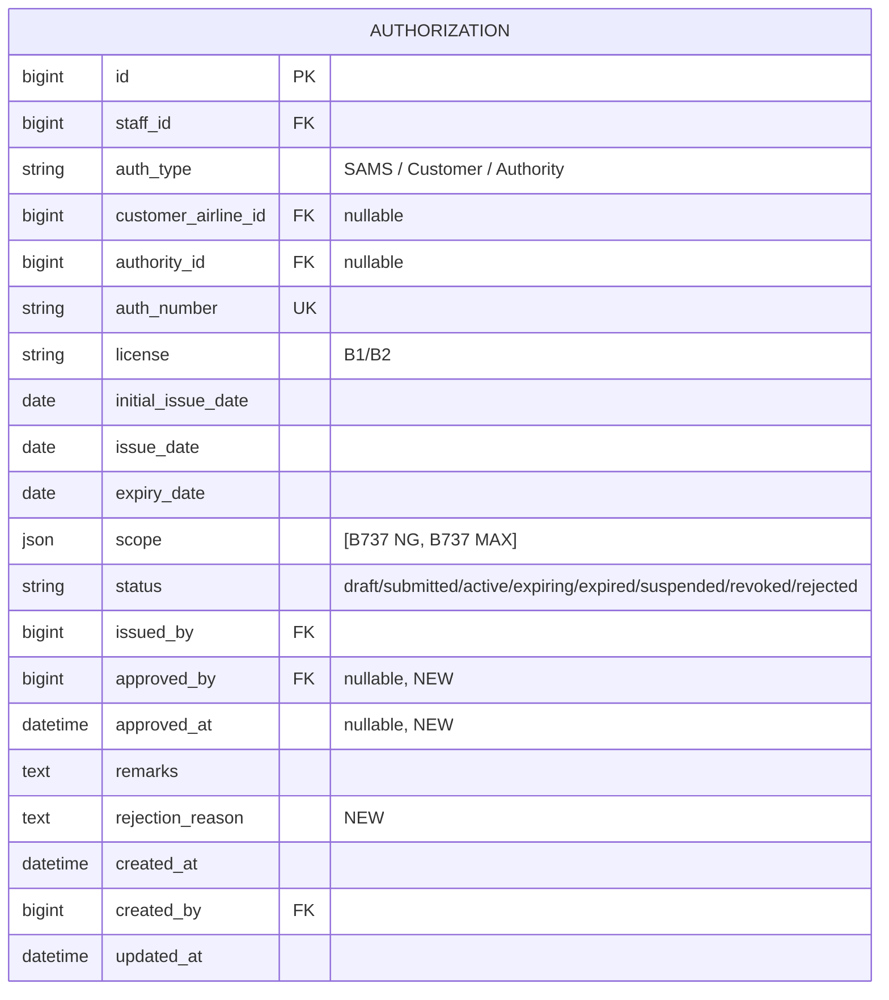

### 2.3 AUTH_HISTORY Table 🆕

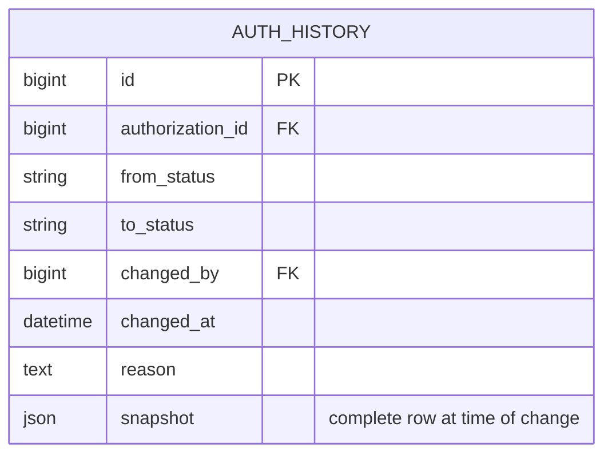

> 🆕 **[NEW DESIGN]** — บันทึกทุกการเปลี่ยน status ของ Authorization เพื่อ audit

### 2.4 TRAINING_RECORD Table

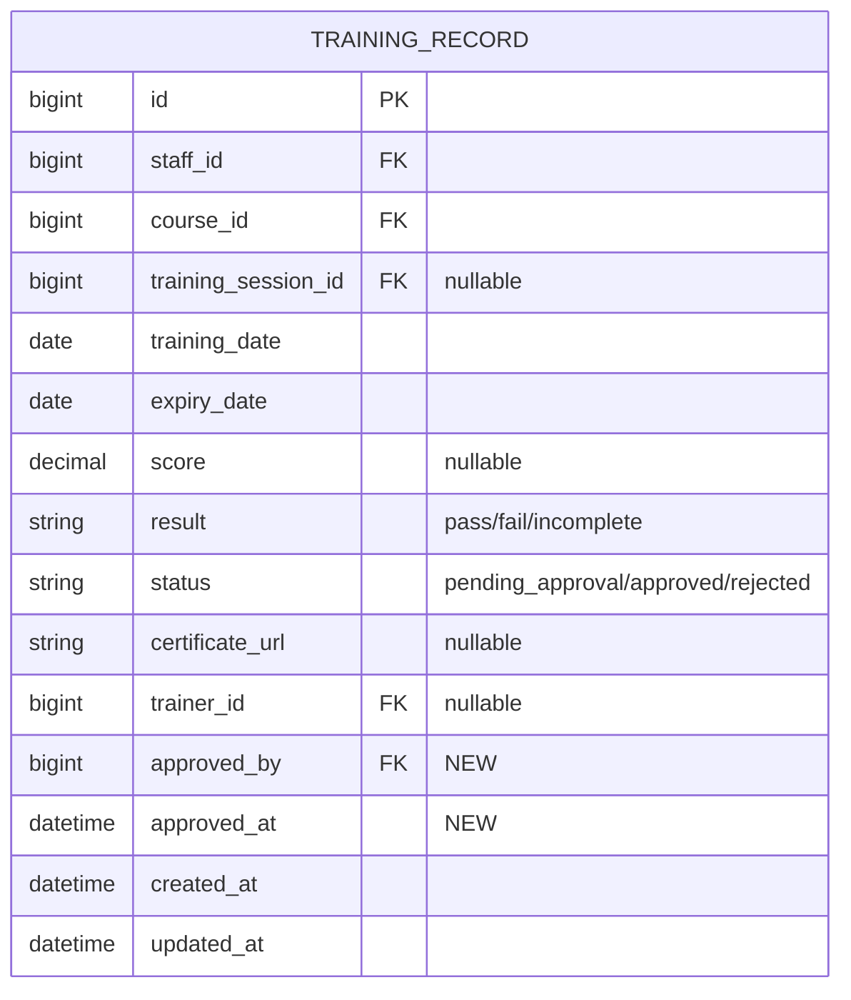

### 2.5 COURSE & MATRIX

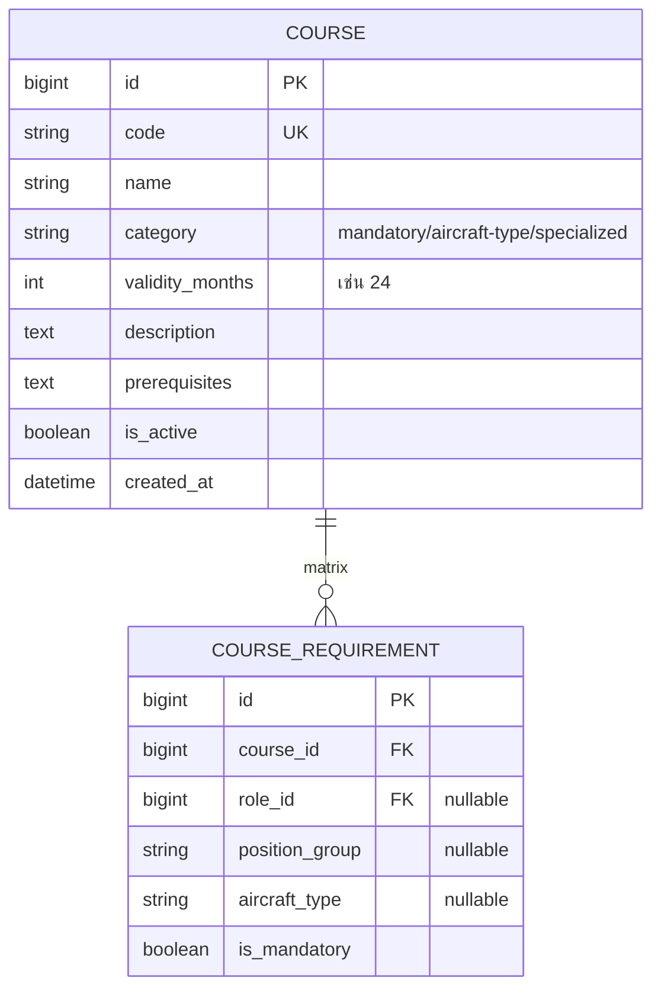

### 2.6 TRAINING_SESSION

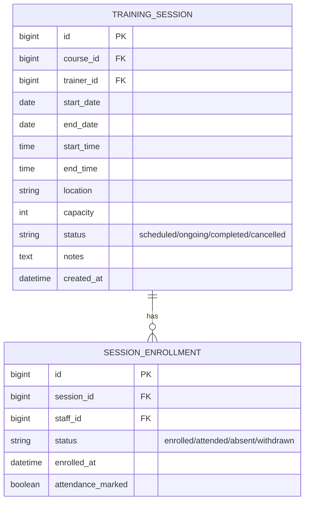

---

## 3. RBAC Tables 🆕

### 3.1 USER, ROLE, PERMISSION

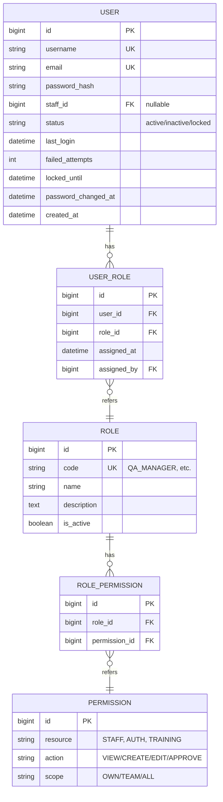

---

## 4. Audit & Notification Tables 🆕

### 4.1 AUDIT_LOG (Append-only)

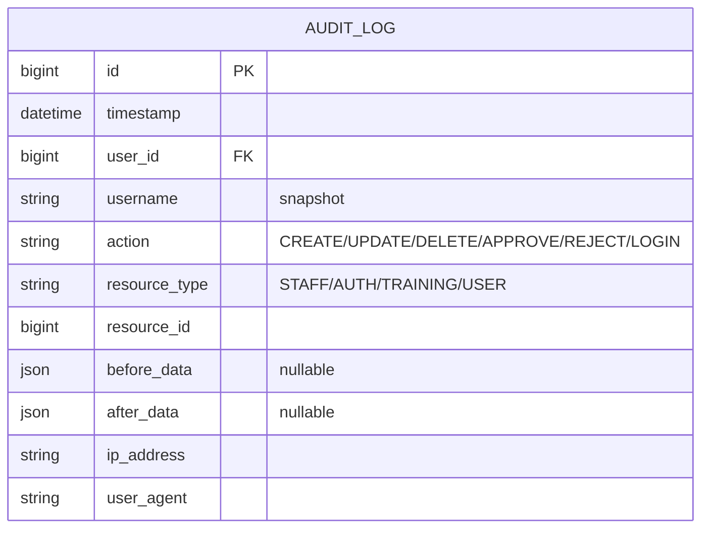

> 🆕 **[NEW DESIGN]** — Append-only, ห้าม UPDATE/DELETE

### 4.2 NOTIFICATION & EMAIL_QUEUE

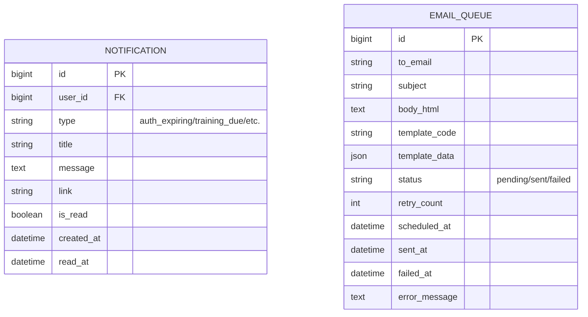

---

## 5. Customer Airlines & Authorities

### 5.1 CUSTOMER_AIRLINE (18 records)

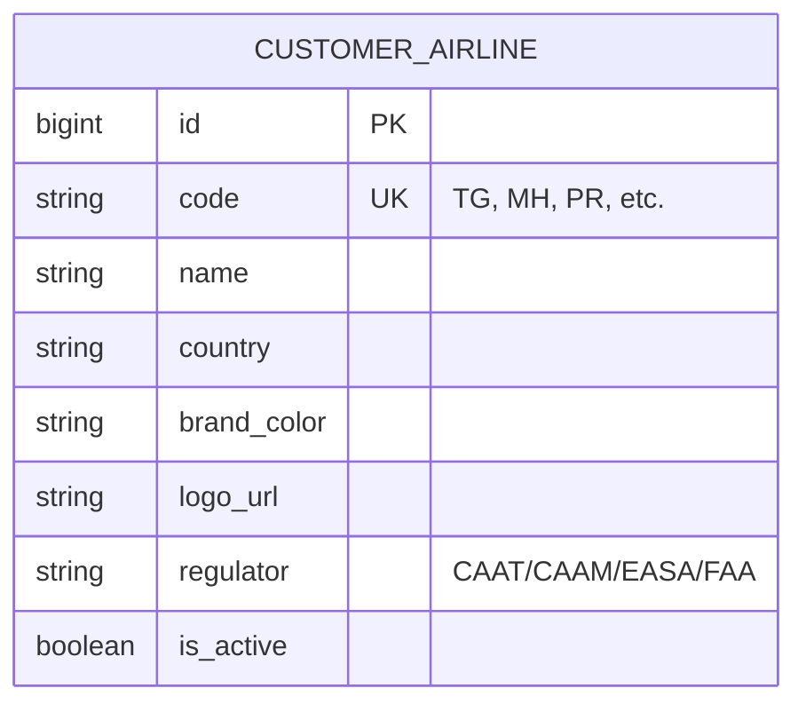

ตัวอย่างข้อมูล:
| code | name | country | regulator |
|---|---|---|---|
| TG | Thai Airways | TH | CAAT |
| MH | Malaysia Airlines | MY | CAAM |
| PR | Philippine Airlines | PH | CAAP |
| EK | Emirates | AE | GCAA |
| QF | Qantas | AU | CASA |

### 5.2 AUTHORITY (13 records)

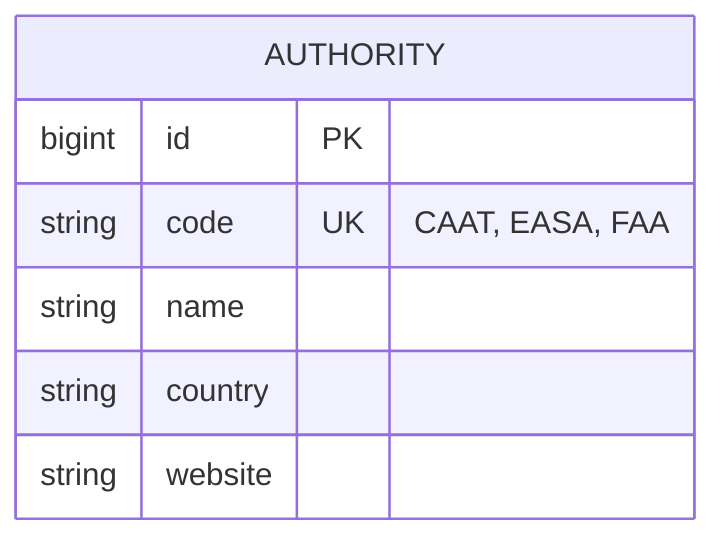

---

## 6. Indexing Strategy

### 6.1 Primary Indexes

| Table | Index | Reason |
|---|---|---|
| STAFF | (employee_code) UNIQUE | Lookup by code |
| STAFF | (department_id) | Filter by dept |
| STAFF | (status) | Filter active |
| AUTHORIZATION | (staff_id) | Get staff's auths |
| AUTHORIZATION | (customer_airline_id, status) | Compliance reporting |
| AUTHORIZATION | (expiry_date) | Expiry scan |
| AUTHORIZATION | (status, expiry_date) | Expiring filter |
| TRAINING_RECORD | (staff_id, course_id) | Get latest training |
| TRAINING_RECORD | (expiry_date) | Expiry scan |
| AUDIT_LOG | (timestamp DESC) | Recent activities |
| AUDIT_LOG | (user_id, timestamp) | User activity |
| AUDIT_LOG | (resource_type, resource_id) | Resource history |
| EMAIL_QUEUE | (status, scheduled_at) | Worker pickup |

### 6.2 Composite/Specialized

| Index | Use Case |
|---|---|
| `(staff_id, status, expiry_date)` on AUTHORIZATION | CS list with expiry filter |
| `(course_id, training_date DESC)` on TRAINING_RECORD | Latest training per course |
| Full-text on STAFF.first_name + last_name | Search |

---

## 7. Data Flow Diagrams

### 7.1 Authorization Lifecycle Data Flow

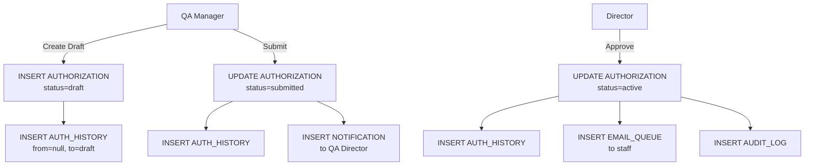

### 7.2 Daily Expiry Scan Data Flow

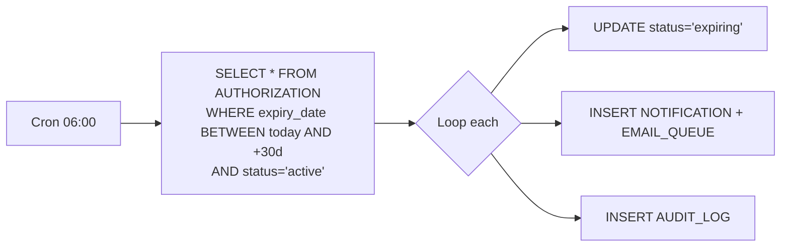

### 7.3 CRS Eligibility Calculation

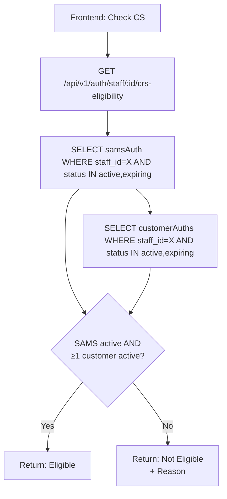

---

## 8. Data Migration Strategy

### 8.1 Migration Sources

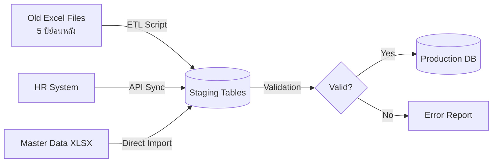

### 8.2 Migration Order

| Step | Entity | เหตุผล |
|---|---|---|
| 1 | DEPARTMENT, COURSE, CUSTOMER_AIRLINE, AUTHORITY | Master data ก่อน |
| 2 | ROLE, PERMISSION, ROLE_PERMISSION | RBAC config |
| 3 | STAFF | ต้องมีก่อน entity อื่น |
| 4 | USER + USER_ROLE | Link to STAFF |
| 5 | EDUCATION, WORK_EXPERIENCE, LOGBOOK | Staff details |
| 6 | TRAINING_RECORD | ต้องมี STAFF + COURSE |
| 7 | AUTHORIZATION | ต้องมี STAFF + CUSTOMER + AUTHORITY |
| 8 | AUTH_HISTORY | บันทึกย้อนหลังจาก timestamp ใน Excel |

---

## 9. Data Retention & Archival 🆕

### 9.1 Retention Policy

| Entity | Active Retention | Archive Retention | Total |
|---|---|---|---|
| STAFF (active) | Forever | — | Forever |
| STAFF (resigned) | 90 วัน | 5 ปี | 5 ปี + 90 วัน |
| AUTHORIZATION | Active period | 5 ปีหลัง expire | Active + 5 ปี |
| TRAINING_RECORD | Active period | 5 ปีหลัง expire | Active + 5 ปี |
| AUDIT_LOG | Forever | — | Forever (≥ 5 ปี ตาม regulation) |
| LOGBOOK | Forever | — | Forever |
| USER (resigned) | Disabled | Forever | Forever (audit) |
| EMAIL_QUEUE (sent) | 30 วัน | — | 30 วัน |
| NOTIFICATION (read) | 90 วัน | — | 90 วัน |
| TRAINING_SESSION (completed) | 1 ปี | 5 ปี | 6 ปี |

### 9.2 Archival Process

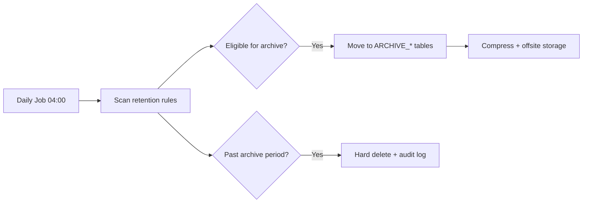

---

## 10. Data Validation Rules

### 10.1 Field-Level Validation

| Field | Rule |
|---|---|
| STAFF.employee_code | Unique, regex `^[A-Z0-9-]{3,20}$` |
| STAFF.email | Valid email format, unique |
| STAFF.national_id | Encrypted, 13 digits (TH) |
| AUTHORIZATION.expiry_date | > issue_date |
| AUTHORIZATION.expiry_date (Customer) | ≤ SAMS auth expiry |
| TRAINING_RECORD.expiry_date | > training_date |
| COURSE.validity_months | > 0, ≤ 60 |
| USER.password_hash | bcrypt format check |
| EMAIL_QUEUE.to_email | Valid email |

### 10.2 Business Rule Constraints (DB-level)

```sql
-- Customer auth expiry ≤ SAMS auth expiry
CHECK (
  auth_type != 'customer' OR
  expiry_date <= (SELECT expiry_date FROM authorization 
                  WHERE staff_id = self.staff_id 
                  AND auth_type = 'SAMS' AND status = 'active')
)

-- Soft delete only (no hard delete)
ROW LEVEL: deleted_at IS NULL for active queries
```

---

## 11. Sample Data Volumes (Estimated)

| Table | Year 1 | Year 5 | Year 10 |
|---|---|---|---|
| STAFF | 2,000 | 5,000 | 8,000 |
| AUTHORIZATION | 10,000 | 50,000 | 100,000 |
| AUTH_HISTORY | 30,000 | 200,000 | 500,000 |
| TRAINING_RECORD | 100,000 | 1,250,000 | 3,000,000 |
| TRAINING_SESSION | 5,000 | 25,000 | 50,000 |
| AUDIT_LOG | 500,000 | 5,000,000 | 15,000,000 |
| EMAIL_QUEUE | 50,000/year | (rolling 30d) | (rolling 30d) |
| NOTIFICATION | 100,000/year | (rolling 90d) | (rolling 90d) |

> Database size estimated: ~50 GB at Year 5 (with audit logs being largest)

---

*— จบเอกสาร SAMS-QA-SRS-07 —*
