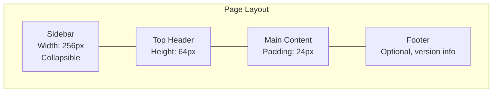
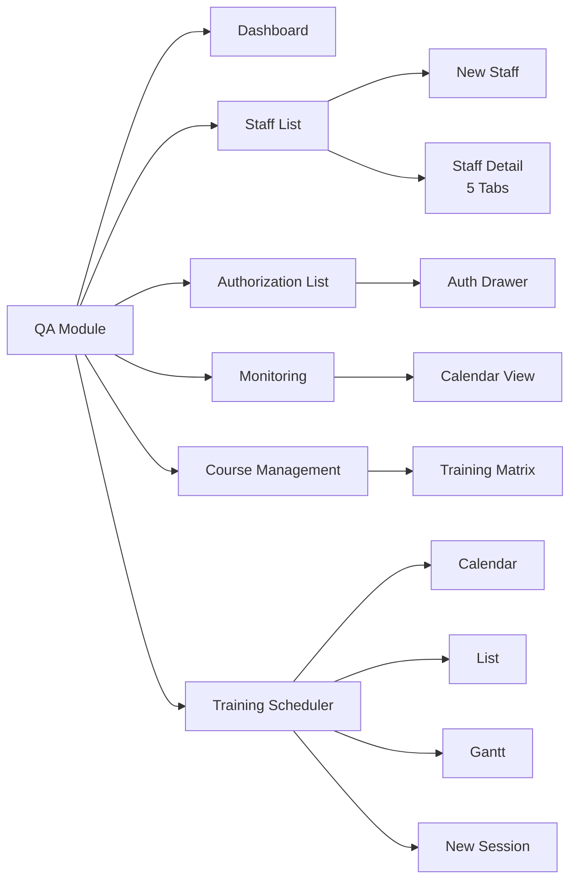
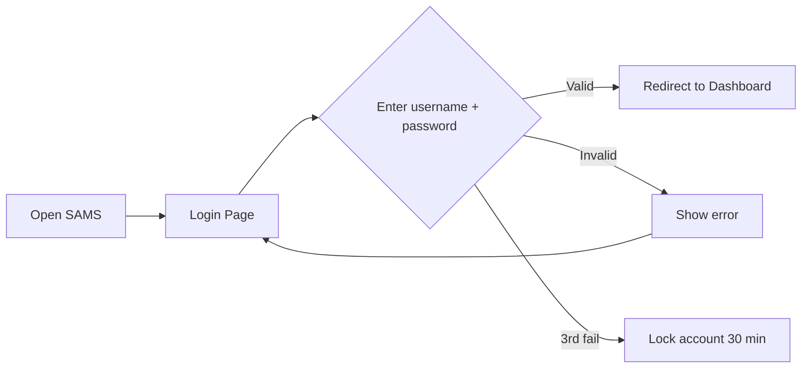
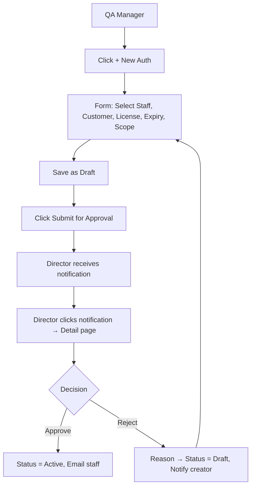
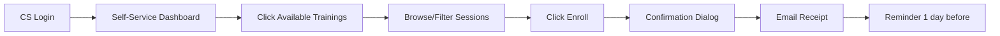
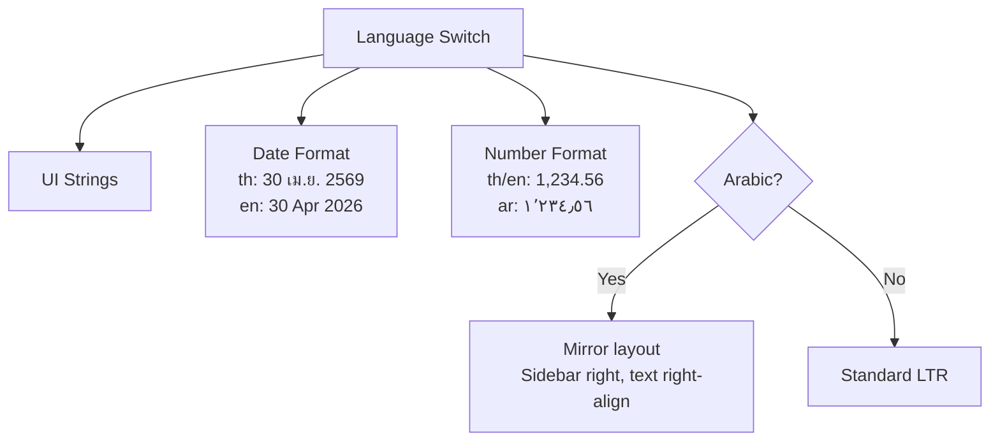

# SAMS-QA-SRS-08 — UI/UX Design
## ระบบ SAMS: โมดูล Quality Assurance (QA)

| รายการ | รายละเอียด |
|---|---|
| **Document No.** | SAMS-QA-SRS-08 |
| **Module** | Quality Assurance (QA) |
| **เวอร์ชัน** | 1.0 |
| **วันที่จัดทำ** | 2026-04-27 |

---

## Revision History

| เวอร์ชัน | วันที่ | ผู้จัดทำ | รายละเอียด |
|---|---|---|---|
| 1.0 | 2026-04-27 | Triple-T Dev | ร่างแรก |

---

## 1. Design Principles

### 1.1 หลักการออกแบบ

| หลักการ | คำอธิบาย |
|---|---|
| **Clarity over Cleverness** | ใช้คำที่ผู้ใช้เข้าใจง่าย, ไม่ใช้ jargon เกินจำเป็น |
| **Consistency** | Pattern เดียวกันทั่วระบบ (เช่น confirmation dialog) |
| **Feedback** | ทุก action มี response ที่ชัดเจน (loading, success, error) |
| **Progressive Disclosure** | แสดงข้อมูลที่จำเป็นก่อน, รายละเอียดอยู่ใน drawer/modal |
| **Mobile-First (responsive)** | ออกแบบให้ใช้งานได้ทุกขนาดจอ (Phase 1: Desktop priority) |
| **Accessibility** | WCAG 2.1 AA — keyboard, screen reader |

### 1.2 Brand Identity

```mermaid
graph LR
    BRAND[SAMS Brand]
    BRAND --> COLOR[Colors:<br/>Primary #1a3c6e<br/>Secondary #2563eb<br/>Success #10b981<br/>Warning #f59e0b<br/>Danger #ef4444]
    BRAND --> FONT[Fonts:<br/>Inter (English)<br/>Sarabun (Thai)<br/>Cairo (Arabic)]
    BRAND --> SPACING[Spacing:<br/>Tailwind scale<br/>4px base unit]
```

---

## 2. Layout Structure

### 2.1 Global Layout (Authenticated)



### 2.2 Layout Anatomy (Desktop ≥1280px)

```
┌──────────────────────────────────────────────────────────┐
│ [Logo] [Search........]  [🔔] [Lang] [Theme] [Avatar ▾] │ Header (64px)
├────────────┬─────────────────────────────────────────────┤
│            │                                             │
│ Sidebar    │   Main Content Area                         │
│            │                                             │
│ - Menu 1   │   ┌───────────────────────────────┐         │
│ - Menu 2   │   │ Page Title + Breadcrumb       │         │
│   - Sub    │   │                               │         │
│   - Sub    │   │ Filter / Search Bar           │         │
│ - Menu 3   │   │                               │         │
│            │   │ Content (Table/Cards/Form)    │         │
│            │   │                               │         │
│ (256px)    │   │ Pagination                    │         │
│            │   └───────────────────────────────┘         │
└────────────┴─────────────────────────────────────────────┘
```

### 2.3 Responsive Breakpoints

| Breakpoint | Behavior |
|---|---|
| **Desktop (≥1280px)** | Sidebar expanded + full content |
| **Laptop (1024-1279px)** | Sidebar collapsible (icon only) |
| **Tablet (768-1023px)** | Sidebar overlay drawer, hamburger menu |
| **Mobile (<768px)** | Bottom navigation, single column |

---

## 3. Sub-module Screen Maps

### 3.1 QA Module Sitemap



---

## 4. Screen Designs (Wireframes)

### 4.1 QA Dashboard

```
┌─ Dashboard ────────────────────────────────────────────┐
│                                                         │
│  ┌──────────┐  ┌──────────┐  ┌──────────┐  ┌──────────┐│
│  │ Total    │  │ Active   │  │ Expiring │  │ Compli-  ││
│  │ Staff    │  │ Auth     │  │ ≤30d     │  │ ance %   ││
│  │   1,234  │  │   856    │  │    42 ⚠️ │  │   94.5%  ││
│  └──────────┘  └──────────┘  └──────────┘  └──────────┘│
│                                                         │
│  ┌─ Compliance Trend ────────────────┐  ┌─ Alerts ────┐│
│  │   [Line chart: 12 months]          │  │ • 5 expired ││
│  │                                     │  │ • 12 ≤30d   ││
│  │                                     │  │ • 25 ≤60d   ││
│  └─────────────────────────────────────┘  └─────────────┘│
│                                                         │
│  ┌─ Upcoming Training Sessions (7 days) ──────────────┐│
│  │ [Date]  [Course]  [Trainer]  [Enrolled/Capacity]   ││
│  └─────────────────────────────────────────────────────┘│
└─────────────────────────────────────────────────────────┘
```

#### Wireframe Mockup

> 📊 **[Wireframe: QA Dashboard]**  
> ดูรายละเอียดที่ codebase: `/home/user/sams/app/[locale]/(protected)/qa/dashboard/`

### 4.2 Staff List

```
┌─ Staff Management ─────────────────────────────────────┐
│                                                         │
│  [Search 🔍...]  [Filter ▾]  [+ New Staff]  [Export ▾] │
│                                                         │
│  ┌──────────────────────────────────────────────────┐  │
│  │ # │ Code  │ Name        │ Position │ Dept │ Stat ││
│  ├──────────────────────────────────────────────────┤  │
│  │ 1 │ E001  │ John Doe    │ CS       │ LM   │ ✅   ││
│  │ 2 │ E002  │ Jane Smith  │ AME      │ HM   │ ✅   ││
│  └──────────────────────────────────────────────────┘  │
│                                                         │
│  [< Prev] Page 1 of 25 [Next >]   [50 ▾] per page    │
└─────────────────────────────────────────────────────────┘
```

### 4.3 Staff Detail (5 Tabs)

```
┌─ Staff: John Doe (E001) ───────────────────────────────┐
│                                                         │
│  ┌─ 👤 ──┐                                              │
│  │ Photo│  John Doe                    [Edit] [Print]  │
│  │      │  Position: Certifying Staff                  │
│  └──────┘  Dept: Line Maintenance | License: B1+B2     │
│                                                         │
│  [Profile][Education][Experience][Training][Logbook]   │
│  ─────────────────────────────────────────────────     │
│                                                         │
│  ┌─ Personal Info ────────────────────────────────┐    │
│  │ Name: ...                                       │    │
│  │ DOB: ...                                        │    │
│  │ Email: ...                                      │    │
│  │ ...                                             │    │
│  └─────────────────────────────────────────────────┘    │
│                                                         │
└─────────────────────────────────────────────────────────┘
```

### 4.4 Authorization List

```
┌─ Authorization Management ─────────────────────────────┐
│                                                         │
│  Filter: [All Customers ▾] [Status ▾] [License ▾]      │
│                                                         │
│  Tabs: [All] [SAMS] [Customer] [Authority]              │
│                                                         │
│  ┌──────────────────────────────────────────────────┐  │
│  │ Staff    │ SAMS │ TG │ MH │ PR │ EK │ ... │ CRS ││
│  ├──────────────────────────────────────────────────┤  │
│  │ John Doe │  🟢  │ 🟢 │ 🟡 │ 🔴 │ —  │     │ ✅  ││
│  │ Jane Smith│ 🟢  │ 🟢 │ 🟢 │ 🟢 │ 🟢 │     │ ✅★ ││
│  └──────────────────────────────────────────────────┘  │
│  Legend: 🟢 Active 🟡 Expiring 🔴 Expired ★ Fully Auth │
└─────────────────────────────────────────────────────────┘
```

### 4.5 Authorization Drawer (Detail)

```
┌─ John Doe — Authorization Detail ─────────[X]──┐
│                                                  │
│  CRS Eligibility: ✅ Eligible                    │
│  Reason: SAMS active + 1 customer active         │
│                                                  │
│  ┌─ SAMS Authorization ─────────────────────┐   │
│  │ Number: SAMS-AUTH-0012                   │   │
│  │ Status: 🟢 Active                        │   │
│  │ Issue: 01 Jan 2024 | Expiry: 31 Dec 2026 │   │
│  │ Scope: B737 NG, B737 MAX                 │   │
│  │ [Renew] [Suspend] [Revoke]               │   │
│  └──────────────────────────────────────────┘   │
│                                                  │
│  ┌─ Customer: TG (Thai Airways) ───────────┐    │
│  │ Number: TG-AUTH-0034 | 🟢 Active        │    │
│  │ Expiry: 30 Sep 2026                      │    │
│  └──────────────────────────────────────────┘    │
│  ...                                             │
│                                                  │
│  [📋 History Timeline]                           │
└──────────────────────────────────────────────────┘
```

### 4.6 Training Scheduler — Calendar View

```
┌─ Training Scheduler ───────────────────────────────────┐
│                                                         │
│  [📅 Calendar] [📋 List] [📊 Gantt]  [+ New Session]   │
│                                                         │
│       April 2026                                        │
│  Sun  Mon  Tue  Wed  Thu  Fri  Sat                     │
│  ───  ───  ───  ───  ───  ───  ───                     │
│       1    2    3    4    5    6                        │
│                  📚    📚                                │
│       8    9    10   11   12   13                       │
│       📚              📚    📚                           │
│  ...                                                    │
│                                                         │
│  Legend: 📚 Training | 🔴 Cancelled | ✅ Completed      │
└─────────────────────────────────────────────────────────┘
```

### 4.7 Monitoring — Compliance View

```
┌─ Compliance Monitoring ────────────────────────────────┐
│                                                         │
│  ┌─ Summary ──────────────────────────────┐            │
│  │ Compliant: 1,180 | Non-Compliant: 54   │            │
│  │ Compliance Rate: 95.6%                 │            │
│  └────────────────────────────────────────┘            │
│                                                         │
│  Filter: [Department ▾] [Course ▾] [Status ▾]          │
│                                                         │
│  ┌──────────────────────────────────────────────────┐  │
│  │ Staff │ Course 1 │ Course 2 │ ... │ Course 14 │  │  │
│  ├──────────────────────────────────────────────────┤  │
│  │ E001  │ ✅ exp:Q1│ ⚠️ ≤30d  │     │ ❌ Missing │  │  │
│  │ E002  │ ✅       │ ✅       │     │ ✅         │  │  │
│  └──────────────────────────────────────────────────┘  │
└─────────────────────────────────────────────────────────┘
```

---

## 5. Component Library

### 5.1 Atomic Components (จาก Shadcn/Radix)

| Component | Purpose |
|---|---|
| Button | Primary/Secondary/Ghost/Destructive |
| Input | Text/Email/Password/Number/Search |
| Select | Dropdown selection |
| Combobox | Searchable dropdown |
| Checkbox / Radio | Selection |
| Switch | Toggle |
| Date Picker | Single date / Date range |
| Modal / Dialog | Confirmations, forms |
| Drawer / Sheet | Side panel for details |
| Toast | Notifications |
| Tooltip | Hover hints |
| Tabs | Tab navigation |
| Card | Content grouping |
| Table | Data display |
| Pagination | Page navigation |
| Badge | Status indicator |
| Avatar | User photo |
| Skeleton | Loading state |
| Alert | Inline notifications |

### 5.2 Composite Components (SAMS-specific)

| Component | Purpose |
|---|---|
| `<StatusBadge>` | สี/icon ตาม authorization status |
| `<ExpiryBadge>` | แสดง countdown (≤30/60/90) |
| `<CRSBadge>` | Eligible/Not Eligible |
| `<StaffSelect>` | Combobox + filter |
| `<AirlineFilter>` | Multi-select 18 airlines |
| `<RoleGate>` | Conditional render by role |
| `<DataTable>` | Server-side pagination + sort + filter |
| `<FormBuilder>` | React Hook Form + Zod wrapper |

---

## 6. User Flows

### 6.1 Login Flow



### 6.2 Authorization Approval Flow



### 6.3 Training Enrollment Flow (Self-Service)



---

## 7. Visual Design Tokens

### 7.1 Color Palette

| Color | Hex | Use |
|---|---|---|
| **Primary 900** | #1a3c6e | Headers, key actions |
| **Primary 600** | #2563eb | Links, secondary buttons |
| **Primary 50** | #eff6ff | Hover backgrounds |
| **Success** | #10b981 | Active, success |
| **Warning** | #f59e0b | Expiring, warning |
| **Danger** | #ef4444 | Expired, error |
| **Neutral 900** | #1f2937 | Body text |
| **Neutral 500** | #6b7280 | Muted text |
| **Neutral 100** | #f3f4f6 | Card backgrounds |
| **White** | #ffffff | Page background |

### 7.2 Typography

| Style | Font | Size | Weight |
|---|---|---|---|
| **Display** | Inter / Sarabun | 36px | Bold |
| **H1** | Inter / Sarabun | 28px | Bold |
| **H2** | Inter / Sarabun | 22px | Semibold |
| **H3** | Inter / Sarabun | 18px | Semibold |
| **Body** | Inter / Sarabun | 14px | Regular |
| **Small** | Inter / Sarabun | 12px | Regular |
| **Code** | JetBrains Mono | 13px | Regular |

### 7.3 Spacing Scale (Tailwind)

| Token | Pixel | Use |
|---|---|---|
| 1 | 4px | Tight icon spacing |
| 2 | 8px | Component padding |
| 4 | 16px | Card padding |
| 6 | 24px | Section spacing |
| 8 | 32px | Page padding |
| 12 | 48px | Large gaps |

### 7.4 Iconography

ใช้ **Lucide Icons** (consistent set, open source)

| Icon | Use |
|---|---|
| Shield | QA / Authorization |
| User / Users | Staff |
| BookOpen | Course |
| Calendar | Schedule |
| AlertCircle | Warning |
| CheckCircle | Success |
| XCircle | Error |
| Bell | Notification |
| Settings | Admin |

---

## 8. Empty States, Errors, Loading

### 8.1 Empty State

```
┌─ Empty Data ─────────────────────────────────┐
│                                                │
│         📭                                     │
│         No data found                          │
│         ลองเปลี่ยน filter หรือเพิ่มข้อมูลใหม่    │
│                                                │
│         [+ Add new]                            │
│                                                │
└────────────────────────────────────────────────┘
```

### 8.2 Loading State

| Type | Pattern |
|---|---|
| Initial Page Load | Full-page skeleton |
| Table Refresh | Row skeletons (5 rows) |
| Button Action | Spinner inside button |
| Inline | Inline spinner ข้าง field |

### 8.3 Error State

```
┌─ Error ───────────────────────────────────────┐
│  ❌  Something went wrong                      │
│      เกิดข้อผิดพลาด: <error message>          │
│      [Retry] [Contact Support]                │
└────────────────────────────────────────────────┘
```

### 8.4 Success Toast

```
┌─ ✅ Success ──────────────────┐
│  Authorization approved        │
│  John Doe (TG-AUTH-0034)      │
│                          [X]  │
└────────────────────────────────┘
```

---

## 9. Accessibility (WCAG 2.1 AA)

### 9.1 Checklist

| Item | ระดับ |
|---|---|
| Keyboard navigation (Tab, Enter, Escape) | AA |
| Focus visible (clear outline) | AA |
| Color contrast ≥ 4.5:1 (text) | AA |
| Color contrast ≥ 3:1 (UI elements) | AA |
| Don't rely solely on color (use icons + text) | AA |
| ARIA labels for icon-only buttons | AA |
| Screen reader compatible | AA |
| Skip to main content link | AA |
| Form labels (visible + ARIA) | AA |
| Error announcements (ARIA live region) | AA |

### 9.2 Test Tools

- axe DevTools
- Lighthouse Accessibility audit
- Manual screen reader testing (NVDA / VoiceOver)
- Keyboard-only navigation test

---

## 10. Localization (i18n)

### 10.1 Supported Languages

| Locale | Direction | Default? |
|---|---|---|
| `th` (ไทย) | LTR | ✅ Default |
| `en` (English) | LTR | — |
| `ar` (العربية) | RTL | — |

### 10.2 Localized Elements



---

## 11. Print/PDF Layouts

ระบบมี print version สำหรับเอกสาร PDF ตาม form templates:

| Form | Source |
|---|---|
| Staff Profile | SAMS-FM-CM-036 |
| Logbook | SAMS-FM-CM-041 |
| CS Experience Summary | SAMS-FM-CM-062 |
| Training Matrix | SAMS-FM-CM-014 |
| Authorization Certificate | (custom template) |
| Attendance Sheet | (custom template) |

> Print layout ใช้ separate CSS (`@media print`) — hide sidebar, header, action buttons

---

*— จบเอกสาร SAMS-QA-SRS-08 —*
