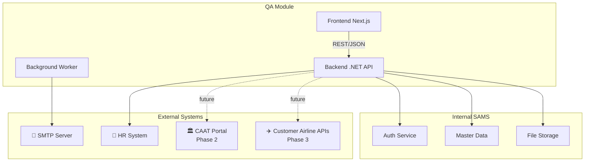
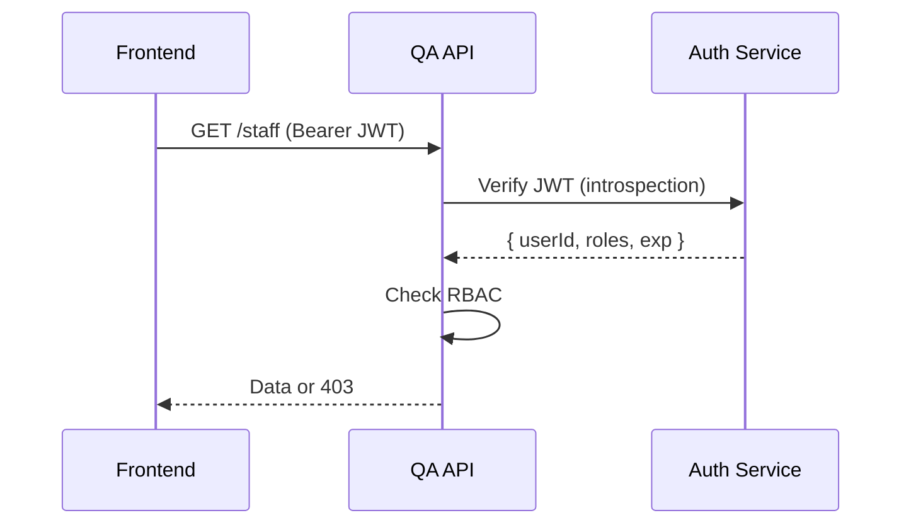
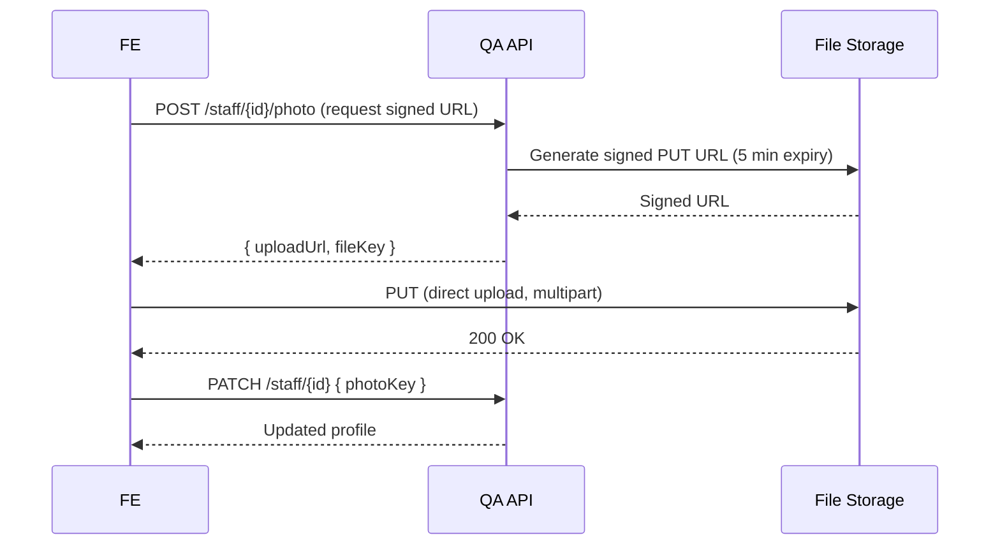
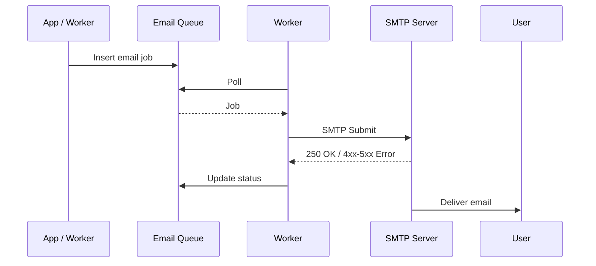
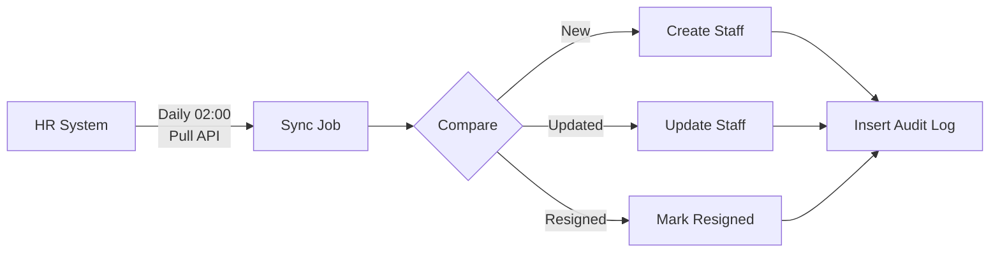
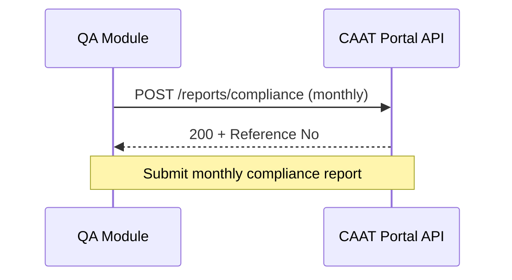
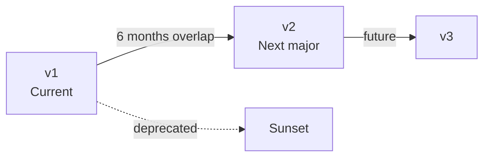

# SAMS-QA-SRS-09 — Integration & Interface
## ระบบ SAMS: โมดูล Quality Assurance (QA)

| รายการ | รายละเอียด |
|---|---|
| **Document No.** | SAMS-QA-SRS-09 |
| **Module** | Quality Assurance (QA) |
| **เวอร์ชัน** | 1.0 |
| **วันที่จัดทำ** | 2026-04-27 |

---

## Revision History

| เวอร์ชัน | วันที่ | ผู้จัดทำ | รายละเอียด |
|---|---|---|---|
| 1.0 | 2026-04-27 | Triple-T Dev | ร่างแรก |

---

## 1. Integration Overview

### 1.1 Integration Map



### 1.2 Integration Inventory

| ID | Integration | ประเภท | Phase |
|---|---|---|---|
| INT-01 | Auth Service (JWT) | Internal | 1 |
| INT-02 | Master Data API | Internal | 1 |
| INT-03 | File Storage API | Internal | 1 |
| INT-04 | SMTP Email Service | External | 1 |
| INT-05 | HR System (Employee Sync) | External | 1 |
| INT-06 | CAAT Portal | External | 2 |
| INT-07 | Customer Airline APIs (Webhook) | External | 3 |

---

## 2. Backend REST API Specification 🆕

> 🆕 **[NEW DESIGN]** — API endpoints ทั้งหมดของ QA module ปัจจุบันยังเป็น mock data ใน frontend  
> ส่วนนี้คือ specification ที่ Backend Team ต้อง implement

### 2.1 API Conventions

| รายการ | Convention |
|---|---|
| **Base URL** | `https://api.sams.aero/api/v1` |
| **Auth** | `Authorization: Bearer <JWT>` |
| **Content-Type** | `application/json` |
| **Charset** | UTF-8 |
| **Date Format** | ISO 8601 (`2026-04-27T10:00:00Z`) |
| **Locale** | `Accept-Language: th-TH | en-US | ar-SA` |

### 2.2 Standard Response Format

**Success:**
```json
{
  "data": { ... },
  "meta": { "page": 1, "size": 50, "total": 1234 }
}
```

**Error:**
```json
{
  "error": {
    "code": "VALIDATION_ERROR",
    "message": "ข้อมูลไม่ถูกต้อง",
    "details": [
      { "field": "expiryDate", "message": "ต้องมากกว่า issueDate" }
    ]
  }
}
```

### 2.3 HTTP Status Codes

| Code | ใช้เมื่อ |
|---|---|
| 200 OK | Success (GET) |
| 201 Created | Created (POST) |
| 204 No Content | Deleted (DELETE) |
| 400 Bad Request | Validation error |
| 401 Unauthorized | JWT invalid/expired |
| 403 Forbidden | Insufficient permission |
| 404 Not Found | Resource not exists |
| 409 Conflict | Duplicate / state conflict |
| 422 Unprocessable Entity | Business rule violation |
| 500 Internal Server Error | Server error |

### 2.4 Auth Endpoints

| Method | Path | Description |
|---|---|---|
| POST | `/auth/login` | Login → JWT + Refresh token |
| POST | `/auth/refresh` | Refresh JWT |
| POST | `/auth/logout` | Logout (invalidate refresh) |
| POST | `/auth/forgot-password` | ส่ง email reset link |
| POST | `/auth/reset-password` | Reset password ด้วย token |

### 2.5 Staff Endpoints

| Method | Path | Description |
|---|---|---|
| GET | `/staff` | List (paginate, filter) |
| GET | `/staff/{id}` | Get detail |
| POST | `/staff` | Create new |
| PATCH | `/staff/{id}` | Update |
| POST | `/staff/{id}/resign` | Mark as resigned |
| GET | `/staff/{id}/education` | Get education list |
| POST | `/staff/{id}/education` | Add education |
| PATCH | `/staff/{id}/education/{eduId}` | Update education |
| DELETE | `/staff/{id}/education/{eduId}` | Delete |
| GET | `/staff/{id}/experience` | Get work experience |
| POST | `/staff/{id}/experience` | Add experience |
| ... | (similar for license, logbook) | ... |
| POST | `/staff/import` | Bulk import (XLSX) |
| GET | `/staff/import/template` | Download XLSX template |
| GET | `/staff/{id}/profile.pdf` | Generate PDF |

### 2.6 Authorization Endpoints

| Method | Path | Description |
|---|---|---|
| GET | `/authorizations` | List with filter |
| GET | `/authorizations/{id}` | Get detail |
| POST | `/authorizations` | Create draft |
| PATCH | `/authorizations/{id}` | Update draft |
| POST | `/authorizations/{id}/submit` | Submit for approval |
| POST | `/authorizations/{id}/approve` | Approve |
| POST | `/authorizations/{id}/reject` | Reject |
| POST | `/authorizations/{id}/suspend` | Suspend |
| POST | `/authorizations/{id}/revoke` | Revoke |
| POST | `/authorizations/{id}/renew` | Renew (extend expiry) |
| GET | `/authorizations/{id}/history` | Get history timeline |
| GET | `/staff/{id}/crs-eligibility` | Calculate CRS eligibility |
| GET | `/authorizations/expiring` | List expiring soon |
| GET | `/authorizations/export.xlsx` | Multi-sheet export |
| GET | `/authorizations/{id}/certificate.pdf` | Generate cert PDF |

### 2.7 Course Management Endpoints

| Method | Path | Description |
|---|---|---|
| GET | `/courses` | List courses |
| GET | `/courses/{id}` | Get course |
| POST | `/courses` | Create course |
| PATCH | `/courses/{id}` | Update |
| POST | `/courses/{id}/deactivate` | Soft delete |
| GET | `/courses/matrix` | Get Training Needs Matrix |
| PUT | `/courses/matrix` | Update matrix |
| GET | `/courses/matrix.pdf` | Print matrix PDF |

### 2.8 Training Scheduler Endpoints

| Method | Path | Description |
|---|---|---|
| GET | `/training-sessions` | List (filter by date/status) |
| GET | `/training-sessions/{id}` | Get detail |
| POST | `/training-sessions` | Create session |
| PATCH | `/training-sessions/{id}` | Update |
| POST | `/training-sessions/{id}/cancel` | Cancel |
| POST | `/training-sessions/{id}/enroll` | Enroll staff (single/bulk) |
| DELETE | `/training-sessions/{id}/enroll/{staffId}` | Withdraw |
| POST | `/training-sessions/{id}/attendance` | Mark attendance |
| POST | `/training-sessions/{id}/results` | Submit results |
| POST | `/training-results/{id}/approve` | Approve result |
| GET | `/training-sessions/{id}/attendance.pdf` | Print attendance PDF |

### 2.9 Monitoring Endpoints

| Method | Path | Description |
|---|---|---|
| GET | `/monitoring/compliance` | Get overall compliance |
| GET | `/monitoring/staff/{id}/training-matrix` | Per-staff training status |
| GET | `/monitoring/expiring` | Aggregate expiring counters |
| GET | `/monitoring/calendar` | Calendar events (training + auth expiry) |
| GET | `/monitoring/report.xlsx` | Compliance XLSX |

### 2.10 Dashboard Endpoints

| Method | Path | Description |
|---|---|---|
| GET | `/dashboard/qa-summary` | Aggregated KPIs |
| GET | `/dashboard/recent-activity` | Recent audit log |
| GET | `/dashboard/upcoming` | Next 7 days events |
| GET | `/dashboard/trend` | 12-month compliance trend |

### 2.11 Notification Endpoints

| Method | Path | Description |
|---|---|---|
| GET | `/notifications` | My notifications |
| PATCH | `/notifications/{id}/read` | Mark as read |
| PATCH | `/notifications/read-all` | Mark all read |

### 2.12 Audit Log Endpoints (Admin only)

| Method | Path | Description |
|---|---|---|
| GET | `/audit-logs` | Search audit logs |
| GET | `/audit-logs/export.xlsx` | Export for authority |

---

## 3. Internal Integration

### 3.1 INT-01: Auth Service



| Spec | รายละเอียด |
|---|---|
| Protocol | REST/HTTPS |
| Auth | JWT (validated at QA API) |
| Token expiry | 30 min |
| Refresh | via `/auth/refresh` |

### 3.2 INT-02: Master Data API

| Endpoint | Purpose |
|---|---|
| `GET /master/customer-airlines` | List 18 airlines |
| `GET /master/authorities` | List 13 regulators |
| `GET /master/departments` | List departments |
| `GET /master/aircraft-types` | List aircraft types |

### 3.3 INT-03: File Storage API



| Spec | รายละเอียด |
|---|---|
| Storage | S3-compatible object storage |
| Bucket | `flight-storage.sams.aero` |
| Max file size | 10 MB (image), 50 MB (document) |
| Allowed types | jpg, png, pdf, xlsx |
| Signed URL expiry | 5 min (upload), 1 hour (download) |
| Virus scan | Required ก่อน accept |

---

## 4. External Integration

### 4.1 INT-04: SMTP Email Service 🆕



| Spec | รายละเอียด |
|---|---|
| Protocol | SMTP (TLS) |
| Auth | Username + Password |
| Port | 587 (STARTTLS) |
| Daily limit | 10,000 emails |
| Retry policy | 3 retries (5/15/60 min) |
| Bounce handling | Track + alert admin |
| Templates | HTML + Text fallback |

#### Email Templates

| Code | Trigger | Recipients |
|---|---|---|
| `auth_approved` | Authorization approved | CS staff |
| `auth_rejected` | Authorization rejected | Creator |
| `auth_expiring` | Auth expiring ≤30d | CS + QM |
| `auth_expired` | Auth expired | CS + QM |
| `training_enrolled` | Enrolled in session | Staff |
| `training_cancelled` | Session cancelled | Enrolled staff |
| `training_result` | Result approved | Staff |
| `password_reset` | Forgot password | User |
| `welcome` | New user | New user |
| `monthly_digest` | Monthly compliance | QM/Director |

### 4.2 INT-05: HR System Sync



| Spec | รายละเอียด |
|---|---|
| Protocol | REST/HTTPS pull (HR provides) |
| Frequency | Daily 02:00 |
| Auth | OAuth 2.0 (TBD) |
| Data Sync | employee code, name, dept, position, hire/resign date |
| Conflict | HR is source of truth สำหรับ basic info |

### 4.3 INT-06: CAAT Portal (Phase 2) 🆕



| Spec | รายละเอียด |
|---|---|
| Protocol | REST/HTTPS |
| Auth | API Key (TBD) |
| Data | Aggregated compliance % per customer |
| Frequency | Monthly |

> **หมายเหตุ**: CAAT Portal API spec ยังไม่ finalize — จะ confirm ใน Phase 2

### 4.4 INT-07: Customer Airline APIs (Phase 3)

| Customer | Integration Type |
|---|---|
| TG (Thai Airways) | Webhook for auth events |
| MH (Malaysia Airlines) | Pull API for compliance |
| ... | TBD per customer |

> **หมายเหตุ**: Phase 3 — รายละเอียดจะ confirm หลัง Phase 1-2 ผลิตภัณฑ์ใช้งานแล้ว

---

## 5. Data Exchange Formats

### 5.1 XLSX Template (Bulk Import)

#### Staff Import Template

| Column | Required | Format | Example |
|---|---|---|---|
| EmployeeCode | ✅ | string | E001 |
| Title | ✅ | string | Mr |
| FirstName | ✅ | string | John |
| LastName | ✅ | string | Doe |
| DateOfBirth | ✅ | YYYY-MM-DD | 1985-06-15 |
| Gender | ✅ | M/F | M |
| Email | ✅ | email | john@sams.aero |
| Phone | ✅ | string | +66812345678 |
| Department | ✅ | string | Line Maintenance |
| Position | ✅ | string | Certifying Staff |
| PositionGroup | ✅ | CS/AME/Trainer | CS |
| License | optional | B1/B2/B1+B2 | B1 |
| LicenseIssueDate | optional | YYYY-MM-DD | 2020-01-01 |
| LicenseExpiryDate | optional | YYYY-MM-DD | 2030-01-01 |
| HireDate | ✅ | YYYY-MM-DD | 2020-02-01 |

#### Authorization Import Template

| Column | Required | Format |
|---|---|---|
| EmployeeCode | ✅ | string |
| AuthType | ✅ | SAMS/Customer/Authority |
| CustomerCode | * | string (if Customer) |
| AuthorityCode | * | string (if Authority) |
| AuthNumber | ✅ | string |
| License | optional | B1/B2 |
| InitialIssueDate | optional | YYYY-MM-DD |
| IssueDate | ✅ | YYYY-MM-DD |
| ExpiryDate | ✅ | YYYY-MM-DD |
| Scope | optional | comma-separated |

### 5.2 Multi-Sheet Export Format

```
authorizations-export.xlsx
├── Sheet "Summary"     — Overall stats
├── Sheet "TG"          — Thai Airways auths
├── Sheet "MH"          — Malaysia Airlines auths
├── Sheet "PR"          — Philippine Airlines auths
├── Sheet "..."         — (one sheet per airline)
└── Sheet "Authority"   — Authority auths
```

### 5.3 PDF Output Standards

| Form | Page Size | Orientation |
|---|---|---|
| Staff Profile | A4 | Portrait |
| Logbook | A4 | Landscape |
| Training Matrix | A3 | Landscape |
| Attendance Sheet | A4 | Portrait |
| Authorization Cert | A4 | Portrait |
| CS Experience | A4 | Portrait |

---

## 6. API Versioning Strategy

### 6.1 Version Lifecycle



| Version | Status | Sunset Date |
|---|---|---|
| v1 | Active | TBD |
| v2 | Future | — |

| Strategy | รายละเอียด |
|---|---|
| URL versioning | `/api/v1/...` |
| Breaking changes | New major version |
| Backwards compat | Maintain v1 อย่างน้อย 6 เดือน หลัง v2 release |
| Deprecation header | `Sunset: <date>` ใน response |

---

## 7. Rate Limiting & Throttling

| Endpoint Group | Limit |
|---|---|
| Login | 5 attempts / 5 min / IP |
| Read API | 1,000 requests / hour / user |
| Write API | 200 requests / hour / user |
| Export | 10 / hour / user |
| Bulk Import | 5 / day / user |

> Rate limit response: `429 Too Many Requests` + `Retry-After` header

---

## 8. Webhook Specification (Phase 3) 🆕

ระบบจะ support outgoing webhooks สำหรับ customer airlines:

| Event | Payload |
|---|---|
| `authorization.created` | { staffId, customerId, authNumber, expiry } |
| `authorization.expired` | { staffId, customerId, authNumber } |
| `authorization.suspended` | { staffId, customerId, reason } |
| `training.completed` | { staffId, courseCode, expiry } |

| Spec | รายละเอียด |
|---|---|
| Protocol | HTTPS POST |
| Format | JSON |
| Signature | HMAC-SHA256 in header `X-SAMS-Signature` |
| Retry | 5 retries (1/5/15/60/240 min) |
| Timeout | 10 seconds |

---

## 9. Health Check & Monitoring Endpoints

| Method | Path | Purpose |
|---|---|---|
| GET | `/health` | Basic liveness check |
| GET | `/health/ready` | Readiness (DB + dependencies) |
| GET | `/health/live` | Liveness (process alive) |
| GET | `/metrics` | Prometheus-compatible metrics |

### Sample Response (`/health/ready`)

```json
{
  "status": "ok",
  "checks": {
    "database": "ok",
    "fileStorage": "ok",
    "smtp": "ok",
    "hrApi": "degraded"
  },
  "timestamp": "2026-04-27T10:00:00Z"
}
```

---

*— จบเอกสาร SAMS-QA-SRS-09 —*
