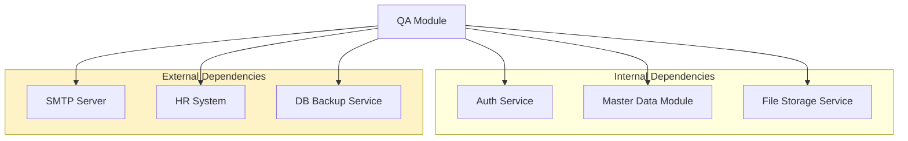
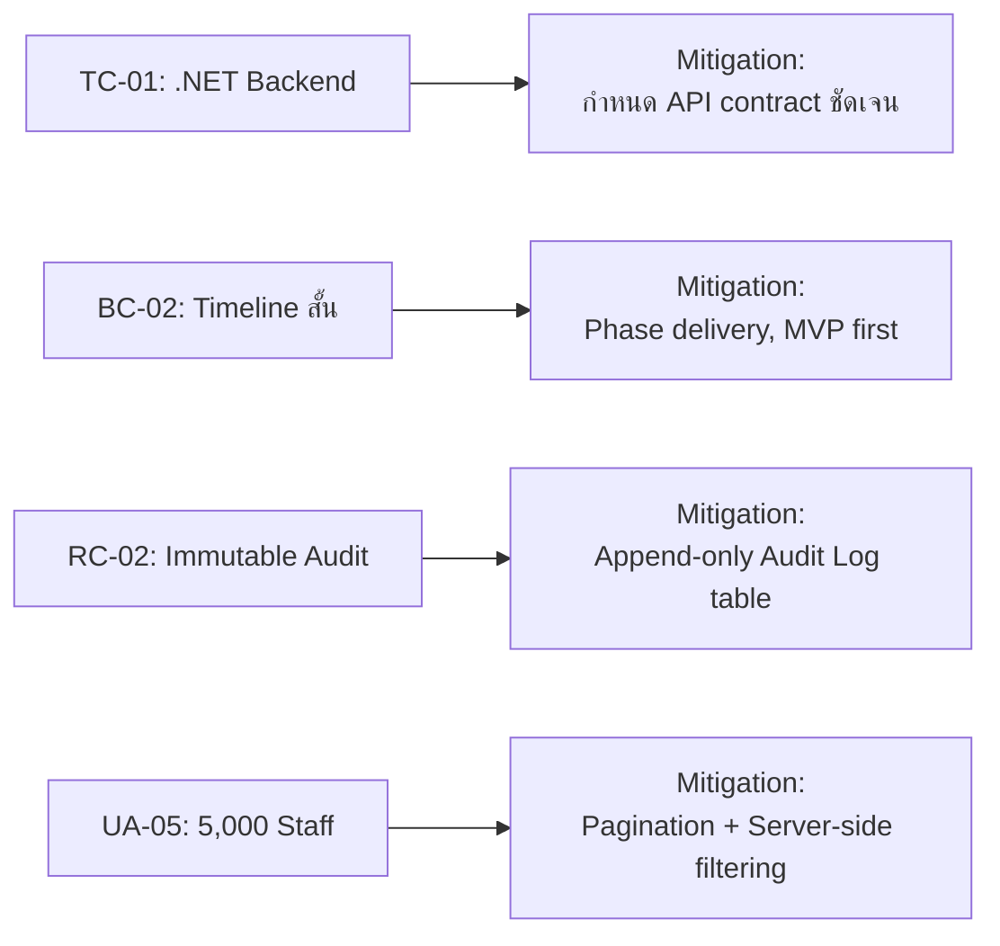

# SAMS-QA-SRS-10 — Constraints & Assumptions
## ระบบ SAMS: โมดูล Quality Assurance (QA)

| รายการ | รายละเอียด |
|---|---|
| **Document No.** | SAMS-QA-SRS-10 |
| **Module** | Quality Assurance (QA) |
| **เวอร์ชัน** | 1.0 |
| **วันที่จัดทำ** | 2026-04-27 |
| **จัดทำโดย** | Triple-T Development Team |

---

## Revision History

| เวอร์ชัน | วันที่ | ผู้จัดทำ | รายละเอียด |
|---|---|---|---|
| 1.0 | 2026-04-27 | Triple-T Dev | ร่างแรก |

---

## 1. ข้อจำกัด (Constraints)

### 1.1 Technical Constraints

| ID | ข้อจำกัด | รายละเอียด | ผลกระทบ |
|---|---|---|---|
| TC-01 | Backend Stack | ใช้ .NET API (ไม่เปลี่ยน) | ทุก service ต้อง integrate ผ่าน REST |
| TC-02 | Frontend Stack | Next.js 16 + React 19 + TypeScript 5 | ต้องใช้ App Router, RSC |
| TC-03 | Database | RDBMS (กำหนดโดย Backend Team) | Schema ดูใน SRS-07 |
| TC-04 | Authentication | JWT + Redux (localStorage) | ไม่มี SSO ในระยะแรก |
| TC-05 | Browser Support | Chrome 110+, Edge 110+, Firefox 110+, Safari 16+ | ไม่รองรับ IE/Legacy |
| TC-06 | Mobile Support | Responsive only — ไม่มี native app | ใช้ผ่านมือถือได้แต่ไม่ optimal |
| TC-07 | Deployment | On-premise / Private cloud | ไม่ใช้ public cloud sharing |
| TC-08 | Internationalization | next-intl: th, en, ar (รองรับ RTL) | ทุก string ต้อง externalize |

### 1.2 Business Constraints

| ID | ข้อจำกัด | รายละเอียด |
|---|---|---|
| BC-01 | Budget | กำหนดโดยฝ่ายบริหาร — รายละเอียดในเอกสารสัญญา |
| BC-02 | Timeline | Phase 1 (3 เดือน), Phase 2 (3 เดือน), Phase 3 (TBD) |
| BC-03 | Team Size | Frontend 2 คน, Backend 2 คน, QA 1 คน, PM 1 คน |
| BC-04 | Working Hours | จันทร์-ศุกร์ 09:00-18:00 (เวลาไทย) |
| BC-05 | UAT Period | ขั้นต่ำ 2 สัปดาห์ก่อน Production |

### 1.3 Regulatory Constraints

| ID | ข้อจำกัด | รายละเอียด |
|---|---|---|
| RC-01 | CAAT Part-145 | ต้องเก็บข้อมูล Authorization/Training อย่างน้อย 5 ปี |
| RC-02 | EASA Part-145 | Audit trail ต้องไม่สามารถลบได้ (immutable) |
| RC-03 | Personal Data | ปฏิบัติตาม PDPA — encrypt ข้อมูลส่วนตัว |
| RC-04 | Document Format | Export PDF ต้องเป็น Form ที่ Authority ยอมรับ |

### 1.4 Performance Constraints

| ID | ข้อจำกัด | เป้าหมาย |
|---|---|---|
| PC-01 | Page Load (P95) | ≤ 3 วินาที |
| PC-02 | API Response (P95) | ≤ 1 วินาที |
| PC-03 | Concurrent Users | รองรับ 200 users พร้อมกัน |
| PC-04 | Data Volume | 5,000 staff × 50 trainings × 5 ปี = ~1.25M records |
| PC-05 | Export XLSX | สำเร็จภายใน 30 วินาทีสำหรับ 10,000 records |

> **รายละเอียดเพิ่มเติมใน SRS-05 (Non-Functional Requirements)**

---

## 2. สมมติฐาน (Assumptions)

### 2.1 User & Operational Assumptions

| ID | สมมติฐาน |
|---|---|
| UA-01 | ผู้ใช้งานทุกคนมีอุปกรณ์ที่เชื่อมต่อ Internet ได้เสถียร |
| UA-02 | ผู้ใช้งานมีพื้นฐานการใช้ Web application |
| UA-03 | จะมีการอบรมการใช้ระบบให้ผู้ใช้งานก่อน Go-Live (อย่างน้อย 2 ชั่วโมง/role) |
| UA-04 | ผู้ใช้งานเข้าใจกระบวนการ QA และคำศัพท์เฉพาะวงการบิน |
| UA-05 | จำนวน Staff ในระบบไม่เกิน 5,000 คนใน 5 ปีแรก |
| UA-06 | จำนวน Customer Airline ไม่เกิน 30 รายใน 3 ปีแรก |

### 2.2 Technical Assumptions

| ID | สมมติฐาน |
|---|---|
| TA-01 | Backend API พร้อมใช้งาน (uptime ≥ 99.5%) |
| TA-02 | SMTP Server ของบริษัทพร้อมใช้งานสำหรับส่ง Notification |
| TA-03 | File Storage (`flight-storage.sams.aero`) มีพื้นที่เพียงพอ |
| TA-04 | Database backup จัดการโดยทีม Infrastructure (ทุกวัน) |
| TA-05 | SSL Certificate ต่ออายุโดยทีม Infrastructure |
| TA-06 | HR System จะให้ข้อมูลพนักงานในรูปแบบ API หรือ XLSX import |

### 2.3 Business Assumptions

| ID | สมมติฐาน |
|---|---|
| BA-01 | กระบวนการอนุมัติ Authorization ที่ระบุใน SRS-04 ตรงกับ practice จริง |
| BA-02 | Master Data (รายชื่อ Customer, Course Catalog) จะถูก import ก่อน Go-Live |
| BA-03 | จะไม่มีการเปลี่ยนแปลง CAAT/EASA regulation ที่กระทบ schema ในช่วงพัฒนา |
| BA-04 | ฝ่าย QA จะให้ข้อมูล historical (5 ปีย้อนหลัง) เป็น XLSX สำหรับ migration |
| BA-05 | Customer Authorization template จากแต่ละสายการบินมีโครงสร้างคล้ายกัน |

### 2.4 Project Assumptions

| ID | สมมติฐาน |
|---|---|
| PA-01 | Stakeholder จะ available สำหรับ requirement workshop ทุก 2 สัปดาห์ |
| PA-02 | UAT user จะใช้เวลาทดสอบอย่างน้อย 4 ชม./วัน ในช่วง UAT |
| PA-03 | Decision turnaround สำหรับ ambiguous requirements ≤ 3 วันทำการ |
| PA-04 | Production deployment ทำได้นอกเวลาทำงาน (เสาร์-อาทิตย์) |

---

## 3. Dependencies (สิ่งที่ระบบพึ่งพา)

| Dependency | ประเภท | ผลกระทบหากใช้ไม่ได้ |
|---|---|---|
| Auth Service | Internal | Login ไม่ได้ — ระบบใช้ไม่ได้เลย |
| Master Data Module | Internal | Customer/Course list ไม่ load — บาง screen ใช้ไม่ได้ |
| File Storage Service | Internal | Upload/Download ไม่ได้ — แต่ฟังก์ชันอื่นใช้ได้ |
| SMTP Server | External | Email alert ไม่ส่ง — แต่ Dashboard ยังแสดงสถานะได้ |
| HR System | External | Import ใหม่ทำไม่ได้ — แต่ข้อมูลเดิมยังใช้ได้ |
| DB Backup Service | External | ไม่กระทบทันที — Risk ระยะยาว |

---

## 4. Out of Scope (สิ่งที่ไม่ครอบคลุม)

### 4.1 ไม่อยู่ในระบบ QA Module

| หมวด | อยู่ที่ไหน |
|---|---|
| Payroll & Compensation | HR System |
| Recruitment / Hiring | HR System |
| Shift Roster / Duty Schedule | Rostering Module (Phase 3) |
| Aircraft Job Card | Line Maintenance Module |
| Customer Invoice / Billing | Invoice Module |
| Flight Operations | Flight Module |
| Inventory / Spare Parts | Inventory Module |

### 4.2 ฟีเจอร์ที่ไม่อยู่ใน Phase 1

| ฟีเจอร์ | Phase ที่จะทำ |
|---|---|
| Mobile native app (iOS/Android) | Phase 3 |
| AI-based competency prediction | Future |
| Integration กับ CAAT online portal | Phase 2 |
| Multi-tenant สำหรับ MRO อื่น | Future |
| Offline mode | Future |
| Voice-based search | ❌ ไม่อยู่ในแผน |

---

## 5. Risk Mitigation Linked to Constraints

> **รายละเอียด Risk เพิ่มเติมใน SRS-13 (Risk & Impact)**

---

*— จบเอกสาร SAMS-QA-SRS-10 —*
