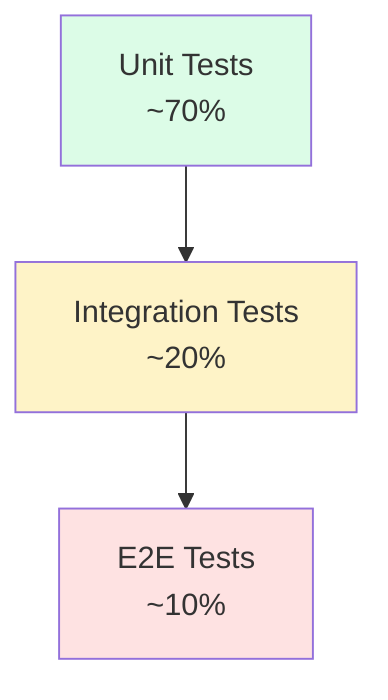
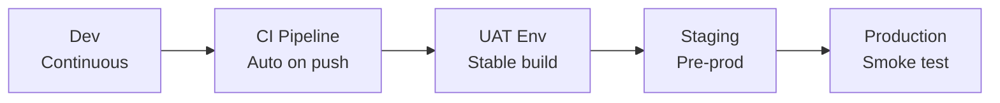
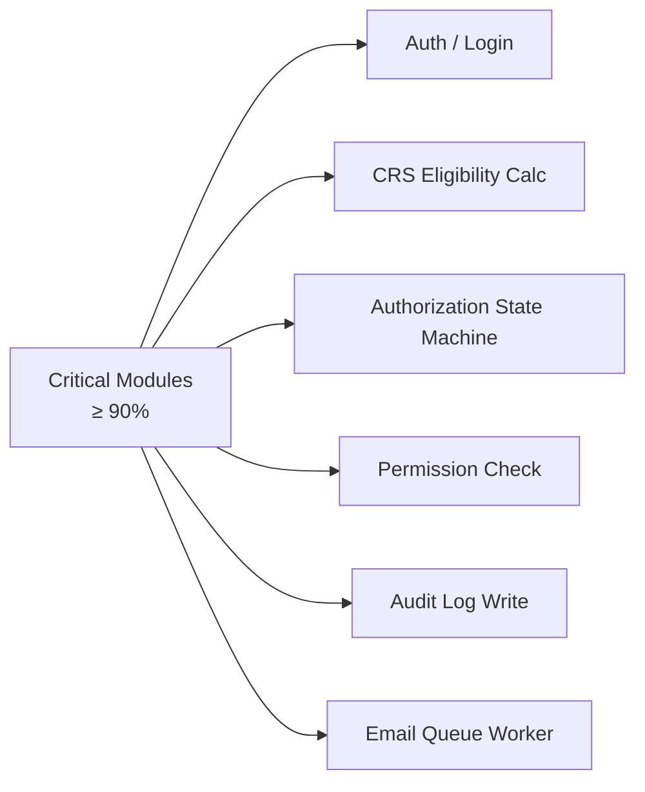
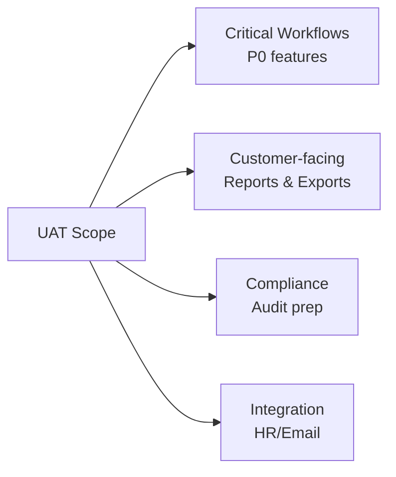

# SAMS-QA-SRS-11 — Testing & Acceptance Criteria
## ระบบ SAMS: โมดูล Quality Assurance (QA)

| รายการ | รายละเอียด |
|---|---|
| **Document No.** | SAMS-QA-SRS-11 |
| **Module** | Quality Assurance (QA) |
| **เวอร์ชัน** | 1.0 |
| **วันที่จัดทำ** | 2026-04-27 |

---

## Revision History

| เวอร์ชัน | วันที่ | ผู้จัดทำ | รายละเอียด |
|---|---|---|---|
| 1.0 | 2026-04-27 | Triple-T Dev | ร่างแรก |

---

## 1. Testing Strategy

### 1.1 Test Pyramid



### 1.2 Test Levels

| Level | Coverage | Tools |
|---|---|---|
| **Unit Test** | ≥ 70% | Vitest + React Testing Library |
| **Integration** | API + Component flows | Vitest + MSW |
| **E2E** | Critical user journeys | Playwright |
| **UAT** | All MUST features | Manual + Test scripts |
| **Performance** | NFR targets | k6 / Lighthouse |
| **Security** | OWASP Top 10 | OWASP ZAP / Snyk |
| **Accessibility** | WCAG 2.1 AA | axe DevTools / Manual |

### 1.3 Test Environments



---

## 2. Test Coverage Requirements

### 2.1 Code Coverage Target

| Type | Target | Mandatory |
|---|---|---|
| Statement | ≥ 70% | ✅ |
| Branch | ≥ 65% | ✅ |
| Function | ≥ 75% | ✅ |
| Line | ≥ 70% | ✅ |

### 2.2 Critical Code (≥90% Coverage)



---

## 3. Test Cases by Module

### 3.1 Test Case ID Format

```
TC-<MODULE>-<NUM>
ตัวอย่าง: TC-AUTH-001
```

### 3.2 Test Case Template

| Field | คำอธิบาย |
|---|---|
| ID | Unique |
| Title | ชื่อ test case |
| Linked FR | FR-XXX-NNN |
| Pre-condition | สถานะเริ่มต้น |
| Steps | ขั้นตอนทดสอบ |
| Expected | ผลที่คาดหวัง |
| Priority | P0 (Critical) / P1 (High) / P2 (Medium) / P3 (Low) |

---

## 4. TC-LOGIN: Login Test Cases

| ID | Title | Pre | Steps | Expected | Pri |
|---|---|---|---|---|---|
| TC-LOGIN-001 | Valid login | Active user | Enter valid credentials → Submit | Redirect to Dashboard, JWT in localStorage | P0 |
| TC-LOGIN-002 | Wrong password | Active user | Enter wrong password 1 time | Show error message | P0 |
| TC-LOGIN-003 | Lock after 5 fails | Active user | Wrong password 5 times | Account locked 30 min | P0 |
| TC-LOGIN-004 | Refresh token | Logged in, JWT expired | Wait 31 min → API call | Auto-refresh JWT, success | P1 |
| TC-LOGIN-005 | Forgot password | Active user | Click forgot → Enter email → Submit | Email reset link sent | P1 |
| TC-LOGIN-006 | Disabled user login | Disabled user | Login | "Account disabled" message | P0 |
| TC-LOGIN-007 | Rate limit | New IP | 6 login attempts < 5 min | 429 Too Many Requests | P1 |

---

## 5. TC-STAFF: Staff Management Test Cases

| ID | Title | Linked FR | Steps | Expected | Pri |
|---|---|---|---|---|---|
| TC-STAFF-001 | List staff with search | FR-STAFF-001 | Search "John" | List shows John* | P0 |
| TC-STAFF-002 | Filter by department | FR-STAFF-002 | Select dept "LM" | List shows LM only | P1 |
| TC-STAFF-003 | View staff detail | FR-STAFF-003 | Click row → Detail page | All 5 tabs accessible | P0 |
| TC-STAFF-004 | Create new staff | FR-STAFF-004 | Fill form → Save | New staff in list, audit logged | P0 |
| TC-STAFF-005 | Edit personal info | FR-STAFF-005 | Click Edit → Change name → Save | Name updated, audit logged | P0 |
| TC-STAFF-006 | Add education | FR-STAFF-006 | Edu tab → Add → Fill → Save | New edu record displayed | P1 |
| TC-STAFF-007 | Resign staff | FR-STAFF-010 | Mark resigned → Confirm | Status=resigned, all auths suspended | P0 |
| TC-STAFF-008 | Bulk import — valid file | FR-STAFF-011 | Upload XLSX 100 rows | All imported, success report | P1 |
| TC-STAFF-009 | Bulk import — invalid | FR-STAFF-011 | Upload with invalid rows | Validation report, no commit | P0 |
| TC-STAFF-010 | Print PDF | FR-STAFF-013 | Click Print | PDF generated (SAMS-FM-CM-036 format) | P1 |
| TC-STAFF-011 | Auto-archive after 90d | FR-STAFF-012 | Resigned > 90d → Run job | Status=archived | P2 |

---

## 6. TC-AUTH: Authorization Test Cases

| ID | Title | Linked FR | Steps | Expected | Pri |
|---|---|---|---|---|---|
| TC-AUTH-001 | List authorizations | FR-AUTH-001 | Open auth page | Staff list with auth matrix | P0 |
| TC-AUTH-002 | Filter by customer | FR-AUTH-002 | Select TG | Show only TG-related | P0 |
| TC-AUTH-003 | CRS Eligible — both active | FR-AUTH-030 | View CS with SAMS+Customer active | Badge: ✅ Eligible | P0 |
| TC-AUTH-004 | CRS Not Eligible — SAMS expired | FR-AUTH-030 | View CS with SAMS expired | Badge: ❌ Not Eligible + Reason | P0 |
| TC-AUTH-005 | Create auth as Draft | FR-AUTH-010 | Fill form → Save | Status=Draft, no notification | P0 |
| TC-AUTH-006 | Submit for approval | FR-AUTH-011 | Click Submit | Status=Submitted, Director notified | P0 |
| TC-AUTH-007 | Approve authorization | FR-AUTH-012 | Director approves | Status=Active, CS emailed | P0 |
| TC-AUTH-008 | Reject with reason | FR-AUTH-012 | Director rejects → reason | Status=Draft, creator notified | P0 |
| TC-AUTH-009 | Validate Customer expiry > SAMS | FR-AUTH-018 | Set Customer expiry > SAMS | Validation error shown | P0 |
| TC-AUTH-010 | Reject Customer auth without SAMS | FR-AUTH-019 | Try Customer w/o SAMS active | Block + error | P0 |
| TC-AUTH-011 | Suspend auth | FR-AUTH-014 | Click Suspend → Reason → Confirm | Status=Suspended, audit log | P0 |
| TC-AUTH-012 | Renew auth | FR-AUTH-016 | Click Renew → New expiry | Old becomes Active w/ new expiry | P0 |
| TC-AUTH-013 | History timeline | FR-AUTH-017 | Open history | All state changes shown | P1 |
| TC-AUTH-014 | Export multi-sheet XLSX | FR-AUTH-040 | Click Export | XLSX with 18 sheets | P0 |
| TC-AUTH-015 | Print Auth PDF | FR-AUTH-041 | Print | Single PDF (cert format) | P1 |
| TC-AUTH-016 | SoD: Manager can't approve own | Custom | Manager A creates → Manager A try approve | Block + warning | P0 |

---

## 7. TC-MON: Monitoring Test Cases

| ID | Title | Linked FR | Steps | Expected | Pri |
|---|---|---|---|---|---|
| TC-MON-001 | Compliance overview | FR-MON-001 | Open monitoring | Show compliance % | P0 |
| TC-MON-002 | Filter expiring ≤30d | FR-MON-002 | Select filter | Only ≤30d shown | P0 |
| TC-MON-003 | Training matrix per staff | FR-MON-003 | Click staff | Show 8 mandatory + 6 type | P0 |
| TC-MON-004 | Calendar view | FR-MON-005 | Switch to Calendar | Show training events | P1 |
| TC-MON-005 | Daily expiry job | FR-MON-007 | Run job manually | Email queue populated | P0 |
| TC-MON-006 | Export compliance report | FR-MON-009 | Click Export | XLSX with all staff compliance | P0 |

---

## 8. TC-COURSE: Course Management Test Cases

| ID | Title | Steps | Expected | Pri |
|---|---|---|---|---|
| TC-COURSE-001 | List courses | Open page | 33+ courses shown | P0 |
| TC-COURSE-002 | Add course | Fill form → Save | New course in list | P0 |
| TC-COURSE-003 | Edit course validity | Change to 12 months | Updated + recalc compliance | P1 |
| TC-COURSE-004 | View Training Matrix | Click Matrix | Show role × course matrix | P0 |
| TC-COURSE-005 | Update Matrix cell | Toggle required | Auto-update compliance | P0 |
| TC-COURSE-006 | Print Matrix PDF | Click Print | PDF (SAMS-FM-CM-014 format) | P1 |

---

## 9. TC-SCHED: Scheduler Test Cases

| ID | Title | Steps | Expected | Pri |
|---|---|---|---|---|
| TC-SCHED-001 | Create session | Fill form → Save | Session in calendar | P0 |
| TC-SCHED-002 | Enroll staff bulk | Select 10 staff → Enroll | All 10 enrolled, emails sent | P0 |
| TC-SCHED-003 | Mark attendance | Mark per staff | Attendance saved | P0 |
| TC-SCHED-004 | Submit results | Pass/Fail per staff | Pending approval | P0 |
| TC-SCHED-005 | Approve results | Manager approves | Records saved + emails | P0 |
| TC-SCHED-006 | Cancel session | Click Cancel + reason | Status=cancelled, all enrolled notified | P0 |
| TC-SCHED-007 | Reschedule | Change date | Notification to enrolled | P1 |
| TC-SCHED-008 | Print Attendance | Click Print | PDF generated | P1 |

---

## 10. TC-DASH: Dashboard Test Cases

| ID | Title | Steps | Expected | Pri |
|---|---|---|---|---|
| TC-DASH-001 | KPI widgets load | Open dashboard | 4 KPI widgets shown | P0 |
| TC-DASH-002 | Drill-down expiring | Click expiring widget | Navigate to filtered list | P1 |
| TC-DASH-003 | Trend chart | View trend | 12-month line chart | P1 |
| TC-DASH-004 | Auto-refresh | Wait 5 min | Data refreshed | P2 |
| TC-DASH-005 | Role-based view (CS) | Login as CS | Show only own data | P0 |

---

## 11. TC-NFR: Non-Functional Test Cases

| ID | Type | Title | Target |
|---|---|---|---|
| TC-NFR-PERF-001 | Performance | Page load ≤ 3s | P95 |
| TC-NFR-PERF-002 | Performance | API P95 ≤ 1s | P95 |
| TC-NFR-PERF-003 | Performance | Search 5,000 staff ≤ 2s | Manual |
| TC-NFR-PERF-004 | Performance | Concurrent 200 users | Load test |
| TC-NFR-PERF-005 | Performance | Export XLSX 10,000 ≤ 30s | Manual |
| TC-NFR-SEC-001 | Security | SQL Injection | Block |
| TC-NFR-SEC-002 | Security | XSS | Sanitize |
| TC-NFR-SEC-003 | Security | CSRF | Token check |
| TC-NFR-SEC-004 | Security | Lock after 5 fails | ✅ |
| TC-NFR-SEC-005 | Security | JWT expired → 401 | ✅ |
| TC-NFR-A11Y-001 | A11y | Keyboard navigation | Pass |
| TC-NFR-A11Y-002 | A11y | Color contrast 4.5:1 | Pass |
| TC-NFR-A11Y-003 | A11y | Screen reader | Pass |
| TC-NFR-COMPAT-001 | Compatibility | Chrome 110+ | Pass |
| TC-NFR-COMPAT-002 | Compatibility | Edge 110+ | Pass |
| TC-NFR-COMPAT-003 | Compatibility | Firefox 110+ | Pass |
| TC-NFR-COMPAT-004 | Compatibility | Safari 16+ | Pass |
| TC-NFR-I18N-001 | i18n | Switch th/en/ar | All UI translated |
| TC-NFR-I18N-002 | i18n | RTL layout (ar) | Layout mirrored |

---

## 12. UAT Plan

### 12.1 UAT Scope



### 12.2 UAT Schedule

| Week | Activities |
|---|---|
| W1 | Smoke test + Critical workflows |
| W2 | Each module: detailed UAT |
| W2 (parallel) | Performance + Security testing |
| W3 (buffer) | Bug fix + Re-test |

### 12.3 UAT Test Scripts

แต่ละ UAT user role จะมี script:

| Role | Script Count | Time/script |
|---|---|---|
| QA Manager | 12 scripts | ~30 min |
| Trainer | 8 scripts | ~30 min |
| CM Officer | 6 scripts | ~30 min |
| Inspector | 4 scripts | ~20 min |
| CS (Self-service) | 3 scripts | ~15 min |
| Admin | 5 scripts | ~30 min |

### 12.4 UAT Sign-off Criteria

| Criterion | Threshold |
|---|---|
| P0 test pass rate | 100% |
| P1 test pass rate | ≥ 95% |
| P2 test pass rate | ≥ 90% |
| P3 test pass rate | ≥ 80% |
| Critical bugs open | 0 |
| Major bugs open | ≤ 3 (with workaround) |
| User satisfaction | ≥ 4.0 / 5.0 |

---

## 13. Acceptance Criteria (Module-level)

### 13.1 Module Acceptance Matrix

| Module | Acceptance Criteria |
|---|---|
| **Login/Auth** | ✓ Login/Logout/Refresh/Reset password ทุก scenario pass |
| **Staff** | ✓ CRUD + Bulk Import + Print PDF ใช้งานได้ |
| **Authorization** | ✓ Lifecycle (Draft → Active) + CRS calc + Multi-export |
| **Monitoring** | ✓ Compliance % accurate + Auto-alert |
| **Course Mgmt** | ✓ Catalog + Matrix + Print ใช้งานได้ |
| **Scheduler** | ✓ Create/Enroll/Attendance/Result + Print |
| **Dashboard** | ✓ All KPIs accurate + Drill-down |
| **Notification** | ✓ Email delivery + In-app shown |
| **Audit Log** | ✓ All critical actions logged + Export |
| **RBAC** | ✓ Role-based menu/action restriction |

---

## 14. Bug Severity & SLA

| Severity | คำอธิบาย | Fix SLA | Block Go-Live? |
|---|---|---|---|
| **Critical (S1)** | ระบบ down / Data loss / Security | < 4 ชม. | ✅ Yes |
| **Major (S2)** | Critical workflow broken | < 1 day | ✅ Yes |
| **Medium (S3)** | Non-critical broken / Workaround มี | < 1 week | ⚠️ Depends |
| **Minor (S4)** | UI/cosmetic / Typo | < 2 weeks | ❌ No |

---

## 15. Test Reporting

### 15.1 Daily UAT Report

```
Date: ____________
Module: __________
Tests Run: __ / __
Pass: __ | Fail: __ | Blocked: __
Bugs found:
  S1: __ | S2: __ | S3: __ | S4: __
Notes: ____________
```

### 15.2 Final Test Report (Pre Go-Live)

| Section | รายละเอียด |
|---|---|
| Test Coverage Summary | Unit/Integration/E2E % |
| Test Pass/Fail Stats | per module |
| Open Bugs | by severity |
| Performance Test Results | NFR targets vs actual |
| Security Audit Result | OWASP findings |
| UAT Sign-off | per stakeholder |
| Go/No-Go Recommendation | ✅ / ⚠️ / ❌ |

---

*— จบเอกสาร SAMS-QA-SRS-11 —*
