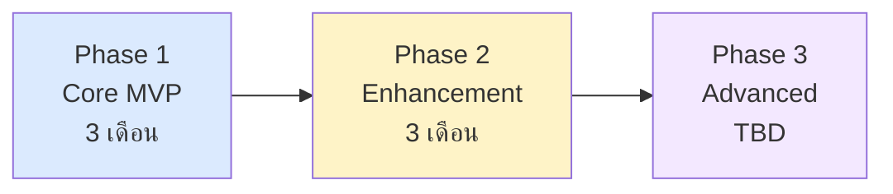
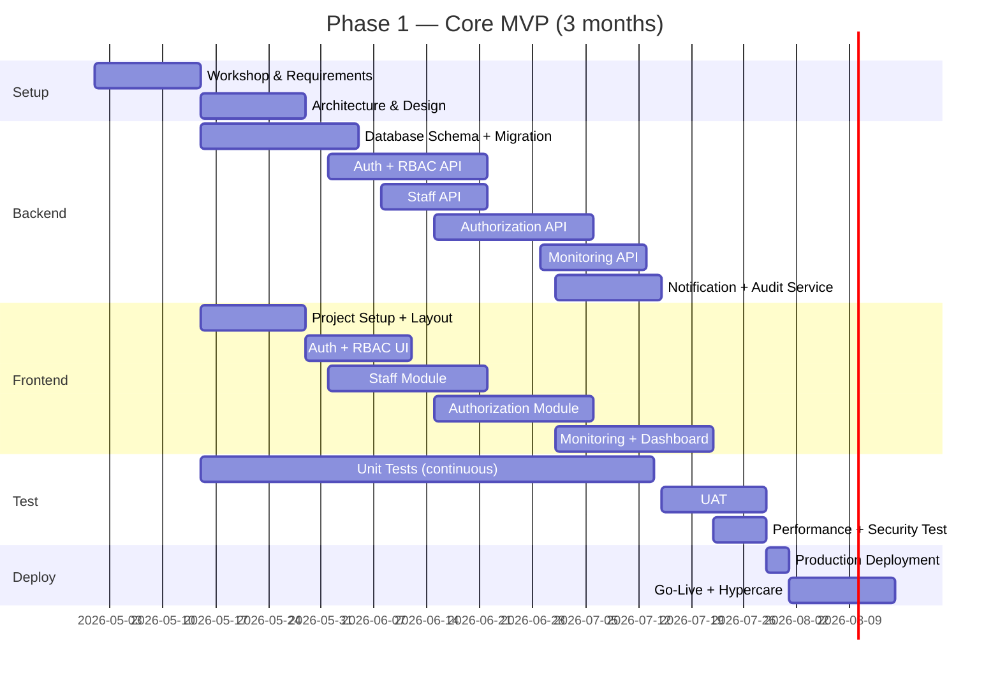
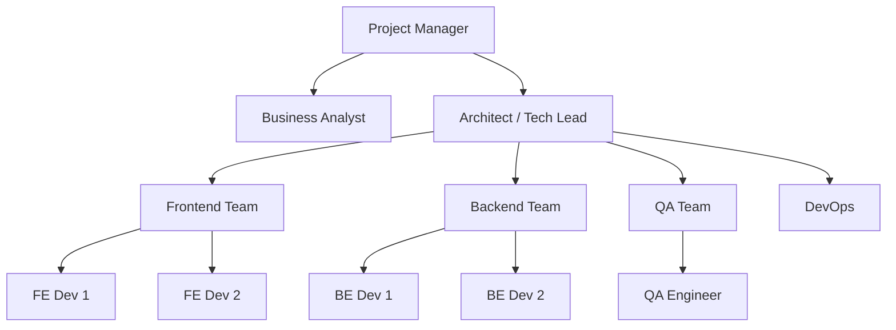
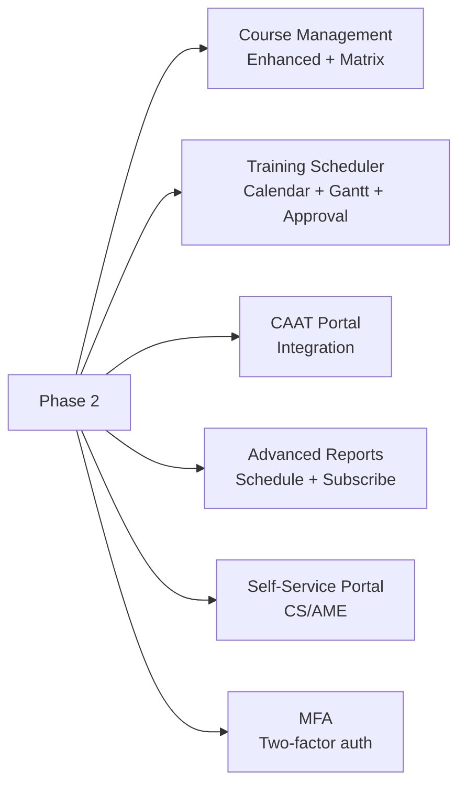
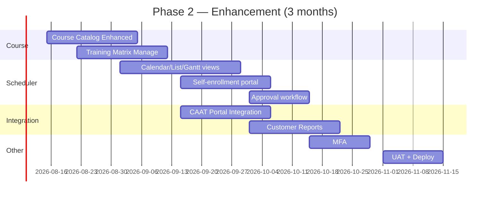
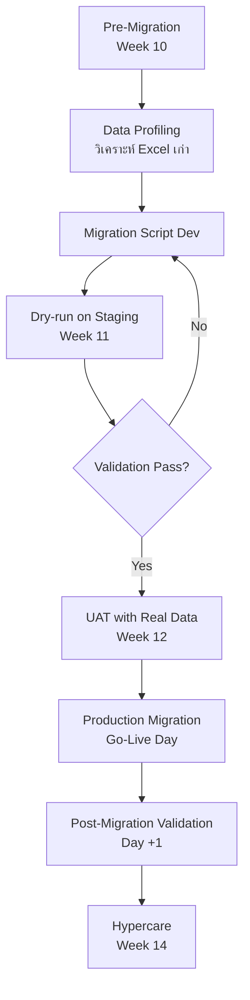
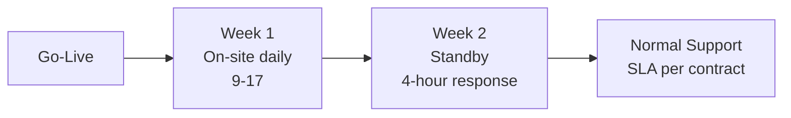
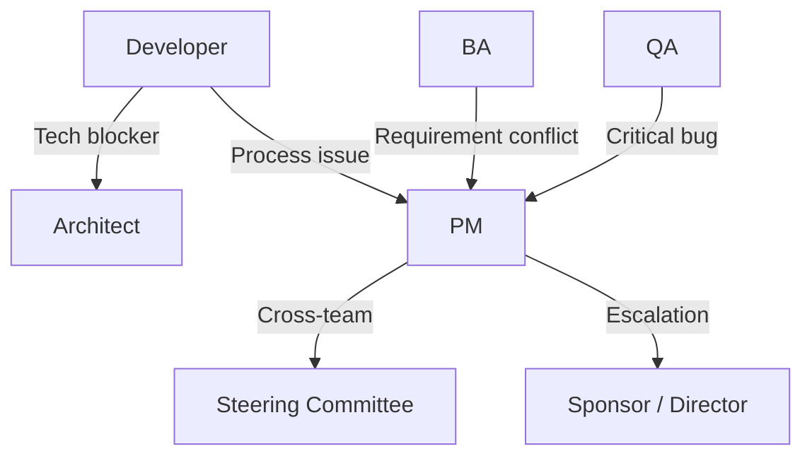
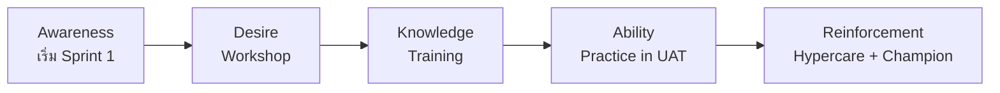
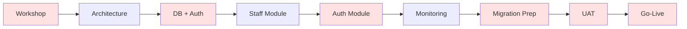

# SAMS-QA-SRS-12 — Implementation Plan
## ระบบ SAMS: โมดูล Quality Assurance (QA)

| รายการ | รายละเอียด |
|---|---|
| **Document No.** | SAMS-QA-SRS-12 |
| **Module** | Quality Assurance (QA) |
| **เวอร์ชัน** | 1.0 |
| **วันที่จัดทำ** | 2026-04-27 |

---

## Revision History

| เวอร์ชัน | วันที่ | ผู้จัดทำ | รายละเอียด |
|---|---|---|---|
| 1.0 | 2026-04-27 | Triple-T Dev | ร่างแรก |

---

## 1. Project Overview

### 1.1 Phasing Strategy

### 1.2 Phase Scope Summary

| Phase | ระยะเวลา | Scope | Go-Live |
|---|---|---|---|
| **Phase 1: Core MVP** | 3 เดือน | Staff, Authorization, Monitoring, Dashboard + RBAC + Audit + Notification | M+3 |
| **Phase 2: Enhancement** | 3 เดือน | Course Mgmt enhanced, Scheduler advanced, CAAT integration, Reports | M+6 |
| **Phase 3: Advanced** | TBD | Mobile, Customer API webhooks, AI competency, Multi-tenant | TBD |

---

## 2. Phase 1 Plan (3 เดือน)

### 2.1 Phase 1 Timeline

### 2.2 Phase 1 Deliverables

| Deliverable | Owner | Due |
|---|---|---|
| Requirements workshop minutes | PM | Week 2 |
| API contract (OpenAPI spec) | Architect | Week 4 |
| Database migration scripts | Backend | Week 6 |
| Working Staff module | FE+BE | Week 8 |
| Working Authorization module | FE+BE | Week 10 |
| Working Dashboard | FE+BE | Week 11 |
| RBAC + Audit + Notification | FE+BE | Week 11 |
| UAT package + scripts | QA | Week 11 |
| Production deployment | DevOps | Week 13 |

### 2.3 Phase 1 Sprint Breakdown (2-week sprints)

| Sprint | Focus | Critical Output |
|---|---|---|
| Sprint 1 (W1-2) | Setup + Workshop | Requirements doc, environment ready |
| Sprint 2 (W3-4) | Architecture + DB schema | ER + Migration script |
| Sprint 3 (W5-6) | Auth + RBAC | Login + permission middleware |
| Sprint 4 (W7-8) | Staff Module | Full CRUD working |
| Sprint 5 (W9-10) | Authorization Module | Lifecycle + CRS calc |
| Sprint 6 (W11-12) | Monitoring + Dashboard + Polish | Auto-alerts, audit, reports |
| UAT/Deploy (W13) | UAT, fix, deploy | Production live |

---

## 3. Team Structure

### 3.1 Phase 1 Team

### 3.2 Roles & Responsibilities

| Role | Count | Responsibilities |
|---|---|---|
| Project Manager | 1 | Schedule, risk, communication |
| Business Analyst | 1 | Requirements, workflow analysis, UAT facilitation |
| Architect / Tech Lead | 1 | Architecture decisions, code review |
| Frontend Developer | 2 | UI implementation, integration |
| Backend Developer | 2 | API, database, services |
| QA Engineer | 1 | Test plan, automation, manual UAT |
| DevOps Engineer | 0.5 (shared) | CI/CD, deployment, monitoring |
| UX Designer | 0.5 (shared) | Wireframes, design review |

### 3.3 RACI Matrix (Phase 1)

| Activity | PM | BA | Arch | FE | BE | QA | DevOps | Stakeholder |
|---|---|---|---|---|---|---|---|---|
| Requirements gathering | A | R | C | I | I | I | I | C |
| Architecture design | I | C | R | C | C | C | C | I |
| API contract | I | C | A | C | R | C | I | I |
| Frontend dev | I | I | C | R | C | C | I | I |
| Backend dev | I | I | C | C | R | C | I | I |
| Unit/Integration test | I | I | I | R | R | C | I | I |
| UAT | C | A | I | I | I | R | I | C |
| Deployment | A | I | C | C | C | C | R | I |

> R=Responsible, A=Accountable, C=Consulted, I=Informed

---

## 4. Phase 2 Plan (3 เดือน, M+3 ถึง M+6)

### 4.1 Phase 2 Scope

### 4.2 Phase 2 Timeline

---

## 5. Phase 3 Plan (TBD)

ขึ้นกับการประเมินหลัง Phase 2:

| Feature | Trigger Condition |
|---|---|
| Mobile Native App | User feedback ขอ + budget approve |
| Customer Webhook API | Customer airline พร้อมรับ |
| AI Competency Prediction | Data 2+ ปีพร้อม + business case ชัดเจน |
| Multi-tenant | มี MRO อื่นต้องการใช้ |

---

## 6. Migration Strategy

### 6.1 Data Migration Plan

### 6.2 Migration Checklist

| Item | Owner | Status |
|---|---|---|
| Excel data profiling | BA | Pre-Sprint 5 |
| Migration script ready | BE | Sprint 6 |
| Staging environment loaded | DevOps | Sprint 6 |
| Dry-run executed | BE+QA | Sprint 7 (W11) |
| Validation report reviewed | BA+QA | Sprint 7 (W11) |
| UAT users approve | Stakeholder | Sprint 8 (W12) |
| Production migration scheduled | DevOps | Sprint 8 (W12) |
| Cut-over plan documented | PM | Sprint 8 (W12) |
| Rollback plan tested | DevOps | Sprint 8 (W12) |

---

## 7. Cut-over & Go-Live Plan

### 7.1 Go-Live Day Timeline (Saturday)

| เวลา | Activity | Owner | Duration |
|---|---|---|---|
| 22:00 (Fri) | Notification ส่ง user "ระบบ down for maintenance" | PM | — |
| 22:00 | Final Excel export from old system | BA | 2 ชม. |
| 00:00 (Sat) | Database migration start | BE+DevOps | 4 ชม. |
| 04:00 | Validation report | QA | 1 ชม. |
| 05:00 | Smoke test on production | QA+BA | 2 ชม. |
| 07:00 | Manager + stakeholder approval | PM | 1 ชม. |
| 08:00 | Open system to users | DevOps | 30 min |
| 08:00 - 18:00 | Hypercare onsite (Day 1) | All | — |

### 7.2 Rollback Triggers

| Condition | Action |
|---|---|
| Migration validation fail (> 1% error) | Stop, investigate, restore backup |
| Critical bug in Smoke test | Rollback, fix in QA env, retry |
| Performance < target (> 5x slower) | Rollback, performance tuning |
| Security incident detected | Rollback immediately |

### 7.3 Hypercare (2 weeks post Go-Live)

---

## 8. Resource & Cost Estimation

### 8.1 Effort Estimation (Phase 1)

| Role | Person-weeks |
|---|---|
| PM | 13 |
| BA | 10 |
| Architect | 8 |
| Frontend Dev (× 2) | 24 |
| Backend Dev (× 2) | 24 |
| QA Engineer | 8 |
| DevOps (shared) | 4 |
| UX Designer (shared) | 4 |
| **Total** | **95 person-weeks** |

### 8.2 Infrastructure Cost (Estimate)

| Item | Phase 1 |
|---|---|
| Production servers (FE × 2, BE × 2) | TBD |
| Database (Primary + backup) | TBD |
| File storage (100 GB initial) | TBD |
| Monitoring tools | TBD |
| Email service (10K/month) | TBD |
| SSL certificate | TBD |

> **หมายเหตุ**: ตัวเลขอ้างอิงในเอกสารสัญญา

---

## 9. Communication Plan

### 9.1 Communication Cadence

| Meeting | Frequency | Audience | Duration |
|---|---|---|---|
| Daily Standup | Daily | Dev team | 15 min |
| Sprint Planning | Bi-weekly | Dev + BA + PM | 2 hr |
| Sprint Review | Bi-weekly | Dev + BA + PM + Stakeholder | 1 hr |
| Sprint Retro | Bi-weekly | Dev + PM | 1 hr |
| Stakeholder Update | Weekly | PM + Stakeholder | 30 min |
| Steering Committee | Monthly | PM + Sponsors | 1 hr |
| Architecture Review | Bi-weekly | Architect + Tech leads | 1 hr |

### 9.2 Communication Channels

| Channel | Use |
|---|---|
| Slack/Teams | Day-to-day chat |
| Jira/Trello | Task tracking |
| Confluence | Documentation |
| Email | Formal sign-off |
| Video call | Meetings |

### 9.3 Escalation Path

---

## 10. Risk Management Plan

> **รายละเอียด Risk เต็มอยู่ใน SRS-13**

### 10.1 Risk Mitigation Calendar

| Sprint | Risk Focus | Action |
|---|---|---|
| Sprint 1-2 | Process mismatch (OR-03) | Workshop + prototype review |
| Sprint 3-4 | Performance (TR-04) | Database design review |
| Sprint 5-6 | Migration risk (OR-01) | Data profiling + dry-run prep |
| Sprint 7-8 | UAT engagement (OR-05) | Stakeholder commitment |
| Pre Go-Live | Security (TR-03) | Pen-test + security audit |

### 10.2 Contingency Buffer

| Phase | Plan | Buffer |
|---|---|---|
| Phase 1 | 12 weeks | +2 weeks (16% buffer) |
| Phase 2 | 12 weeks | +2 weeks |
| Migration | 1 weekend | +1 weekend rollback option |

---

## 11. Quality Gates

### 11.1 Sprint-level Gates

| Gate | Criteria |
|---|---|
| Definition of Ready (DOR) | Story has acceptance criteria + estimated |
| Definition of Done (DOD) | Code + Test + Code review + Deploy to Dev |
| Sprint Review | Demo to PM/Stakeholder, accept or backlog |

### 11.2 Phase Gate (Pre Go-Live)

| Criterion | Threshold |
|---|---|
| All P0/P1 features delivered | 100% |
| Code coverage | ≥ 70% |
| All P0 test cases pass | 100% |
| Security audit | No Critical findings |
| Performance test | All NFR met |
| UAT sign-off | All key stakeholders |
| Documentation | Complete (architecture, API, runbook) |
| Migration tested | Dry-run + validation pass |

---

## 12. Training & Change Management

### 12.1 User Training Plan

| Audience | Format | Duration | Materials |
|---|---|---|---|
| QA Manager | Workshop + hands-on | 4 hours | User manual + recorded session |
| Trainer | Workshop + hands-on | 3 hours | User manual + recorded session |
| CM Officer | Workshop + hands-on | 3 hours | User manual + recorded session |
| Inspector | Brief + self-study | 1 hour | User manual |
| CS / AME | Brief | 30 min | Quick guide |
| Admin | Workshop + hands-on | 4 hours | Admin guide |

### 12.2 Change Management

---

## 13. Post Go-Live Support

### 13.1 Support Tiers

| Tier | Description | SLA |
|---|---|---|
| **Tier 1** | User questions, basic troubleshooting | < 4 hours |
| **Tier 2** | Bug reproduction, configuration | < 1 day |
| **Tier 3** | Code fixes, deep investigation | < 1 week (Major) |

### 13.2 Continuous Improvement

| Activity | Frequency |
|---|---|
| User feedback survey | Quarterly |
| Performance review | Monthly |
| Security review | Quarterly |
| Feature backlog grooming | Monthly |
| Stakeholder business review | Quarterly |

---

## 14. Critical Path Summary

> **Critical path** = Workshop → DB+Auth → Auth Module → Migration → UAT → Go-Live  
> ระยะเวลาตามลำดับนี้ห้าม slip; กิจกรรมอื่น parallel ได้

---

## 15. Success Criteria

### 15.1 Phase 1 Success Criteria

| Criterion | Target |
|---|---|
| ✅ All P0 features delivered | 100% |
| ✅ All P1 features delivered | ≥ 95% |
| ✅ UAT sign-off obtained | All stakeholders |
| ✅ User adoption (active rate) | ≥ 80% by Day 30 |
| ✅ Compliance % accuracy | 100% match Excel baseline |
| ✅ System uptime (post Go-Live) | ≥ 99.5% |
| ✅ User satisfaction | ≥ 4.0 / 5.0 |
| ✅ Critical bugs in production | 0 |

### 15.2 Long-term Success Metrics (M+6)

| Metric | Baseline | Target M+6 |
|---|---|---|
| CM Officer time spent on expiry checks | 2-3 days/month | < 4 hours/month |
| Authorization processing time | 1-2 days | < 1 hour |
| Compliance % data accuracy | unknown | 100% |
| Audit prep time | 2 weeks | 2 days |
| User satisfaction | n/a | ≥ 4.5 / 5.0 |

---

*— จบเอกสาร SAMS-QA-SRS-12 —*  
*สร้างโดย Triple-T Development Team | SAMS QA Module SRS/BRD v1.0*
