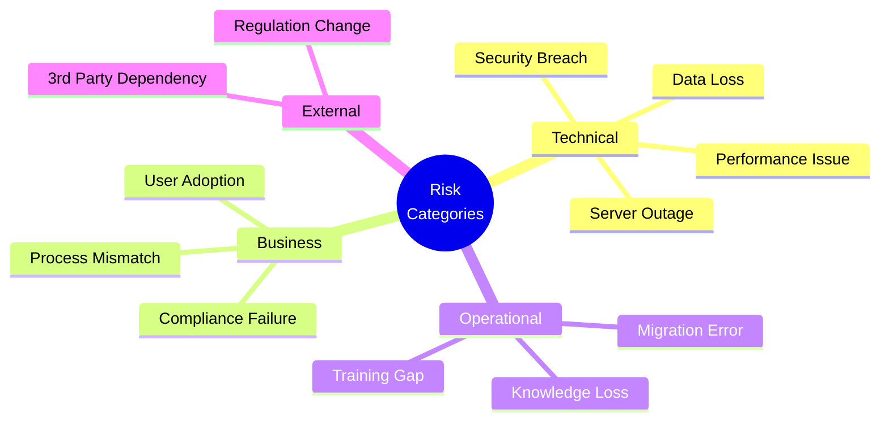
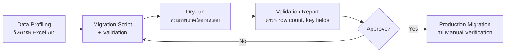
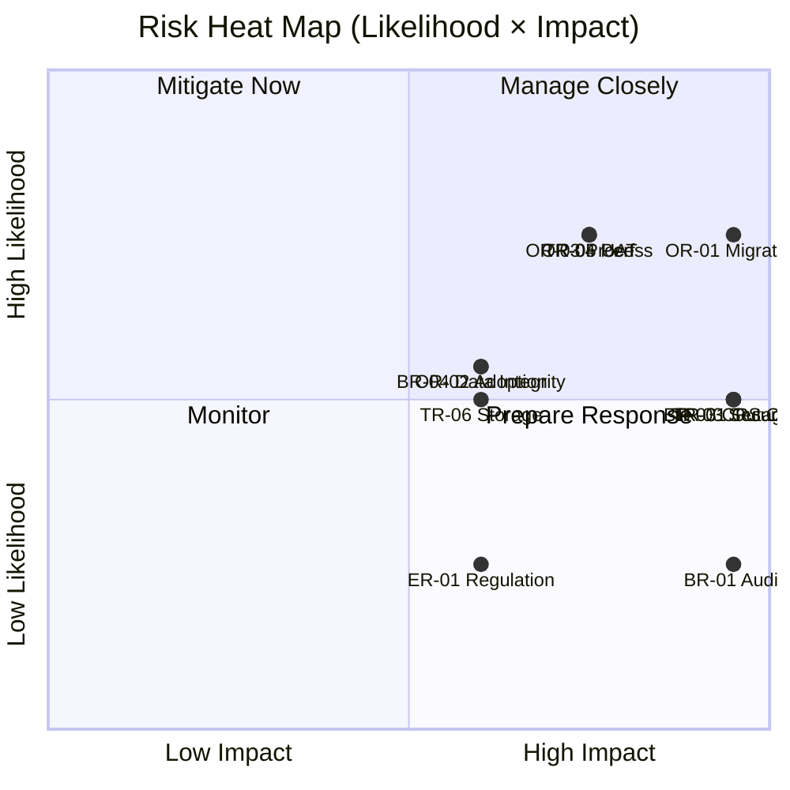
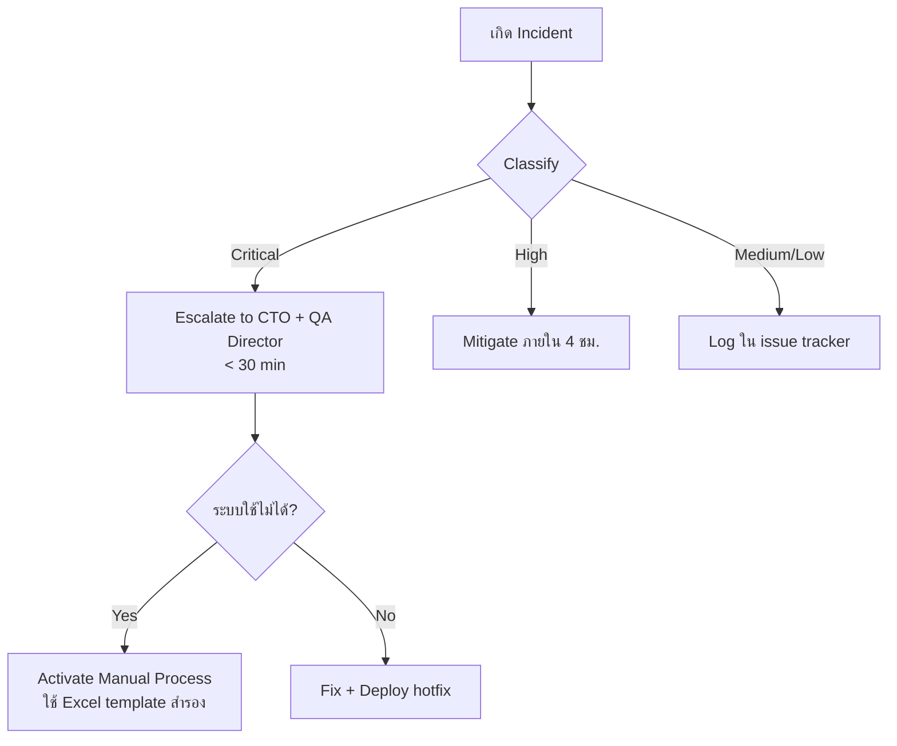

# SAMS-QA-SRS-13 — Risk & Impact Analysis
## ระบบ SAMS: โมดูล Quality Assurance (QA)

| รายการ | รายละเอียด |
|---|---|
| **Document No.** | SAMS-QA-SRS-13 |
| **Module** | Quality Assurance (QA) |
| **เวอร์ชัน** | 1.0 |
| **วันที่จัดทำ** | 2026-04-27 |
| **จัดทำโดย** | Triple-T Development Team |

---

## Revision History

| เวอร์ชัน | วันที่ | ผู้จัดทำ | รายละเอียด |
|---|---|---|---|
| 1.0 | 2026-04-27 | Triple-T Dev | ร่างแรก |

---

## 1. Risk Assessment Methodology

### 1.1 Risk Scoring Matrix

| โอกาสเกิด \ ผลกระทบ | ต่ำ (1) | ปานกลาง (2) | สูง (3) | วิกฤต (4) |
|---|---|---|---|---|
| **น้อย (1)** | 1 🟢 | 2 🟢 | 3 🟡 | 4 🟡 |
| **เป็นไปได้ (2)** | 2 🟢 | 4 🟡 | 6 🟠 | 8 🔴 |
| **น่าจะเกิด (3)** | 3 🟡 | 6 🟠 | 9 🔴 | 12 🔴 |
| **เกิดบ่อย (4)** | 4 🟡 | 8 🔴 | 12 🔴 | 16 🔴 |

**ระดับความเสี่ยง:**
- 🟢 Low (1-2): ไม่ต้องดำเนินการพิเศษ
- 🟡 Medium (3-4): ติดตาม, มี contingency plan
- 🟠 High (6): ต้องมี mitigation plan ที่ชัดเจน
- 🔴 Critical (8-16): ต้อง mitigate ทันที

---

## 2. Risk Categories Overview

---

## 3. Risk Register

### 3.1 Technical Risks

| ID | ความเสี่ยง | โอกาส | ผลกระทบ | คะแนน | วิธีป้องกัน / Mitigation |
|---|---|---|---|---|---|
| **TR-01** | Server outage / Downtime | 2 | 4 | 8 🔴 | High Availability + Auto failover + 99.5% SLA |
| **TR-02** | Database corruption / loss | 1 | 4 | 4 🟡 | Daily backup + offsite replication + restore drill |
| **TR-03** | Security breach (SQL Injection/XSS) | 2 | 4 | 8 🔴 | OWASP guidelines, security audit, WAF |
| **TR-04** | API performance degradation | 3 | 3 | 9 🔴 | Pagination, indexing, query optimization, caching |
| **TR-05** | Email delivery failure (SMTP down) | 2 | 2 | 4 🟡 | Retry queue, fallback notification ใน Dashboard |
| **TR-06** | File storage full | 2 | 3 | 6 🟠 | Monitoring + alert + archival policy |
| **TR-07** | Browser incompatibility | 2 | 2 | 4 🟡 | Specify supported browsers, automated cross-browser test |
| **TR-08** | Authorization token leak | 2 | 4 | 8 🔴 | Short-lived JWT (30 min) + refresh token + HTTPS only |

### 3.2 Business Risks

| ID | ความเสี่ยง | โอกาส | ผลกระทบ | คะแนน | วิธีป้องกัน |
|---|---|---|---|---|---|
| **BR-01** | CAAT/EASA audit ไม่ผ่าน | 1 | 4 | 4 🟡 | Audit log immutable, retention 5 ปี, regular self-audit |
| **BR-02** | Authorization expiry ที่ไม่แจ้งเตือน | 1 | 4 | 4 🟡 | Multi-channel alert: Dashboard + Email + (Phase 2) SMS |
| **BR-03** | CRS Eligibility คำนวณผิด | 2 | 4 | 8 🔴 | Unit test ครอบคลุม + Manual override + Audit log |
| **BR-04** | Data integrity ผิด (เช่น expiry > start) | 2 | 3 | 6 🟠 | DB constraint + UI validation + Server-side check |
| **BR-05** | Customer ไม่พอใจกับ format report | 2 | 2 | 4 🟡 | Workshop กับ stakeholder + ปรับ template ก่อน Go-Live |
| **BR-06** | Compliance % แสดงผลผิด | 2 | 3 | 6 🟠 | Validation rules ใน Dashboard + Daily reconciliation |

### 3.3 Operational Risks

| ID | ความเสี่ยง | โอกาส | ผลกระทบ | คะแนน | วิธีป้องกัน |
|---|---|---|---|---|---|
| **OR-01** | Migration data ผิดพลาด | 3 | 4 | 12 🔴 | Migration script + dry-run + data validation report |
| **OR-02** | User adoption ต่ำ | 2 | 3 | 6 🟠 | Training program + super user + change management |
| **OR-03** | Process จริงต่างจาก spec | 3 | 3 | 9 🔴 | Workshop, prototype review, phased rollout |
| **OR-04** | Knowledge loss (key person leave) | 2 | 3 | 6 🟠 | Documentation, code review, knowledge sharing |
| **OR-05** | UAT user ไม่ active เพียงพอ | 3 | 3 | 9 🔴 | กำหนดเวลา UAT ชัดเจน + sign-off ทุก feature |
| **OR-06** | Bug ใน production ที่กระทบ workflow | 2 | 3 | 6 🟠 | CI/CD + Smoke test + Rollback plan |

### 3.4 External Risks

| ID | ความเสี่ยง | โอกาส | ผลกระทบ | คะแนน | วิธีป้องกัน |
|---|---|---|---|---|---|
| **ER-01** | CAAT regulation เปลี่ยน | 1 | 3 | 3 🟡 | Modular schema, Configuration-driven rules |
| **ER-02** | HR System API เปลี่ยน contract | 2 | 2 | 4 🟡 | Adapter pattern, API versioning |
| **ER-03** | 3rd-party library security CVE | 3 | 2 | 6 🟠 | Snyk/Dependabot scan, regular update |
| **ER-04** | Power outage / Network failure | 1 | 3 | 3 🟡 | UPS, redundant network, offline cache |

---

## 4. Top 5 Critical Risks (คะแนน ≥ 9)

### 4.1 OR-01: Migration data ผิดพลาด (Score 12)

**สถานการณ์**: นำเข้าข้อมูลจาก Excel เก่า 5 ปีย้อนหลัง อาจมีข้อมูลผิด format, ขาดฟิลด์, หรือ duplicate

**ผลกระทบ**:
- Compliance % แสดงผิด → กระทบความน่าเชื่อถือ
- Authorization บางคนหายไป → CS ออก CRS ไม่ได้
- Audit ของ Authority ผ่านไม่ได้

**Mitigation Plan**:

### 4.2 TR-04: API Performance Degradation (Score 9)

**สถานการณ์**: เมื่อข้อมูลโตขึ้น (1M+ records) query ช้า, page load > 5 วินาที

**Mitigation Plan**:
- Database indexing บน fields ที่ค้นหาบ่อย (employeeCode, expiryDate)
- Pagination แทนการ load ทั้งหมด
- React Query caching (staleTime, cacheTime)
- API response compression (gzip)
- Monitoring (P95 < 1s)

### 4.3 OR-03: Process จริงต่างจาก Spec (Score 9)

**สถานการณ์**: หลัง Go-Live พบว่ากระบวนการจริงต่างจาก SRS

**Mitigation Plan**:
- Workshop กับผู้ใช้งานทุก role ก่อนเริ่ม dev
- Prototype review ทุก 2 สัปดาห์
- Phased rollout (Pilot กับ 1 แผนกก่อน)
- Feedback channel ที่ active

### 4.4 OR-05: UAT User ไม่ Active (Score 9)

**สถานการณ์**: ผู้ใช้ UAT ติดงานประจำ ไม่ได้ทดสอบเพียงพอ → bug หลุดไป production

**Mitigation Plan**:
- กำหนดเวลา UAT ชัดเจน + ส่งผู้แทน 100% time ในช่วง UAT
- UAT checklist ละเอียด (อยู่ใน SRS-11)
- Sign-off ต่อ feature, ไม่ใช่รวมท้าย
- Daily UAT standup

### 4.5 TR-01 / TR-03 / TR-08 / BR-03: Security & Critical (Score 8)

**Mitigation Plan**:
- Security audit ก่อน Go-Live
- OWASP Top 10 compliance
- Penetration test
- JWT short-lived + refresh token
- HTTPS enforced + HSTS

---

## 5. Risk Heat Map

---

## 6. Impact Analysis

### 6.1 ผลกระทบจาก Critical Risk

| Risk | Impact ทางธุรกิจ | Impact ทางการเงิน | Impact ทางชื่อเสียง |
|---|---|---|---|
| OR-01 Migration | CS ออก CRS ไม่ได้ | สูง — สูญเสียลูกค้า | สูง — Audit fail |
| TR-04 Performance | User productivity ลดลง | ปานกลาง — efficiency loss | ต่ำ |
| OR-03 Process Mismatch | Re-development | สูง — rework cost | ปานกลาง |
| TR-03 Security | Data leak | สูงมาก — fine + lawsuit | สูงมาก |
| BR-03 CRS Calc | CS ที่ไม่มีสิทธิ์ออก CRS | สูง — Authority sanction | สูงมาก |

### 6.2 Business Continuity

### 6.3 Manual Fallback Plan

หากระบบ down เกิน 4 ชั่วโมง ให้ใช้ Excel template สำรองที่เตรียมไว้:
- `Auth_Manual_Backup.xlsx` — บันทึก Authorization ชั่วคราว
- `Training_Manual_Backup.xlsx` — บันทึก Training ชั่วคราว
- เมื่อระบบกลับมา: Import data ผ่าน Bulk Import Tool (SRS-04 §FR-IMP-01)

---

## 7. Risk Monitoring & Review

### 7.1 Risk Review Cadence

| ระยะ | ความถี่ | ผู้เข้าร่วม |
|---|---|---|
| Development | ทุก 2 สัปดาห์ (sprint review) | Dev Team + PM |
| UAT | ทุกสัปดาห์ | PM + QA Lead + Stakeholder |
| Pre Go-Live | ทุกวัน | ทุกคน |
| Post Go-Live (Month 1) | ทุกสัปดาห์ | PM + Stakeholder |
| Production Steady | ทุกเดือน | PM + Stakeholder |

### 7.2 KPI ติดตามความเสี่ยง

| KPI | เป้าหมาย | Trigger ทบทวน Risk |
|---|---|---|
| Uptime | ≥ 99.5% | < 99% → ทบทวน TR-01 |
| API P95 | ≤ 1s | > 1.5s → ทบทวน TR-04 |
| Bug count (Production) | ≤ 5 / month | > 10 → ทบทวน OR-06 |
| User active rate | ≥ 80% | < 60% → ทบทวน OR-02 |
| Compliance % accuracy | 100% | < 100% → ทบทวน BR-03/06 |

---

## 8. สรุป Risk Owner

| Risk Category | Primary Owner | Backup |
|---|---|---|
| Technical (TR) | CTO / Tech Lead | Senior Developer |
| Business (BR) | QA Director | QA Manager |
| Operational (OR) | Project Manager | Business Analyst |
| External (ER) | Project Manager | Architect |

---

*— จบเอกสาร SAMS-QA-SRS-13 —*
