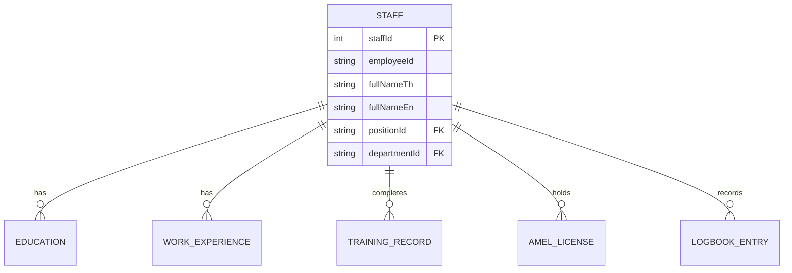

# 07. Data Design (การออกแบบโครงสร้างข้อมูล)

เอกสารฉบับนี้อธิบายโครงสร้างข้อมูล (Data Model), ข้อมูลอภิพันธุ์ (Metadata) และฟิลด์ข้อมูลที่ใช้งานบนหน้าจอต่างๆ ในส่วนของ **QA Staff List**, **New Staff Registration** และ **Staff Profile**

---

## 1. Data Model Overview (ภาพรวมความสัมพันธ์ของข้อมูล)
โครงสร้างหลักจะมี `Staff` เป็นศูนย์กลาง ซึ่งเชื่อมโยงข้อมูลประวัติต่างๆ แบบ 1-to-Many ดังนี้:

---

## 2. Metadata (ข้อมูลอภิพันธุ์)
ข้อมูลตัวเลือกที่ดึงมาจาก Master Data หรือกำหนดไว้ล่วงหน้า (Dropdown Lists):
1. **Positions:** Aircraft Mechanic, Certifying Staff (B1), Quality Assurance Inspector ฯลฯ
2. **Departments:** Line Maintenance, Base Maintenance, Quality Assurance ฯลฯ
3. **Staff Types:** MECH, CS, Operational Staff
4. **Title Names:** Mr, Mrs, Ms, Miss
5. **Aircraft Ratings:** B737-800, A320, A350-900 ฯลฯ
6. **AMEL Categories:** B1.1, B1.2, B2, C

---

## 3. ตารางฟิลด์ข้อมูลแยกตามหน้าจอ (Data Fields by Screen)

### 3.1 หน้า QA Staff List (`/qa/staff`)
*หน้าจอตารางแสดงรายชื่อพนักงานทั้งหมด สำหรับการค้นหาและเข้าถึงข้อมูล*

| ชื่อฟิลด์ (Field Name) | รายละเอียด (Description) | ประเภท (Type) |
| :--- | :--- | :---: |
| `Avatar` | รูปโปรไฟล์ขนาดเล็ก หรือตัวอักษรย่อ (Initials) | Image/Text |
| `Employee ID` | รหัสประจำตัวพนักงาน | String |
| `Name` | ชื่อ-นามสกุล ของพนักงาน | String |
| `Position` | ตำแหน่งการทำงาน (เช่น Certifying Staff) | String |
| `Department` | แผนกต้นสังกัด (เช่น Quality Assurance) | String |
| `Status` | สถานะของพนักงาน (Active, Inactive, On Leave) รูปแบบ Badge สี | String |
| `Action` | ปุ่มสำหรับคลิกเพื่อเข้าไปยังหน้า Staff Profile | Button |

---

### 3.2 หน้า New Staff Registration (`/qa/staff/new`)
*หน้าจอสำหรับลงทะเบียนข้อมูลพนักงานใหม่เข้าสู่ระบบ*

| หมวดหมู่ฟอร์ม | ชื่อฟิลด์ (Field Name) | บังคับ (Required) | รายละเอียด (Description) |
| :--- | :--- | :---: | :--- |
| **Personal Info** | `Title` | Yes | คำนำหน้าชื่อ (Mr, Mrs, Ms, Miss) |
| | `Full Name (Thai)` | Yes | ชื่อ-นามสกุล ภาษาไทย |
| | `Full Name (English)` | Yes | ชื่อ-นามสกุล ภาษาอังกฤษ |
| | `Date of Birth` | Yes | วันเดือนปีเกิด |
| | `Place of Birth` | No | สถานที่เกิด |
| | `Thai ID Card No.` | Yes | เลขประจำตัวประชาชน 13 หลัก (มี Validation) |
| | `Nationality` | Yes | สัญชาติ |
| **Contact** | `Phone` | Yes | เบอร์โทรศัพท์สำหรับติดต่อ |
| | `Email` | Yes | อีเมลบริษัท หรือส่วนตัว |
| | `Address` | No | ที่อยู่ปัจจุบัน |
| **Employment**| `Employee ID` | Yes | รหัสประจำตัวพนักงาน (เช่น EMP-0001) |
| | `Start Date` | Yes | วันที่เริ่มงาน |
| | `Position` | Yes | ตำแหน่ง (เลือกจาก Metadata) |
| | `Department` | Yes | แผนก (เลือกจาก Metadata) |
| | `Staff Type` | No | ประเภทพนักงาน (เช่น MECH, CS) |
| | `Job Title` | No | ชื่อตำแหน่งย่อย (ถ้ามี) |
| **Education** | `Degree` | Yes | วุฒิการศึกษา |
| *(กดเพิ่มได้)* | `Institution` | Yes | ชื่อสถาบันการศึกษา |
| | `Field of Study` | No | สาขาวิชา |
| | `Year` | Yes | ปีที่จบการศึกษา |
| **Work Exp.** | `Job Title` | Yes | ตำแหน่งงานในที่ทำงานเดิม |
| *(กดเพิ่มได้)* | `Company` | Yes | ชื่อบริษัทเดิม |
| | `Period From - To` | Yes | ระยะเวลาการทำงาน (วันที่เริ่ม - วันที่สิ้นสุด) |
| | `Description` | No | รายละเอียดหน้าที่ความรับผิดชอบ |
| **Documents** | `Attachment Uploads` | No | ระบบอัปโหลดไฟล์ เช่น รูปโปรไฟล์, ID Card, Passport, CV, ใบอนุญาต AMEL |

---

### 3.3 หน้า Staff Profile (`/qa/staff/{id}`)
*หน้าจอแสดงรายละเอียดเชิงลึกของพนักงาน 1 คน (แบ่งเป็น Tabs)*

#### 3.3.1 Hero Section (ส่วนหัวโปรไฟล์)
| ชื่อฟิลด์ (Field Name) | รายละเอียด (Description) |
| :--- | :--- |
| `Profile Image` | รูปถ่ายของพนักงาน (แสดงผลขนาดใหญ่) |
| `Full Name` | ชื่อ-นามสกุล (TH/EN) |
| `Position & Department` | ตำแหน่ง และแผนกปัจจุบัน |
| `Employee ID & Status` | รหัสพนักงาน พร้อมสถานะการทำงาน (Active/Inactive) |

#### 3.3.2 Profile Tab (แท็บข้อมูลส่วนตัว)
| ชื่อฟิลด์ (Field Name) | รายละเอียด (Description) |
| :--- | :--- |
| `Personal Information` | รวมข้อมูล Date of Birth, ID Card, Nationality |
| `Contact Information` | รวมข้อมูล Phone, Email, Address |
| `Education Details` | แสดงรายการวุฒิการศึกษาทั้งหมดที่บันทึกไว้ |
| `Employment History` | แสดงประวัติการทำงาน (บริษัทเดิม, ตำแหน่ง, ระยะเวลา) |

#### 3.3.3 Training Tab (แท็บประวัติการอบรม)
| ชื่อฟิลด์ (Field Name) | รายละเอียด (Description) |
| :--- | :--- |
| `Course Name` | ชื่อหลักสูตรที่ผ่านการอบรม |
| `Type` | ประเภทหลักสูตร (INI - Initial, R2Y - Recurrent) |
| `Date From - To` | ช่วงวันที่เข้าอบรม |
| `Valid Until` | วันที่ใบประกาศ/การอบรมหมดอายุ |
| `Status` | สถานะของหลักสูตร (Valid = เขียว, Expiring = เหลือง, Expired = แดง) |

#### 3.3.4 Experience & License Tab (แท็บใบอนุญาต)
| ชื่อฟิลด์ (Field Name) | รายละเอียด (Description) |
| :--- | :--- |
| `License No.` | หมายเลขใบอนุญาต AMEL |
| `Category` | ประเภทใบอนุญาต (เช่น B1.1, B2) |
| `Valid From - To` | ช่วงวันที่ใบอนุญาตมีผลบังคับใช้ |
| `Aircraft Ratings` | รุ่นเครื่องบินที่ได้รับสิทธิ์ซ่อมบำรุง (เช่น B737-800) |
| `Limitations` | ข้อจำกัดในการปฏิบัติงาน (ถ้ามี) |

#### 3.3.5 Logbook Records Tab (แท็บบันทึกประสบการณ์ซ่อมบำรุง)
| ชื่อฟิลด์ (Field Name) | รายละเอียด (Description) |
| :--- | :--- |
| `Date` | วันที่ปฏิบัติงานซ่อมบำรุง |
| `Aircraft Reg No.` | ทะเบียนเครื่องบินที่ซ่อม |
| `Task Type / THF No.` | ประเภทงาน หรือหมายเลขใบสั่งงาน (Task Handling Form) |
| `Hours` | จำนวนชั่วโมงที่ใช้ทำงาน |
| `Signed Off` | สถานะการรับรองการปฏิบัติงาน (Sign-off) |
