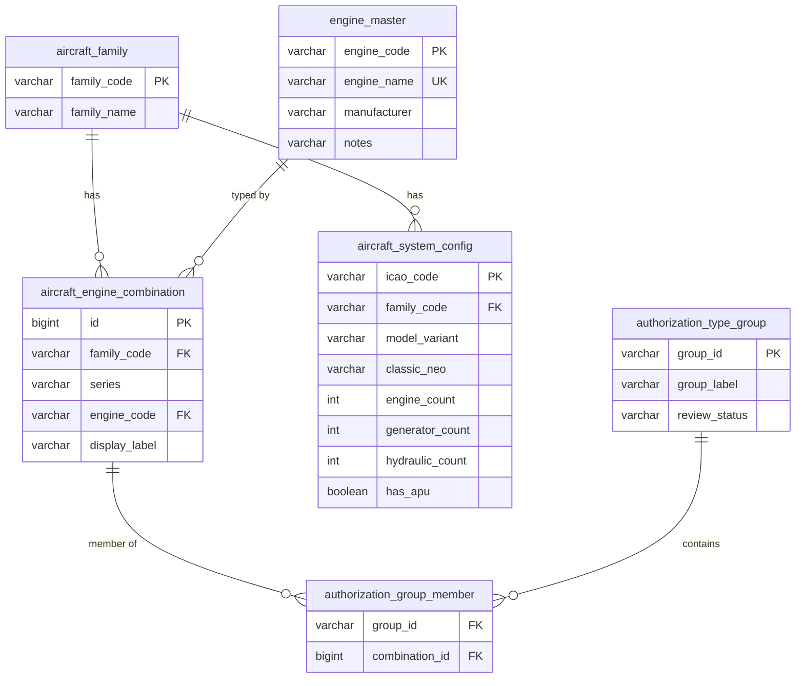

# Aircraft & Engine — Master Data model

Master data for the SAMS Engineering Maintenance System. This is the single
reference set that Training Needs Matrix (FM-CM-014), Authorization Certificate
(FM-CM-063), Authorization & Certification (M-03) and Task Summary (FM-CM-062)
all derive from.

> **Design goal:** prevent the data drift that happened in the old Excel files
> (engine names not matching between sheets, new series dropped from an
> authorization group) **structurally** — through foreign keys and derived
> views — not through the discipline of whoever types the data.

---

## 1. Entity-relationship overview

```
 aircraft_family ─┐
                  │ 1                     ┌─ engine_master (controlled vocabulary)
                  │                       │ 1
                  ▼ *                     ▼ *
        aircraft_engine_combination ◄─────┘
          (SINGLE SOURCE OF TRUTH)
                  ▲ *
                  │
   authorization_group_member (junction)
                  │ *
                  ▼ 1
        authorization_type_group

 aircraft_family ──1──*── aircraft_system_config
```



---

## 2. Tables

### `aircraft_family`
Reference list of families. `family_code` (e.g. `A320`, `B737`) is the natural PK.

### `engine_master` — controlled vocabulary
The **only** place an engine name is authored. Every engine dropdown in the app,
and every engine reference in another table, resolves through `engine_code`.
`engine_name` carries a **UNIQUE** constraint so two rows can't disagree on spelling.

### `aircraft_engine_combination` — single source of truth
One row = one atomic pairing of **family + series + engine**.

| column           | notes |
|------------------|-------|
| `id`             | surrogate PK |
| `family_code`    | FK → `aircraft_family` |
| `series`         | nullable/empty when the family has no sub-series (e.g. A318) |
| `engine_code`    | FK → `engine_master` — **never** free text |
| `display_label`  | derived + persisted: `{family}{-series?} ({engine_name})` |

`display_label` is computed on write from the joined `engine_name`; it is
**read-only** in the UI (auto-generated preview). It is denormalised only for
display/search performance — the FK remains the source of truth, and any change
to an engine's name rewrites the labels of every combination that references it.

There is a **UNIQUE(family_code, series, engine_code)** constraint so the same
pairing can't be entered twice.

### `authorization_type_group` + `authorization_group_member`
A group is a named set of combinations (junction table). The engine list shown
for a group is **rolled up** from its members' `engine_code`s — it is never
typed. Because membership references combinations, a group physically cannot
reference an engine that doesn't exist, and a new series added to a member
combination flows into the group automatically.

Draft → review → publish columns (see §4) live on the group.

### `aircraft_system_config`
Per-ICAO systems configuration (engine/generator/hydraulic counts, APU,
Classic/NEO). `family_code` is an FK so system config and combinations agree on
families.

---

## 3. How each historical drift is now prevented

| Old failure (from the 3 Excel files) | Structural prevention |
|--------------------------------------|-----------------------|
| Engine spelled `IAE V500` in one sheet, `V2500` in another | Engine is an FK to `engine_master`; the UI dropdown is the only way to set it. Free text can't be entered. |
| `RR211 Trent 1000` vs `RB211 Trent 1000` | Same — one authored spelling, `engine_name` is UNIQUE. |
| New series (B737-10, -8200) missing from an authorization group | Groups reference combinations; the **data-quality scan** flags any combination in **no** group (orphan). |
| Family present in one sheet, absent from another | The scan flags families present in combinations but absent from system config, and the reverse. |

The remaining risk — legacy free-text that predates the FK model — is handled by
an **import-staging** field (`legacy_engine_label`). Anything that fails to
resolve against `engine_master` is surfaced in the data-quality banner with a
"did you mean…" suggestion, rather than silently written into the clean tables.

---

## 4. Review workflow (draft → review → publish)

Because a change to an authorization group changes the **CRS scope** of certifying
staff, group edits do **not** take effect immediately. Each group carries:

| column          | meaning |
|-----------------|---------|
| `review_status` | `DRAFT` → `IN_REVIEW` → `PUBLISHED` |
| `submitted_by` / `submitted_at_utc` | who sent it to review, when |
| `reviewed_by`   | who actioned the review |
| `published_by` / `published_at_utc` | who published (made it live) |

- **Any create/edit/membership change lands the group in `DRAFT`** — never live.
- `DRAFT → IN_REVIEW` via **Submit for review** (author authority).
- `IN_REVIEW → PUBLISHED` via **Publish**, or back to `DRAFT` via **Reject**
  (approver authority).
- Only `PUBLISHED` groups are consumed by downstream modules for CRS scope.

**Permission mapping (interim):** authoring actions require `canEdit` on
`MASTER_DATA_AIRCRAFT_ENGINE`; the publish/reject (approver) step requires
`canDelete`, giving a separation of duties with the existing permission
dimensions. When the backend adds a dedicated approver permission this mapping
should move to it (single constant `canPublish` in `AuthGroupsTab.tsx`).

---

## 5. Auditing & time

Every table has `updated_by` and `updated_at_utc`. Following the SAMS convention
(`lib/dayjs.ts`), **timestamps are stored in UTC** and converted to the viewer's
local timezone only at render time (`dateTimeUtils.fromApiFormat`). The header
LOCAL/UTC pill makes the two explicit.

---

## 6. Referential integrity (soft-block on delete)

Deletes are **restricted**, not cascaded:

- An `engine_master` row cannot be deleted while any combination references it.
- An `aircraft_engine_combination` cannot be deleted while any authorization
  group references it.

The UI checks references first and, if blocked, shows exactly what still points
at the record instead of failing silently. In SQL this is enforced by
`ON DELETE RESTRICT` (see `schema.sql`).

---

## 7. Current implementation status

The frontend (4-tab screen at `/master-data/aircraft-engine`) is complete and
runs against an **in-memory mock** (`lib/api/master/aircraft-engine/`), seeded
from the reference mockup **including the known drift** so the data-quality
banner is exercised. The mock is a drop-in for the REST API: each hook's
`queryFn`/`mutationFn` swaps to `axiosConfig` one line at a time (see the
`SWAP POINT` comments). This document + `schema.sql` are the spec for the
backend tables; no migration of the real Excel data has been performed yet.

---

## 8. Change log — Rev.02 (migrations in `./migrations/`)

`schema.sql` is the **baseline**; the changes below layer on top as reversible
migrations. Each has UP/DOWN sections and is covered by Vitest (`lib/api/master/aircraft-engine/*.test.ts`).

| CR   | Migration | Change | Key logic |
|------|-----------|--------|-----------|
| CR-3 | `001` | `valid_from`/`valid_to` on `aircraft_engine_combination` (versioned by stable `id`) and `authorization_group_member` (temporal junction); append-only edit/delete; `?as_of=` point-in-time reads | `aircraftEngine.temporal.ts` — the **single** active-scope helper (`isActiveAt`/`activeAt`); do not inline `valid_to IS NULL` elsewhere |
| CR-1 | `002` | `completeness_status` (draft/incomplete/complete) + `incomplete_since_utc`. **Independent** of `review_status`; downstream gate = `PUBLISHED` **and** `complete`. Empty draft groups are always allowed | `computeCompletenessStatus`, `filterDownstreamGroups`; banner escalates amber→red past 3 days (`COMPLETENESS_SLA_MS`) |
| CR-4 | `003` | `engine_list_cached` on the group; regenerated at the same trigger as CR-1 (`recomputeAllGroups` in the mock) | read paths consume the cache; junction is joined only on edit/regenerate |
| CR-2 | `004` | nullable `customer_id` FK → `airlines(id)`. NULL = global default; value = per-airline override | `resolveGroupsForCustomer` (override else global, per scope) |
| CR-5 | `005` | *(no schema)* `aircraft_engine.updated` event over the existing react-query invalidation transport | `aircraftEngine.events.ts` — typed payload builder + subscribe hook |
| CR-6 | `006` | *(no schema)* shared read-only `AircraftEngineRefPanel`, embedded in M-03 (authorization) and M-02 (course setup) | `components/aircraft-engine/AircraftEngineRefPanel.tsx` |

Two status dimensions now coexist on a group: the **manual** `review_status`
(draft → review → publish, §4, a separation-of-duties control) and the
**auto-computed** `completeness_status` (CR-1). A group is consumable downstream
only when it is both PUBLISHED and complete.
