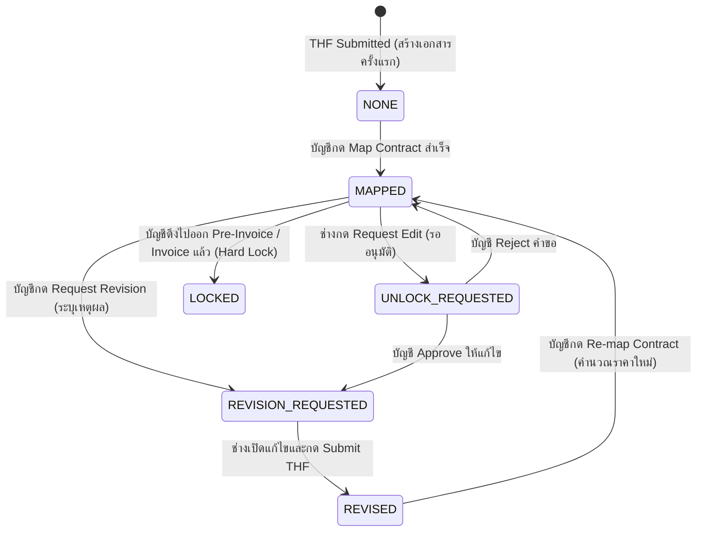

# API Specification: THF Revision & Mapping Workflow
**ระบบวงจรชีวิตการขอแก้ไขเอกสาร THF และการผูกสัญญา (Mapping Lifecycle)**
**ระบบ:** SAM Airline Maintenance System (SAMS)
**วันที่:** 10 กันยายน 2026
**โมดูลที่เกี่ยวข้อง:** Flight THF (ทีมช่าง), Invoice > THF DOCUMENT (ทีมบัญชี), Pre-Invoice / Contract Mapping

---

## 1. บทนำและภาพรวมของ Workflow (Overview)

เอกสารนี้ระบุข้อกำหนดทางเทคนิค (API Specifications) สำหรับฝั่ง Backend เพื่อรองรับกระบวนการขอแก้ไขเอกสาร Technical Handling Form (THF) และการควบคุมความถูกต้องทางบัญชีก่อนออกใบแจ้งหนี้ (Invoice)

### ปัญหาที่ต้องแก้ไข
1. เมื่อเอกสาร THF บันทึกเสร็จสมบูรณ์และถูกผูกสัญญา (Mapped) ไปแล้ว หากช่างหน้างานเข้ามาแก้ไขโดยพลการ จะทำให้ยอดเงินและบริการในระบบบัญชีคลาดเคลื่อน
2. บัญชีที่ตรวจพบข้อผิดพลาดในเอกสาร THF ไม่มีช่องทางส่งกลับแก้ไขพร้อมระบุเหตุผลให้ช่างทราบ
3. ช่างหน้างานไม่ทราบว่าเที่ยวบินใดมีเอกสารที่ต้องแก้ไข และต้องแก้ไขในจุดใด
4. เมื่อช่างแก้ไขเสร็จ เอกสารต้องถูกส่งกลับมาให้บัญชีเพื่อทำการคำนวณราคาและ Re-map ใหม่

### แผนผังวงจรสถานะ (State Lifecycle Diagram)



---

## 2. การปรับปรุงโครงสร้างฐานข้อมูล (Database Schema)

ตารางเป้าหมาย: `LineMaintenances` (หรือตารางที่เก็บสถานะเอกสาร THF)

| ชื่อฟิลด์ | ชนิดข้อมูล | ค่าที่อนุญาต / ตัวอย่าง | ค่าเริ่มต้น | คำอธิบาย |
| :--- | :--- | :--- | :--- | :--- |
| `mapping_status` | `VARCHAR(30)` | `'NONE'`, `'MAPPED'`, `'REVISION_REQUESTED'`, `'REVISED'`, `'LOCKED'` | `'NONE'` | สถานะการผูกสัญญากับบัญชี |
| `thf_state` | `VARCHAR(30)` | `'plan'`, `'draft'`, `'save'`, `'revision_required'`, `'pending_unlock'`, `'locked'` | `'plan'` | สถานะเอกสารสำหรับทีมช่าง |
| `revision_category` | `VARCHAR(100)` | `'Manpower'`, `'Parts & Tools'`, `'Fluid / Servicing'`, `'Attachments'`, `'Flight Details'`, `'General'` | `NULL` | หมวดหมู่ข้อผิดพลาดที่บัญชีระบุ |
| `revision_reason` | `TEXT` | เช่น *"ชั่วโมงแรงงานไม่ตรงกับใบล็อกบุ๊กหน้า 2"* | `NULL` | รายละเอียดสิ่งที่ต้องการให้แก้ไข |
| `revision_requested_by` | `VARCHAR(100)` | เช่น *"Somchai (Accounting)"* | `NULL` | ชื่อผู้ส่งกลับแก้ไข |
| `revision_requested_at` | `DATETIME` | `'2026-09-10 14:30:00'` | `NULL` | วันที่และเวลาที่ส่งกลับแก้ไข |
| `unlock_reason` | `TEXT` | เช่น *"ต้องการปรับยอดการเติมน้ำมันไฮดรอลิก"* | `NULL` | เหตุผลที่ช่างขอปลดล็อกเพื่อแก้ไข |
| `unlock_requested_at` | `DATETIME` | `'2026-09-10 15:00:00'` | `NULL` | วันที่และเวลาที่ช่างขอปลดล็อก |
| `revision_count` | `INT` | `0, 1, 2, ...` | `0` | จำนวนครั้งที่เอกสารนี้ถูกแก้ไข |

---

## 3. Endpoints ใหม่ที่ต้องพัฒนา (New API Endpoints)

### 3.1 บัญชีส่งกลับแก้ไขเอกสาร THF (Request Revision)
เมื่อเจ้าหน้าที่บัญชีตรวจสอบเอกสารในหน้า `Invoice > THF DOCUMENT` แล้วพบข้อผิดพลาด จึงกดส่งกลับแก้ไข

- **Method:** `POST`
- **Path:** `/lineMaintenances/{lineMaintenanceId}/request-revision`
- **Headers:** `Content-Type: application/json`, `Authorization: Bearer <token>`

#### Request Body
```json
{
  "category": "Manpower / Technician",
  "reason": "ชั่วโมงแรงงานไม่ตรงกับใบล็อกบุ๊กหน้า 2 ขอให้ตรวจสอบยอดใหม่",
  "requestedBy": "Somchai Accounting"
}
```

#### Response (Success - 200 OK)
```json
{
  "message": "success",
  "responseData": {
    "lineMaintenanceId": 1234,
    "thfNumber": "THF-2026-0089",
    "mappingStatus": "REVISION_REQUESTED",
    "thfState": "revision_required",
    "revisionCategory": "Manpower / Technician",
    "revisionReason": "ชั่วโมงแรงงานไม่ตรงกับใบล็อกบุ๊กหน้า 2 ขอให้ตรวจสอบยอดใหม่",
    "revisionRequestedBy": "Somchai Accounting",
    "revisionRequestedAt": "2026-09-10T07:30:00Z"
  },
  "error": ""
}
```

#### Business Logic:
1. อัปเดต `mapping_status = 'REVISION_REQUESTED'`
2. อัปเดต `thf_state = 'revision_required'`
3. บันทึก `revision_category`, `revision_reason`, `revision_requested_by`, `revision_requested_at`
4. ปลดการ Map หรือระงับสถานะ Mapping เดิม ไม่ให้นำไปออก Pre-Invoice

---

### 3.2 ช่างขออนุญาตแก้ไขเอกสาร (Request Unlock)
เมื่อเอกสารถูก Save/Mapped ไปแล้ว แต่ช่างหน้างานพบข้อผิดพลาดต้องการขอแก้ไขเอง

- **Method:** `POST`
- **Path:** `/lineMaintenances/{lineMaintenanceId}/request-unlock`
- **Headers:** `Content-Type: application/json`, `Authorization: Bearer <token>`

#### Request Body
```json
{
  "reason": "ต้องการปรับปรุงยอดการเบิกอะไหล่และแก้ไขเลขตั๋วช่าง",
  "requestedBy": "Somsak Engineer"
}
```

#### Response (Success - 200 OK)
```json
{
  "message": "success",
  "responseData": {
    "lineMaintenanceId": 1234,
    "thfNumber": "THF-2026-0089",
    "thfState": "pending_unlock",
    "unlockReason": "ต้องการปรับปรุงยอดการเบิกอะไหล่และแก้ไขเลขตั๋วช่าง",
    "unlockRequestedAt": "2026-09-10T08:00:00Z"
  },
  "error": ""
}
```

#### Business Logic:
1. ตรวจสอบว่าเอกสารไม่ได้อยู่ในสถานะ `LOCKED` (หากออก Invoice แล้ว ให้ส่ง Error 400 ห้ามขอปลดล็อก)
2. อัปเดต `thf_state = 'pending_unlock'`
3. บันทึก `unlock_reason`, `unlock_requested_at`

---

### 3.3 บัญชีพิจารณาคำขอปลดล็อก (Review Unlock)
เจ้าหน้าที่บัญชีกดอนุมัติหรือปฏิเสธคำขอปลดล็อกของช่าง

- **Method:** `POST`
- **Path:** `/lineMaintenances/{lineMaintenanceId}/review-unlock`
- **Headers:** `Content-Type: application/json`, `Authorization: Bearer <token>`

#### Request Body
```json
{
  "action": "APPROVE", // "APPROVE" หรือ "REJECT"
  "reviewerNote": "อนุมัติให้แก้ไขได้ กรุณาดำเนินการให้เสร็จก่อน 17:00 น.",
  "reviewedBy": "Somchai Accounting"
}
```

#### Response (Success - 200 OK)
```json
{
  "message": "success",
  "responseData": {
    "lineMaintenanceId": 1234,
    "thfNumber": "THF-2026-0089",
    "mappingStatus": "REVISION_REQUESTED",
    "thfState": "revision_required",
    "reviewedBy": "Somchai Accounting",
    "reviewedAt": "2026-09-10T08:15:00Z"
  },
  "error": ""
}
```

#### Business Logic:
- หาก `action == "APPROVE"`:
  - เปลี่ยน `thf_state = 'revision_required'`
  - เปลี่ยน `mapping_status = 'REVISION_REQUESTED'`
  - คัดลอก `unlock_reason` ไปเป็น `revision_reason` เพื่อให้ช่างเห็นในฟอร์ม
- หาก `action == "REJECT"`:
  - คืนค่า `thf_state = 'save'`
  - คงค่า `mapping_status = 'MAPPED'`

---

## 4. การปรับปรุง Existing APIs (Existing Endpoints Update)

### 4.1 `POST /flight/listdata` (ดึงรายการ Flight List)
เพิ่มฟิลด์เกี่ยวกับ Revision ในออบเจกต์ของแต่ละเที่ยวบิน:

```json
{
  "flightsId": 101,
  "flightInfosId": 501,
  "arrivalFlightNo": "FD3024",
  "state": "revision_required",  // 'plan' | 'draft' | 'save' | 'revision_required' | 'pending_unlock' | 'locked'
  "thfNumber": "THF-2026-0089",
  "lineMaintenancesId": 1234,
  "isMapping": false,
  
  // ฟิลด์ใหม่ที่ต้องส่งเพิ่ม:
  "mappingStatus": "REVISION_REQUESTED",
  "revisionReason": "ชั่วโมงแรงงานไม่ตรงกับใบล็อกบุ๊กหน้า 2 ขอให้ตรวจสอบยอดใหม่",
  "revisionCategory": "Manpower / Technician",
  "revisionRequestedBy": "Somchai Accounting",
  "revisionRequestedAt": "2026-09-10T07:30:00Z",
  "revisionCount": 1
}
```

---

### 4.2 `POST /lineMaintenances/listDoneOrMapped` (ดึงรายการหน้า Invoice > THF DOCUMENT)
เพิ่มฟิลด์สถานะ `mappingStatus` และข้อมูลการ Revision ในแต่ละรายการ:

```json
{
  "flightsObj": { ... },
  "lineMaintenancesObj": { ... },
  "contractsObj": { ... },
  "isMapping": false,
  
  // ฟิลด์ใหม่ที่ต้องส่งเพิ่ม:
  "mappingStatus": "REVISION_REQUESTED", // 'NONE' | 'MAPPED' | 'REVISION_REQUESTED' | 'REVISED' | 'LOCKED'
  "revisionReason": "ชั่วโมงแรงงานไม่ตรงกับใบล็อกบุ๊กหน้า 2",
  "revisionCategory": "Manpower / Technician",
  "revisionRequestedBy": "Somchai Accounting",
  "revisionRequestedAt": "2026-09-10T07:30:00Z",
  "revisionCount": 1
}
```

---

### 4.3 `PUT /lineMaintenances/attachfile-other` (เมื่อช่างกด Submit THF)
เมื่อช่างทำการแก้ไขเอกสารจนครบทุกขั้นตอนและกด **Submit**:

#### Logic ฝั่ง Backend:
1. บันทึกข้อมูลและไฟล์แนบตามปกติ
2. ตรวจสอบว่าหากเดิม `thf_state == 'revision_required'`:
   - เปลี่ยน `thf_state = 'save'`
   - เปลี่ยน `mapping_status = 'REVISED'` (เพื่อแจ้งบัญชีว่าช่างแก้แล้ว รอกด Re-map)
   - อัปเดต `revision_count = revision_count + 1`
   - ล้างค่า `unlock_reason`

---

### 4.4 `PUT /lineMaintenances/mapping-contracts-v2` (สร้าง Pre-Invoice / Mapping สัญญา V2)
*(หมายเหตุ: API V1 `PUT /lineMaintenances/{id}/mapping-contracts` ยกเลิกการใช้งานแล้ว ระบบเปลี่ยนมาใช้ V2 ซึ่งรวมการคำนวณสัญญากับการสร้าง Pre-Invoice ไว้ในขั้นตอนเดียว)*

เมื่อบัญชีกดปุ่ม **Pre-Invoice** ในหน้า Invoice THF DOCUMENT:

#### Request Body:
```json
{
  "curencyType": "THB",
  "curencyRate": 35,
  "lineMaintenanceIdLiist": [101, 102]
}
```

#### Logic ฝั่ง Backend:
1. ประมวลผลจับคู่สัญญากับบริการล่าสุด และคำนวณราคาตาม Currency & Rate ที่ระบุ
2. สำหรับรายการที่มีสถานะเป็น `REVISED`: อัปเดต `mapping_status = 'MAPPED'`
3. อัปเดต `isMapping = true`
4. สร้างข้อมูลชุด Pre-Invoice เพื่อให้แสดงในแท็บ `PRE-INVOICE` ต่อไป

---

## 5. กฎความปลอดภัยทางธุรกิจ (Business Rules & Validations)

1. **การป้องกันการนำเอกสารไปออก Pre-Invoice:**
   - ที่ Endpoint `PUT /lineMaintenances/mapping-contracts-v2` (สร้าง Pre-Invoice):
   - Backend ต้องทำการตรวจสอบก่อนว่า ในรายชื่อ `lineMaintenanceIdLiist` ที่ส่งมา มีรายการใดที่มี `mapping_status === 'REVISION_REQUESTED'` หรือ `mapping_status === 'NONE'` หรือไม่
   - หากมี ให้ตอบกลับเป็น Error ทันที:
     ```json
     {
       "message": "error",
       "error": "ไม่สามารถออก Pre-Invoice ได้ เนื่องจากเอกสาร THF-2026-0089 อยู่ระหว่างรอการแก้ไข (Revision Requested)"
     }
     ```

2. **การล็อกเอกสารที่ออก Invoice แล้ว (Hard Lock):**
   - หากเที่ยวบินถูกดึงไปออก Draft Invoice หรือ Final Invoice แล้ว:
   - Backend ต้องตั้งค่า `mapping_status = 'LOCKED'` และ `thf_state = 'locked'`
   - บล็อกคำสั่งการแก้ไขทุกชนิด (`PUT /lineMaintenances/*`) และบล็อกคำขอ `request-unlock`
   - หากต้องการแก้ไข จะต้องทำการยกเลิก/ใบลดหนี้ (Credit Note) ผ่านระบบบัญชีก่อนเท่านั้น

---

## 6. Checklist สำหรับทีม Backend

- [ ] เพิ่มคอลัมน์ในตาราง `LineMaintenances`: `mapping_status`, `thf_state`, `revision_category`, `revision_reason`, `revision_requested_by`, `revision_requested_at`, `unlock_reason`, `unlock_requested_at`, `revision_count`
- [ ] สร้าง API `POST /lineMaintenances/{id}/request-revision`
- [ ] สร้าง API `POST /lineMaintenances/{id}/request-unlock`
- [ ] สร้าง API `POST /lineMaintenances/{id}/review-unlock`
- [ ] ปรับ Response ของ `POST /flight/listdata` ให้คืนค่าฟิลด์สถานะและข้อมูล Revision
- [ ] ปรับ Response ของ `POST /lineMaintenances/listDoneOrMapped` ให้คืนค่า `mappingStatus` และข้อมูล Revision
- [ ] อัปเดต `PUT /lineMaintenances/attachfile-other` ให้เปลี่ยนสถานะเป็น `REVISED` เมื่อช่างส่งงานแก้ไข
- [ ] อัปเดต `PUT /lineMaintenances/mapping-contracts-v2` ให้เปลี่ยนสถานะเป็น `MAPPED` หลังคำนวณราคาและออก Pre-Invoice สำเร็จ
- [ ] เพิ่ม Validation ที่ `PUT /lineMaintenances/mapping-contracts-v2` ป้องกันเอกสารที่รอแก้ (`REVISION_REQUESTED`) ไม่ให้ออก Pre-Invoice
- [ ] ทดสอบความถูกต้องร่วมกับ Frontend
